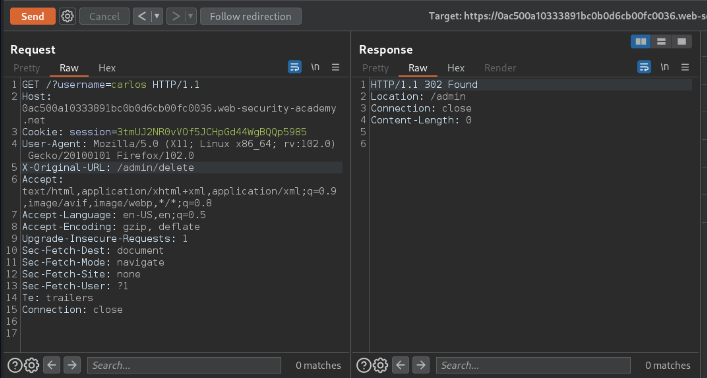

# URL-based access control can be circumvented

## Description

[This website](https://portswigger.net/web-security/access-control/lab-url-based-access-control-can-be-circumvented) has an unauthenticated admin panel at `/admin`, but a front-end system has been configured to block external access to that path. However, the back-end application is built on a framework that supports the `X-Original-URL` header.

## Reproduction and proof of concept

1. Try to load `/admin` and observe that you get blocked. The response is very plain, suggesting it may originate from a front-end system.
2. Send the request to Burp Repeater. Change the URL in the request line to / and add the HTTP header `X-Original-URL: /invalid`. Observe that the application returns a "not found" response. This indicates that the back-end system is processing the URL from the `X-Original-URL` header.
3. Change the value of the `X-Original-URL` header to `/admin`. Observe that you can now access the `admin` page.
4. To delete the user `carlos`, add `?username=carlos` to the real query string, and change the `X-Original-URL` path to `/admin/delete`.

 

## Exploitability

An attacker will need to access the admin panel and delete the user carlos. 
