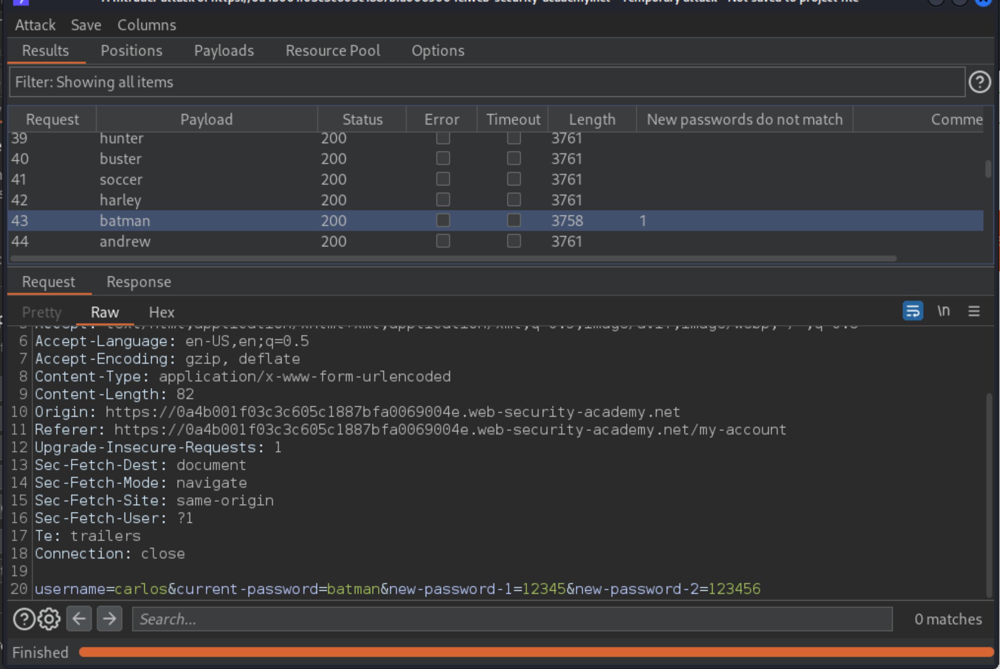

# Password brute-force via password change

## Description

[This lab](https://portswigger.net/web-security/authentication/other-mechanisms/lab-password-brute-force-via-password-change)'s password change functionality makes it vulnerable to brute-force attacks. 

## Reproduction and proof of concept

1. With Burp running, log in with `wiener:peter` and experiment with the password change functionality. Observe that the username is submitted as hidden input in the request.
2. Notice the behaviour when you enter the wrong current password. If the two entries for the new password match, the account is locked. However, if you enter two different new passwords, an error message simply states `Current password is incorrect`. If you enter a valid current password, but two different new passwords, the message says `New passwords do not match`. We can use this message to enumerate correct passwords.
3. Enter your correct current password and two new passwords that do not match. Send this `POST /my-account/change-password` request to Burp Intruder.
4. In Burp Intruder, change the username parameter to carlos and add a payload position to the current-password parameter. Make sure that the new password parameters are set to two different values. For example:

```
username=carlos&current-password=§peter§&new-password-1=12345&new-password-2=123456
```
    
5. On the Payloads tab, enter the list of passwords as the payload set
6. On the Options tab, add a grep match rule to flag responses containing New passwords do not match. Start the attack.
7. When the attack finishes, notice that one response was found that contains the `New passwords do not match` message. Make a note of this password.



8. In the browser, log out of your own account and log back in with the username `carlos` and the password just identified.
9. Click **My account** to solve the lab.

## Exploitability

An attacker will need to use the [list of candidate passwords](https://portswigger.net/web-security/authentication/auth-lab-passwords) to brute-force Carlos's account and access his **My account** page. 
