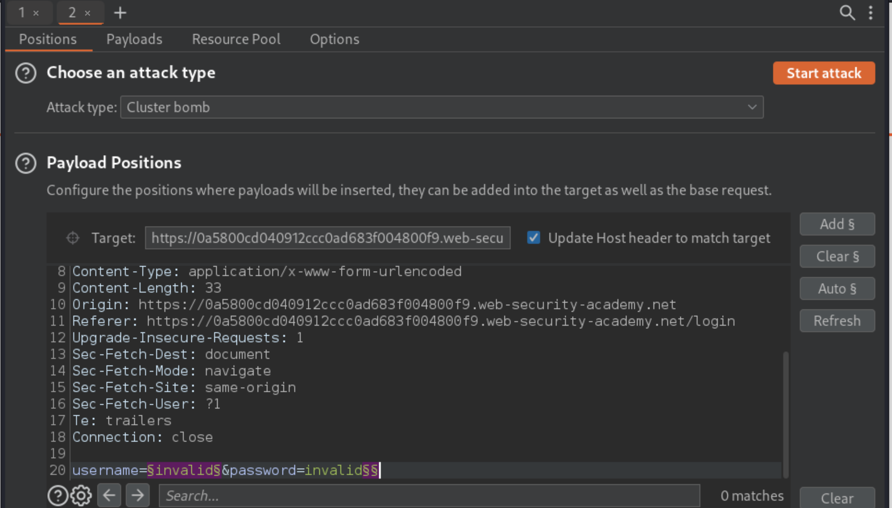
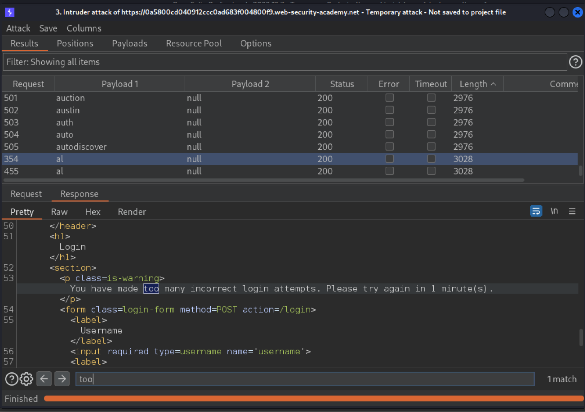
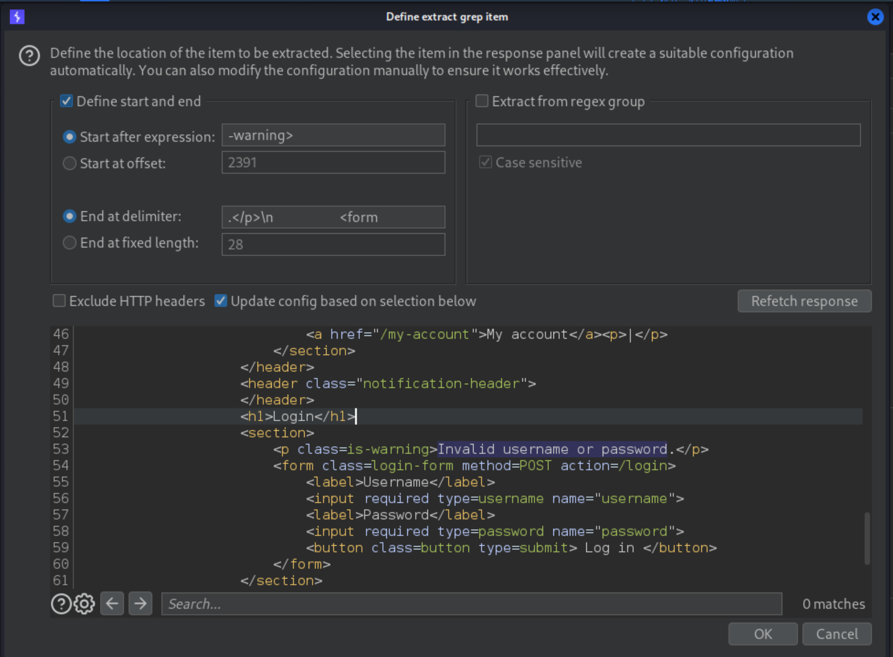
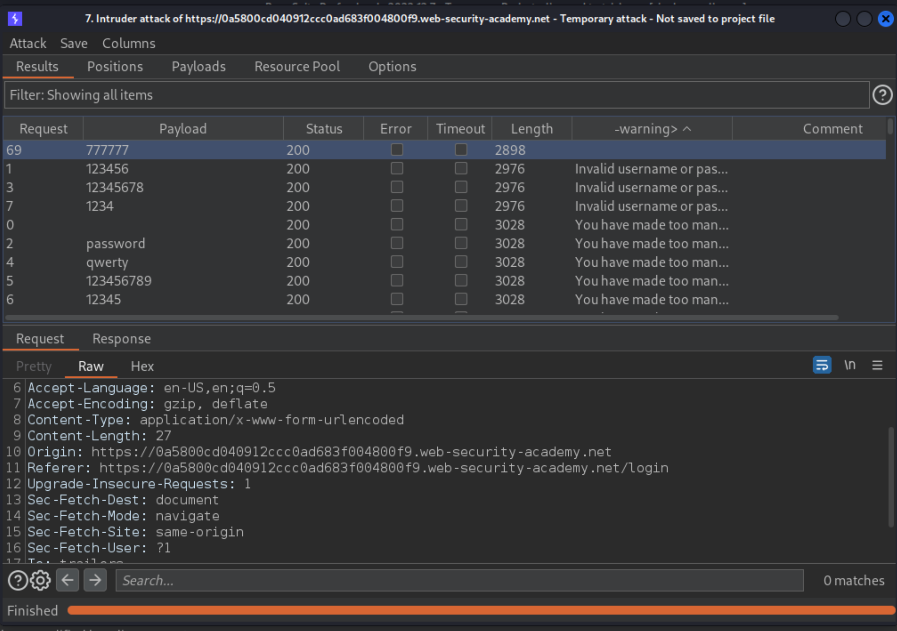

# Username enumeration via account lock

## Description

[This lab](https://portswigger.net/web-security/authentication/password-based/lab-username-enumeration-via-account-lock) is vulnerable to username enumeration. It uses account locking, but this contains a logic flaw.

## Reproduction and proof of concept

1. With Burp running, investigate the login page and submit an invalid username and password. Send the `POST /login` request to Burp Intruder.
2. Select the attack type Cluster bomb. Add a payload position to the `username` parameter. Add a blank payload position to the end of the request body by clicking Add § twice. The result should look something like this:

3. On the Payloads tab, add the list of usernames to the first payload set. For the second set, select the **Null payloads** type and choose the option to generate 5 payloads. This will effectively cause each username to be repeated 5 times. Start the attack.
4. In the results, notice that the responses for one of the usernames were longer than responses when using other usernames. Study the response more closely and notice that it contains a different error message: `You have made too many incorrect login attempts`. Make a note of this username.

5. Create a new Burp Intruder attack on the ``POST /login`` request, but this time select the Sniper attack type. Set the `username` parameter to the username that you just identified and add a payload position to the `password` parameter.
6. Add the list of passwords to the payload set and create a grep extraction rule for the error message "Invalid username or password". 

7. Start the attack. In the results, look at the grep extract column. Notice that there are a couple of different error messages, but one of the responses did not contain any error message. Make a note of this password.

8. Wait for a minute to allow the account lock to reset. Log in using the username and password that identified and access the user account page to solve the lab.

## Exploitability

An attacker will need to enumerate a valid [username](https://portswigger.net/web-security/authentication/auth-lab-usernames), brute-force this user's [password](https://portswigger.net/web-security/authentication/auth-lab-passwords), then access their account page. 
