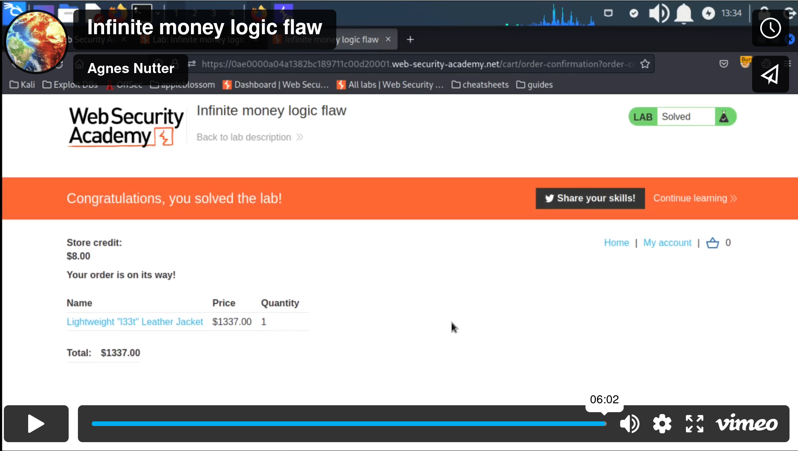

# Infinite money logic flaw

## Description

[This lab](https://portswigger.net/web-security/logic-flaws/examples/lab-logic-flaws-infinite-money) has a logic flaw in its purchasing workflow.

## Reproduction

1. With Burp running, log in with `wiener:peter`, and sign up for the newsletter to obtain a coupon code, `SIGNUP30`. Notice that you can buy $10 gift cards and redeem them from the **My account** page.
2. Add a gift card to your basket and proceed to the checkout. Apply the coupon code to get a 30% discount. Complete the order and copy the gift card code to your clipboard.
3. Go to your account page and redeem the gift card. Observe that this entire process has added $3 to your store credit. To obtain the `$1234` required to purchase a leather jacket, `412` gift cards need to be redeemed. This process can be automated.
4. Study the proxy history and notice that the gift card is redeemed by supplying the code in the `gift-card` parameter of the ``POST /gift-card`` request.
5. Go to **Settings -> Project -> Sessions**. In the **Session handling rules** panel, click **Add**. The **Session handling rule editor** dialog opens.
6. In the dialog, go to the **Scope** tab. Under **URL Scope**, select **Include all URLs**.
7. Go back to the **Details** tab. Under **Rule actions**, click **Add -> Run a macro**. Under **Select macro**, click **Add** again to open the Macro Recorder.
8. Select the following sequence of requests:

```text
POST /cart
POST /cart/coupon
POST /cart/checkout
GET /cart/order-confirmation?order-confirmed=true
POST /gift-card
```

Then, click **OK**. The Macro Editor opens.

9. In the list of requests, select `GET /cart/order-confirmation?order-confirmed=true`. Click **Configure item**. In the dialog that opens, click **Add** to create a custom parameter. Name the parameter `gift-card` and highlight the gift card code at the bottom of the response. Click **OK** twice to go back to the Macro Editor.
10. Select the ``POST /gift-card`` request and click **Configure item** again. In the **Parameter handling** section, use the drop-down menus to specify that the `gift-card` parameter should be derived from the prior response (response 4). Click **OK**.
11. In the Macro Editor, click **Test macro**. Look at the response to `GET /cart/order-confirmation?order-confirmation=true` and note the gift card code that was generated. Look at the `POST /gift-card` request. Make sure that the `gift-card` parameter matches and confirm that it received a `302` response. Keep clicking **OK** until you get back to the main Burp window.
12. Send the `GET /my-account` request to Burp Intruder. Use the "Sniper" attack type and clear the default payload positions.
13. On the **Payloads** tab, select the payload type **Null payloads**. Under **Payload options**, choose to generate `412` payloads.
14. Go to the **Resource pool** tab and add the attack to a resource pool with the **Maximum concurrent requests** set to `1`. Start the attack.
15. When the attack finishes, you will have enough store credit to buy the jacket and solve the lab.

## PoC

[](https://vimeo.com/801341234)

## Exploitability

An attacker will need to log in; abuse the logic flaw to get enough credit; and buy a "Lightweight l33t leather jacket" with it.
