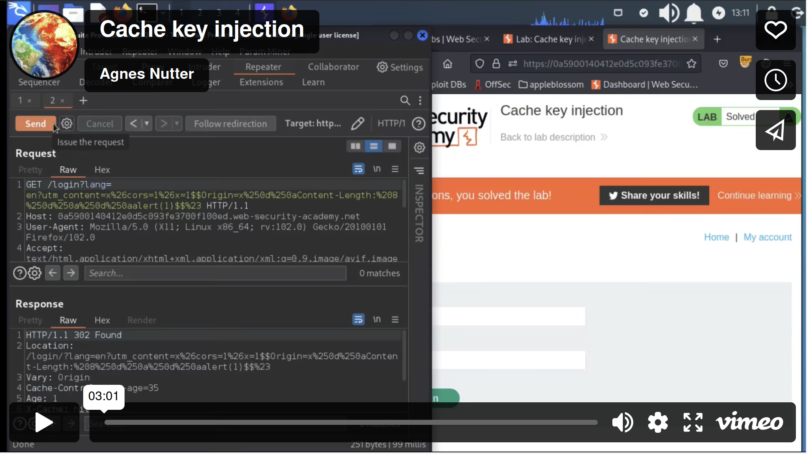

# Cache key injection

## Description

[This lab](https://portswigger.net/web-security/web-cache-poisoning/exploiting-implementation-flaws/lab-web-cache-poisoning-cache-key-injection) contains multiple independent vulnerabilities, including cache key injection. A user regularly visits this site's home page using Chrome. 

## Reproduction

1. The redirect at `/login` excludes the parameter `utm_content` from the cache key using a flawed `regex`. This allows appending arbitrary unkeyed content to the `lang` parameter:

```text
/login?lang=en?utm_content=fire
```

2. The page at `/login/` has an import from `/js/localize.js`. This is vulnerable to client-side parameter pollution via the `lang` parameter because it doesn't URL-encode the value.
3. The login page references an endpoint at `/js/localize.js` that is vulnerable to response header injection via the `Origin` request header, provided the `cors` parameter is set to `1`.
4. Use the `Pragma: x-get-cache-key` header to identify that the server is vulnerable to cache key injection, meaning the header injection can be triggered via a crafted URL.
5. Combine these four behaviours by poisoning the cache with following two requests:

```text
GET /js/localize.js?lang=en?utm_content=z&cors=1&x=1 HTTP/1.1
Origin: x%0d%0aContent-Length:%208%0d%0a%0d%0aalert(1)$$$$
```

```text
GET /login?lang=en?utm_content=x%26cors=1%26x=1$$Origin=x%250d%250aContent-Length:%208%250d%250a%250d%250aalert(1)$$%23 HTTP/1.1
```

6. This will poison `/login?lang=en` such that it redirects to a login page with a poisoned localization import that executes `alert(1)`, solving the lab.

## PoC

[](https://vimeo.com/798859602)

## Exploitability

An attacker will need to combine the vulnerabilities to execute `alert(1)` in the victim's browser. and make use of the `Pragma: x-get-cache-key` header in order to solve this lab. 
