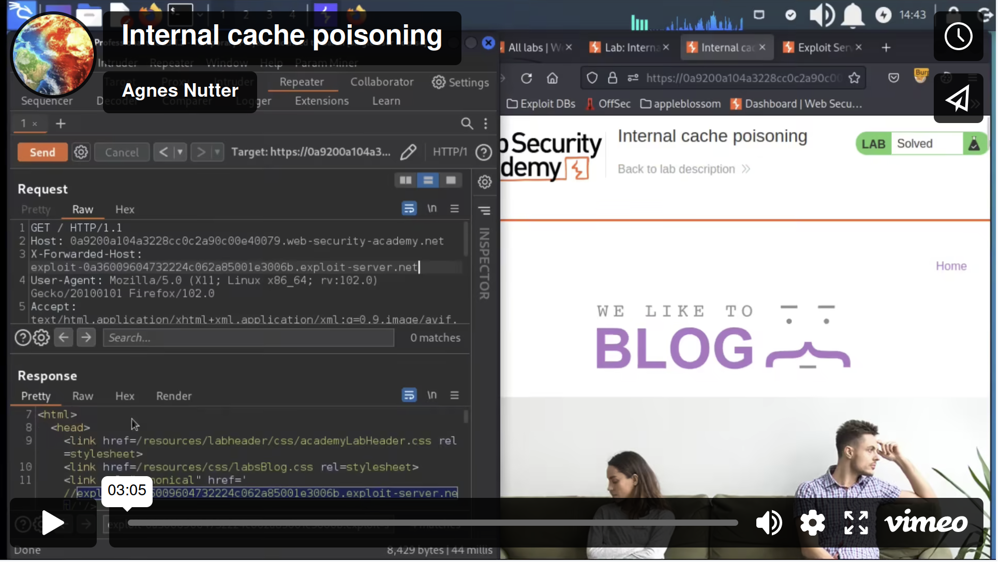

# Internal cache poisoning

## Description

[This lab](https://portswigger.net/web-security/web-cache-poisoning/exploiting-implementation-flaws/lab-web-cache-poisoning-internal) is vulnerable to web cache poisoning. It uses multiple layers of caching. A user regularly visits this site's home page using Chrome.

## Reproduction

1. The home page is a suitable cache oracle and send the `GET /` request to Burp Repeater.
2. Any changes to the query string are reflected in the response. This indicates that the external cache includes this in the cache key. Use Param Miner to add a dynamic cache-buster query parameter. This will allow you to bypass the external cache.
3. The `X-Forwarded-Host` header is supported. Add this to your request, containing your exploit server URL:

```text
X-Forwarded-Host: exploit-server-id.exploit-server.net
```
    
4. Send the request. If you get lucky with your timing, you will notice that the exploit server URL is reflected three times in the response. However, most of the time, you will see that the URL for the canonical link element and the `analytics.js` import now both point to your exploit server, but the `geolocate.js` import URL remains the same.
5. Keep sending the request. Eventually, the URL for the `geolocate.js` resource will also be overwritten with your exploit server URL. This indicates that this fragment is being cached separately by the internal cache. Notice that you've been getting a cache hit for this fragment even with the cache-buster query parameter - the query string is unkeyed by the internal cache.
6. Remove the `X-Forwarded-Host` header and resend the request. Notice that the internally cached fragment still reflects your exploit server URL, but the other two URLs do not. This indicates that the header is unkeyed by the internal cache but keyed by the external one. Therefore, you can poison the internally cached fragment using this header.
7. Go to the exploit server and create a file at `/js/geolocate.js` containing the payload `alert(document.cookie)`. Store the exploit.
8. Back in Burp Repeater, disable the dynamic cache buster in the query string and re-add the `X-Forwarded-Host` header to point to your exploit server.
9. Send the request over and over until all three of the dynamic URLs in the response point to your exploit server. Keep replaying the request to keep the cache poisoned until the victim user visits the page and the lab is solved.

## PoC

[](https://vimeo.com/798886356)

## Exploitability

An attacker will need to poison the internal cache so that the home page executes `alert(document.cookie)` in the victim's browser. 
