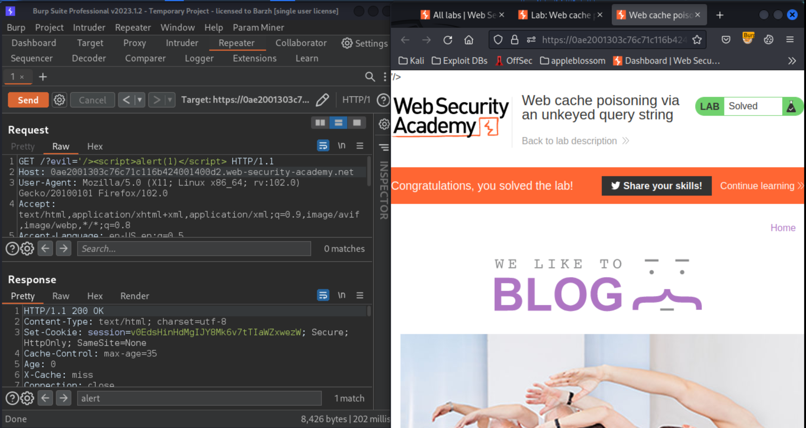

# Web cache poisoning via an unkeyed query string

## Description

[This lab](https://portswigger.net/web-security/web-cache-poisoning/exploiting-implementation-flaws/lab-web-cache-poisoning-unkeyed-query) is vulnerable to web cache poisoning because the query string is unkeyed. A user regularly visits this site's home page using Chrome. 

## Reproduction and proof of concept

1. With Burp running, load the website's home page. In Burp, go to **Proxy -> HTTP history**. Find the `GET` request for the home page. Notice that this page is a potential cache oracle. Send the request to Burp Repeater.
2. Add arbitrary query parameters to the request, for example: 

```text
GET /?parameter1=x&parameter2=evil HTTP/1.1
```

You can still get a cache hit even if you change the query parameters. This indicates that they are not included in the cache key.

3. Notice that you can use the `Origin` header as a cache buster. Add it to your request.
4. When you get a cache miss, notice that your injected parameters are reflected in the response. If the response to your request is cached, you can remove the query parameters and they will still be reflected in the cached response.
5. Add an arbitrary parameter that breaks out of the reflected string and injects an XSS payload:

```text
GET /?evil='/><script>alert(1)</script>
```

6. Keep replaying the request until you see your payload reflected in the response and `X-Cache: hit` in the headers.
7. To simulate the victim, remove the query string from your request and send it again (while using the same cache buster). Check that you still receive the cached response containing your payload.
8. Remove the cache-buster `Origin` header and add your payload back to the query string. Replay the request until you have poisoned the cache for normal users. Confirm this attack has been successful by loading the home page in your browser and observing the popup.
9. The lab will be solved when the victim user visits the poisoned home page. You may need to re-poison the cache if the lab is not solved after 35 seconds.



## Exploitability

An attacker will need to poison the home page with a response that executes alert(1) in the victim's browser.
