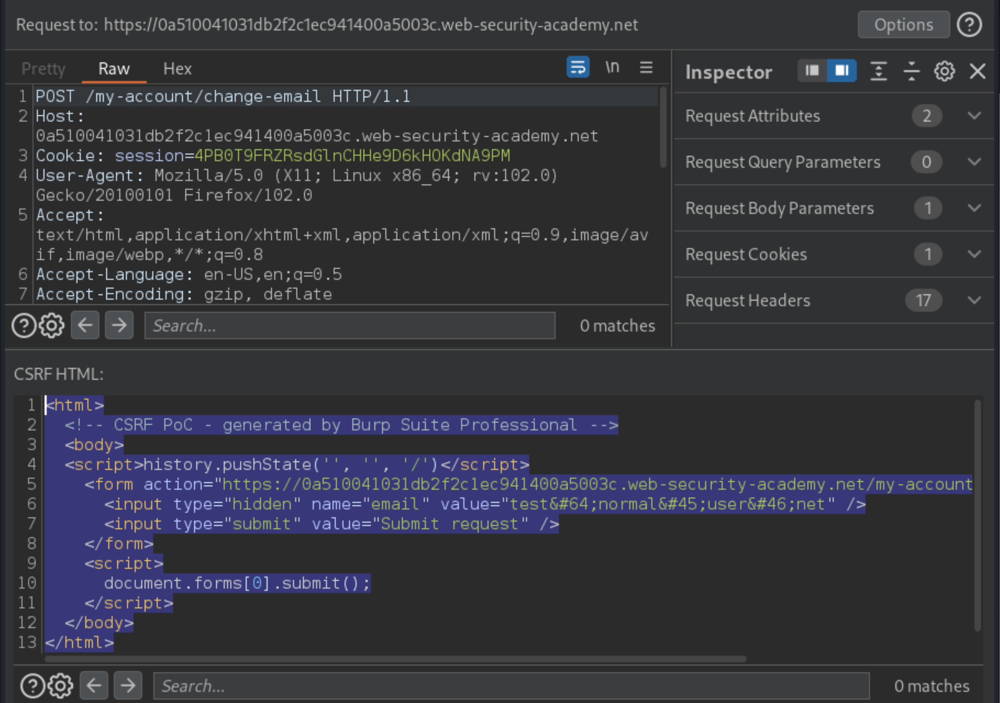
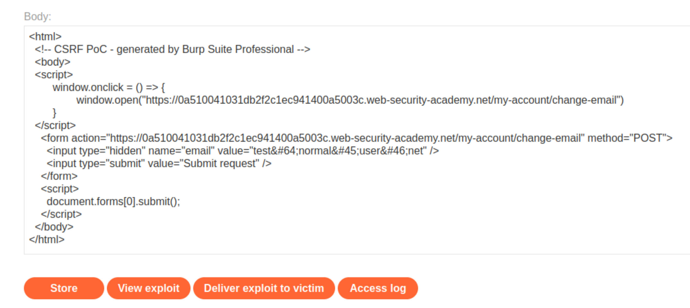

# SameSite Lax bypass via cookie refresh

## Description

[This lab](https://portswigger.net/web-security/csrf/bypassing-samesite-restrictions/lab-samesite-strict-bypass-via-cookie-refresh)'s change email function is vulnerable to [CSRF](https://portswigger.net/web-security/csrf). 

Running out of time, I chose a shortcut for this lab. :)

## Reproduction and proof of concept

### Study the change email function

1. In Burp's browser, log in via your social media account and change your email address.
2. In Burp, go to the **Proxy -> HTTP history** tab.
3. Study the `POST /my-account/change-email` request and notice that this doesn't contain any unpredictable tokens, so may be vulnerable to CSRF if you can bypass any `SameSite` cookie restrictions.
4. Look at the response to the `GET /oauth-callback?code=[...]` request at the end of the OAuth flow. Notice that the website doesn't explicitly specify any SameSite restrictions when setting session cookies. As a result, the browser will use the default `Lax` restriction level.

### Attempt a CSRF attack

1. From the `POST /my-account/change-email` request in Repeater, create a PoC: 

 

2. Copy/paste it in the body of the exploit server.
3. Replace the:

```text
<script>history.pushState('', '', '/')</script>
```

With:

```text
<script>
	window.onclick = () => {
		window.open("")
	}
</script>
```

4. In the `POST /my-account/change-email` request in Repeater, right-click and **Copy URL**.
5. Paste the URL in the `window("")`. The exploit now looks like:

 

6. **Store** and **Deliver to victim**.

## Exploitability

An attacker needs to have a social media account and use an exploit server to host the attack. The lab supports OAuth-based login, and the attacker can log in via a social media account with credentials: `wiener:peter`.
