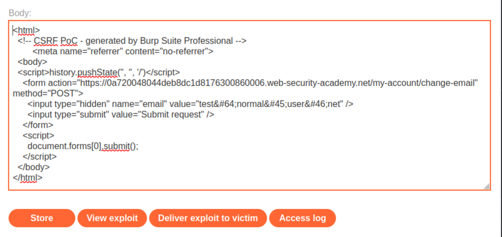

# CSRF where Referer validation depends on header being present

## Description

[This lab](https://portswigger.net/web-security/csrf/bypassing-referer-based-defenses/lab-referer-validation-depends-on-header-being-present)'s email change functionality is vulnerable to CSRF. It attempts to block cross domain requests but has an insecure fallback. 

## Reproduction and proof of concept

1. Open Burp's browser and log in to your account. Submit the "Update email" form, and find the resulting request in your Proxy history.
2. Send the request to Burp Repeater and observe that if you change the domain in the Referer HTTP header then the request is rejected.
3. Delete the Referer header entirely and observe that the request is now accepted.
4. Create and host a proof of concept exploit as described in the solution to the CSRF vulnerability with no defenses lab (above). Include the following HTML to suppress the Referer header:

```text
<meta name="referrer" content="no-referrer">
```

    

5. **Store** the exploit, then click **Deliver to victim**.

## Exploitability

An attacker needs to have an account and use an exploit server to host an HTML page that uses a CSRF attack to change the viewer's email address. 
