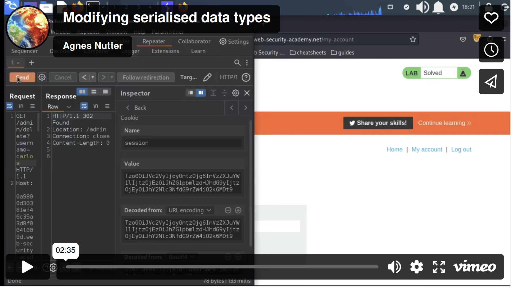

# Modifying serialised data types

## Description

[This lab](https://portswigger.net/web-security/deserialization/exploiting/lab-deserialization-modifying-serialized-data-types) uses a serialisation-based session mechanism and is vulnerable to authentication bypass as a result. 

## Reproduction

1. Log in using with `wiener:peter`. In Burp, open the post-login `GET /my-account` request and examine the session cookie using the Inspector to reveal a serialized PHP object. Send this request to Burp Repeater.
2. In Burp Repeater, use the Inspector panel to modify the session cookie as follows:
* Update the length of the username attribute to `13`.
* Change the username to `administrator`.
* Change the access token to the integer `0`. As this is no longer a string, you also need to remove the double-quotes surrounding the value.
* Update the data type label for the access token by replacing `s` with `i`.

The result should look like this:

```text
O:4:"User":2:{s:8:"username";s:13:"administrator";s:12:"access_token";i:0;}
```
    
2. Click "Apply changes". The modified object will automatically be re-encoded and updated in the request.
3. Send the request. Notice that the response now contains a link to the admin panel at `/admin`, indicating that you have successfully accessed the page as the administrator user.
4. Change the path of your request to `/admin` and resend it. Notice that the `/admin` page contains links to delete specific user accounts.
5. Change the path of your request to `/admin/delete?username=carlos` and send the request to solve the lab.

## PoC

[](https://vimeo.com/798944911)

## Exploitability

An attacker will need to log in; edit the serialized object in the session cookie to access the administrator account; and delete Carlos' account. 
