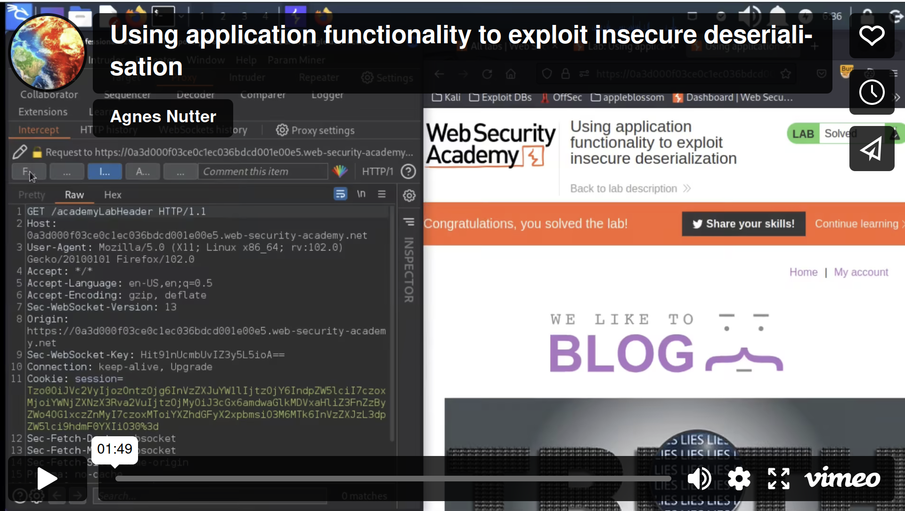

# Using application functionality to exploit insecure deserialisation

## Description

[This lab](https://portswigger.net/web-security/deserialization/exploiting/lab-deserialization-using-application-functionality-to-exploit-insecure-deserialization) uses a serialization-based session mechanism. A certain feature invokes a dangerous method on data provided in a serialized object.

## Reproduction

1. Log in to `wiener:peter`. On the **My account** page, there is an option to delete the account by sending a `POST` request to `/my-account/delete`.
2. Intercept the request. 
3. Study the session cookie using the Inspector panel. The serialised object has an `avatar_link` attribute, which contains the file path to your avatar.
4. Edit the serialised data so that the `avatar_link` points to `/home/carlos/morale.txt`. Update the length indicator. The modified attribute looks like this:

```text
s:11:"avatar_link";s:23:"/home/carlos/morale.txt"
```
    
5. Click **Apply changes**. The modified object will automatically be re-encoded and updated in the request.
6. Forward the request. Your account will be deleted, along with Carlos's `morale.txt` file.

## PoC

[](https://vimeo.com/799082569)

## Exploitability

An attacker will need to log in to `wiener:peter`; edit the serialised object in the session cookie and use it to delete the `morale.txt` file from Carlos's home directory. 
