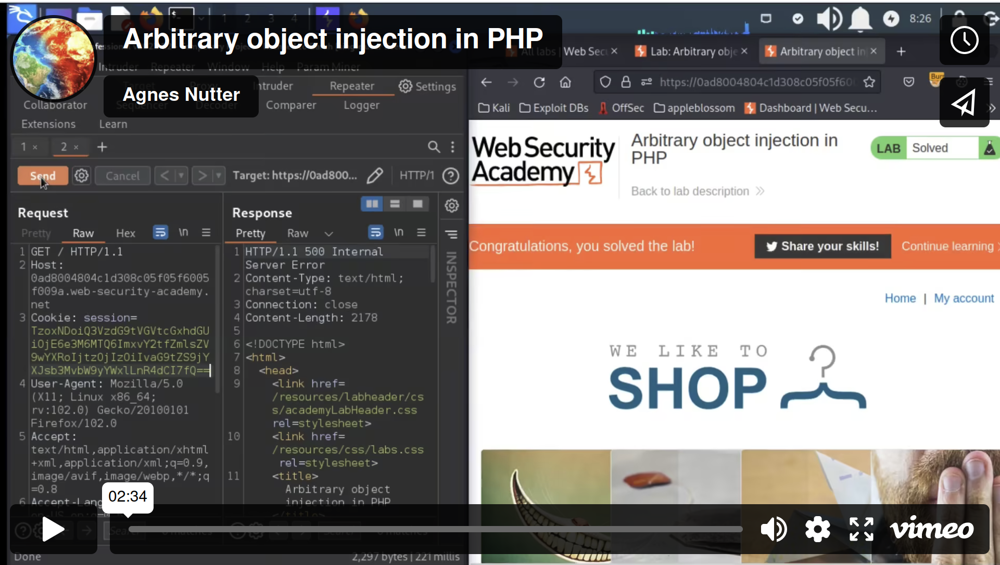

# Arbitrary object injection in PHP

## Description

[This lab](https://portswigger.net/web-security/deserialization/exploiting/lab-deserialization-arbitrary-object-injection-in-php) uses a serialisation-based session mechanism and is vulnerable to arbitrary object injection as a result. 

## Reproduction

1. Log in to the site with the `wiener:peter` account. The session cookie contains a serialised PHP object.
2. From the site map, notice that the website references the file `/libs/CustomTemplate.php`. Right-click on the file and select **Send to Repeater**.
3. In Burp Repeater, read the source code by appending a tilde (`~`) to the filename in the request line.

```text

```

4. In the source code, the `CustomTemplate` class contains the `__destruct()` magic method. This will invoke the `unlink()` method on the `lock_file_path` attribute, which will delete the file on this path.
5. In Burp Decoder, use the correct syntax for serialised PHP data to create a `CustomTemplate` object with the `lock_file_path` attribute set to `/home/carlos/morale.txt`. Make sure to use the correct data type labels and length indicators. The final object should look like this:

```text
O:14:"CustomTemplate":1:{s:14:"lock_file_path";s:23:"/home/carlos/morale.txt";}
```
    
6. Base64 and URL-encode this object and save it to the clipboard.
7. Send a request containing the session cookie to Burp Repeater.
8. In Burp Repeater, replace the session cookie with the modified cookie in the clipboard.
9. Send the request. The `__destruct()` magic method is automatically invoked and will delete Carlos's file.

## PoC

[](https://vimeo.com/799116736)

## Exploitability

An attacker will need to log in to `wiener:peter`; create and inject a malicious serialized object to delete the morale.txt file from Carlos's home directory. An attacker will need to obtain source code access to solve this lab. 
