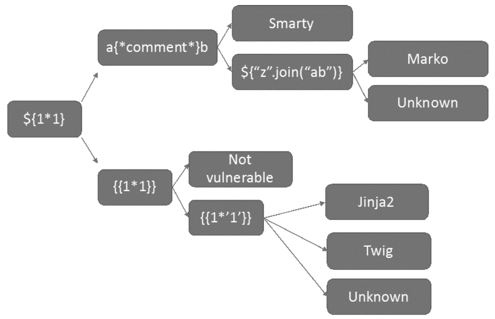

# What to look for

## XSS

To detect most of the [XSS vulnerabilities](../exploit/xss.md) in web applications, the basic tool to detect, analyse, and exploit them, is an HTTP proxy like Zap or Burp to analyse each HTTP request made by the application. And field by field, modify the content with some basic testing strings.

## Open redirects

There are some redirections that are easy to detect – most [open redirections](../exploit/redirects.md) use a GET request. Others are a little more difficult to detect in simple view and need the use of the HTTP proxy to confirm them.

## Clickjacking

[Clickjacking vulnerabilities](../exploit/clickjacking.md) are valuable only when the target page contains state-changing actions. Look for pages that allow users to make changes to their accounts, like changing their account details or settings. Also check that the action can be achieved via clicks alone.

## CSRF

To detect [CSRF flaws](../exploit/csrf.md) in an application, it is important to navigate through the entire application, trying to map all the called methods to identify which are important due to the kind of processing it has. Find out how they are called, which parameters are sent to the application, if there is any anti-CSRF protection, and if it is a known vulnerable protection. Also, if protected, try to find an error. The information needed to exploit the vulnerability could be in another application's request.

## IDOR

To detect [IDOR vulnerabilities](../exploit/idor.md), use Burp Suite’s `HTTPHistory` for checking requests. The `HTTPHistory` feature shows all the traffic between the device (browser, phone, tablet) and the application's server. Also, you can use Burp's scope feature for fast testing. The scope feature can be useful to make a target list and showing only relevant data for the chosen testing scope.

## SQL

The only way to know if an input source is potentially [SQLi vulnerable](../exploit/sqli.md) is to trigger anomalies in the tested webpage or application. In order to do this, the attacker must submit input values that are likely to be incorrectly handled. This technique (named fuzzing) will not yet confirm that an SQL injection flaw is present, but it will help finding what needs further testing.

Classic SQL injections are the easiest to find and exploit. In classic SQL injections, the results of the SQL query are returned directly to the attacker in an HTTP response. There are two subtypes: UNION based and error based.

Blind SQL injections are a little harder to detect and exploit. They happen when attackers cannot directly extract information from the database because the application does not return SQL data or descriptive error messages. In this case, attackers can infer information by sending SQL injection payloads to the server and observing its subsequent behaviour. Blind SQL injections have two subtypes as well: Boolean based and time based.

## Race conditions

Attackers use [race conditions](../exploit/race.md) to subvert access controls. In theory, any application whose sensitive actions rely on access-control mechanisms could be vulnerable. Most of the time, race conditions occur in features that deal with numbers, such as online voting, online gaming scores, bank transfers, e-commerce payments, and gift card balances. Look for these features in an application and take note of the request involved in updating these numbers.

## XXE

An [XML External Entity](../exploit/xxe.md) attack is a type of attack against an application that parses XML input.

If it's possible, download an XML document generated by the application so you know the structure. If not possible, create a simple template which can be modified to discover its structure.

* See if it's possible to add a reference to a resource; a good trick that's commonly used by attackers is to generate a reverse response that could be captured in a server where we have control
* If it's not possible to add an external reference, but you receive an error, modify the request and submit tags. If the error disappears, it means that the parser is accepting the tags as valid, so it might be vulnerable.
* You can also try entering data before or in the middle of the tags, as it needs to be valid for the parser, and sometimes the parser is waiting for a value. If this continues without any errors, try to create a reference to a resource, internal or external, and look at the result.

## SSTI

[SSTIs](../exploit/ssti.md) can appear in two contexts:

* Plaintext: It is possible to directly input HTML into the application, for example, in a text editor. 
* Code: Values entered are processed by the application and return a result. Usually these kind result in XSS attacks, due to the evaluated input, so, if you enter an `alert()` function, it will be shown.

Once you detect that there's SSTI, using an invalid input and getting a result, try to determine which template engine is used, because although all of them working in similar ways, they have important differences:

|  |
|:--:|
| Based on the input and by following it, you can determine which is the engine used by the  application in some cases. |

## SOP

Determine whether the target is using an [SOP-relaxation](../exploit/sop.md) technique by looking for the signatures of each SOP-relaxation technique. When you’re browsing a web application, open your proxy and look for any signs of cross-origin communication. For example:

* CORS sites will often return HTTP responses that contain an `Access-Control-Allow-Origin` header. 
* A site could be using `postMessage()` if you inspect a page (for example, by right-clicking it in Chrome and choosing Inspect, then navigating to Event Listeners) and find a message event listener.
* A site could be using `JSONP` if you see a URL being loaded in a `script` tag with a `callback` function.

## Resources

* [Zaproxy on Kali](red-iac:docs/lab/zap)
* [ZAP Getting Started](https://www.zaproxy.org/getting-started/)
* [ZAP Baseline scan](https://www.zaproxy.org/docs/docker/baseline-scan/)
* [ZAP Full scan](https://www.zaproxy.org/docs/docker/full-scan/)
