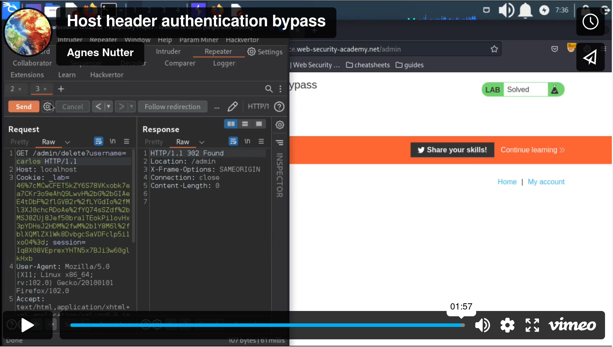

# Host header authentication bypass

## Description

[This lab](https://portswigger.net/web-security/host-header/exploiting/lab-host-header-authentication-bypass) makes an assumption about the privilege level of the user based on the HTTP Host header.

## Reproduction

1. Send the `GET /` request that received a `200` response to Burp Repeater. Notice that you can change the Host header to an arbitrary value and still successfully access the home page.
2. Browse to `/robots.txt` and observe that there is an admin panel at `/admin`.
3. Try and browse to ``/admin``. You do not have access, but notice the error message, which reveals that the panel can be accessed by local users.
4. Send the `GET /admin` request to Burp Repeater.
5. In Burp Repeater, change the Host header to `localhost` and send the request. Observe that you have now successfully accessed the admin panel, which provides the option to delete different users.
6. Change the request line to ``GET /admin/delete?username=carlos`` and send the request to delete Carlos and solve the lab.

## PoC

## Exploitability

An attacker will need to access the admin panel and delete Carlos's account. 
