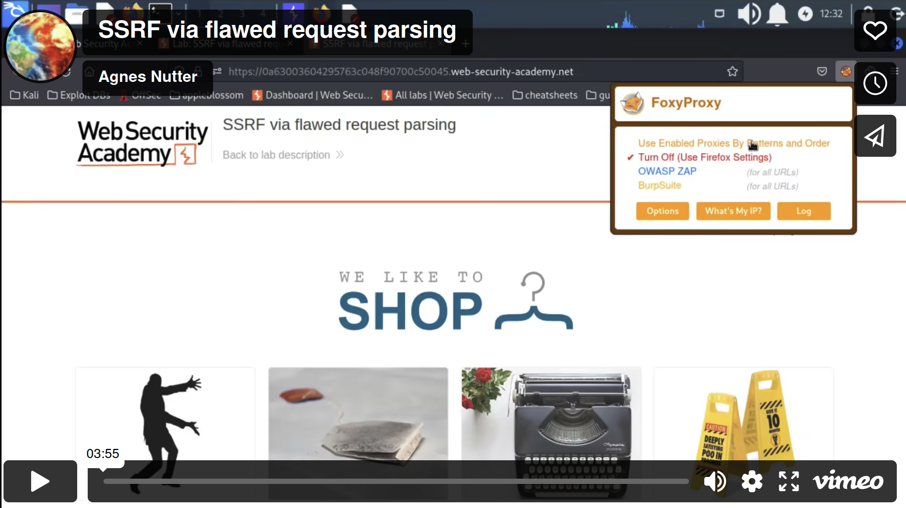

# SSRF via flawed request parsing

## Description

[This lab](https://portswigger.net/web-security/host-header/exploiting/lab-host-header-ssrf-via-flawed-request-parsing) is vulnerable to routing-based SSRF due to its flawed parsing of the request's intended host. This can be exploited to access an insecure intranet admin panel located at an internal IP address. 

## Reproduction

1. Send the `GET /` request that received a `200` response to Burp Repeater and study the lab's behaviour. Observe that the website validates the Host header and blocks any requests in which it has been modified.
2. Observe that you can also access the home page by supplying an absolute URL in the request line as follows:

```text
GET https://lab-id.web-security-academy.net/
```

3. Notice that when you do this, modifying the Host header no longer causes your request to be blocked. Instead, you receive a timeout error. This suggests that the absolute URL is being validated instead of the Host header.
4. Use Burp Collaborator client to confirm that you can make the website's middleware issue requests to an arbitrary server in this way. For example, the following request will trigger an HTTP request to your Collaborator server:

```text
GET https://lab-id.web-security-academy.net/
Host: BURP-COLLABORATOR-SUBDOMAIN
```

5. Right-click and select "Insert Collaborator payload" to insert a Burp Collaborator subdomain where indicated in the request.
6. Send the request containing the absolute URL to Burp Intruder. Use the Host header to scan the IP range `192.168.0.0/24` to identify the IP address of the admin interface. Send this request to Burp Repeater.
7. In Burp Repeater, append `/admin` to the absolute URL in the request line and send the request. Observe that you now have access to the admin panel, including a form for deleting users.
8. Change the absolute URL in your request to point to `/admin/delete`. Copy the `CSRF` token from the displayed response and add it as a `query` parameter to your request. Also add a `username` parameter containing `carlos`. The request line should now look like this but with a different `CSRF` token:

```text
GET https://lab-id.web-security-academy.net/admin/delete?csrf=QCT5OmPeAAPnyTKyETt29LszLL7CbPop&username=carlos
```

9. Send the request to delete Carlos and solve the lab.

## PoC

[](https://vimeo.com/802284495)

## Exploitability

An attacker will need to access the internal admin panel located in the `192.168.0.0/24` range, then delete Carlos. _Note: To prevent the Academy platform being used to attack third parties, the firewall blocks interactions between the labs and arbitrary external systems. To solve the lab, use Burp Collaborator's default public server._ 
