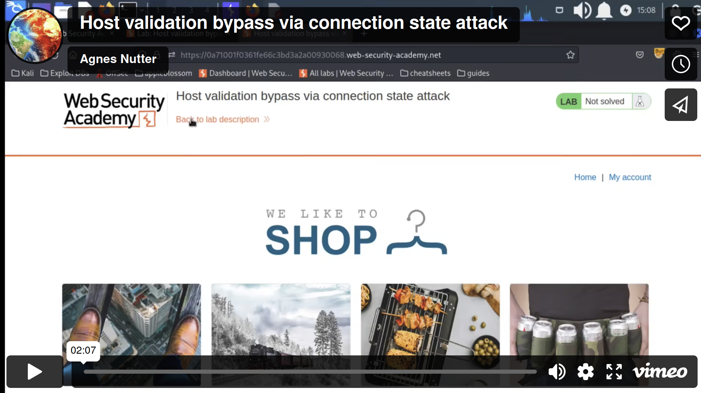

# Host validation bypass via connection state attack

## Description

[This lab](https://portswigger.net/web-security/host-header/exploiting/lab-host-header-host-validation-bypass-via-connection-state-attack) is vulnerable to routing-based SSRF via the Host header. Although the front-end server may initially appear to perform robust validation of the Host header, it makes assumptions about all requests on a connection based on the first request it receives. Also see [Browser-Powered Desync Attacks: A New Frontier in HTTP Request Smuggling: Connection state attacks](https://portswigger.net/research/browser-powered-desync-attacks#state).

## Reproduction

1. Send the `GET /` request to Burp Repeater.
2. Make the following adjustments:
* Change the path to `/admin`.
* Change Host header to `192.168.0.1`.
3. Send the request. Observe that you are simply redirected to the homepage.
4. Duplicate the tab, then add both tabs to a new group.
5. Select the first tab and make the following adjustments:
* Change the path back to `/`.
* Change the `Host` header back to `lab-id.web-security-academy.net`.
6. Using the drop-down menu next to the Send button, change the send mode to Send group in sequence (single connection).
7. Change the `Connection` header to `keep-alive`.
8. Send the sequence and check the responses. Observe that the second request has successfully accessed the admin panel.
9. Study the response and observe that the admin panel contains an HTML form for deleting a given user. Make a note of the following details:
* The `action` attribute (`/admin/delete`)
* The `name` of the input (`username`)
* The `csrf` token.
10. On the second tab in your group, use these details to replicate the request that would be issued when submitting the form. The result should look something like this:

```text
POST /admin/delete HTTP/1.1
Host: 192.168.0.1
Cookie: _lab=YOUR-LAB-COOKIE; session=YOUR-SESSION-COOKIE
Content-Type: x-www-form-urlencoded
Content-Length: CORRECT

csrf=YOUR-CSRF-TOKEN&username=carlos
```

11. Send the requests in sequence down a single connection to solve the lab.

## PoC

[](https://vimeo.com/802306700/)

## Exploitability

An attacker will need to exploit the lab's behaviour to access an internal admin panel located at `192.168.0.1/admin`, then delete the user carlos. 
