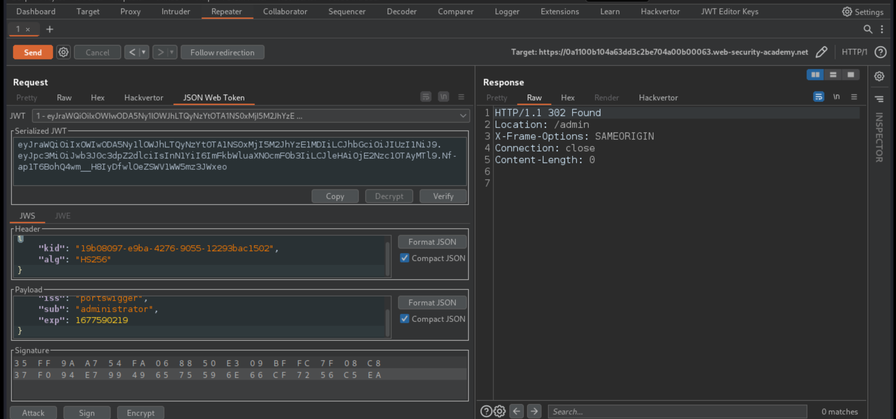

# JWT authentication bypass via weak signing key

## Description

[This lab](https://portswigger.net/web-security/jwt/lab-jwt-authentication-bypass-via-weak-signing-key) uses a JWT-based mechanism for handling sessions. It uses an extremely weak secret key to both sign and verify tokens. This can be easily brute-forced using a [wordlist of common secrets](https://github.com/wallarm/jwt-secrets/blob/master/jwt.secrets.list).

## Reproduction and proof of concept

### Brute-force the secret key

1. In Burp, load the [JWT Editor extension](https://portswigger.net/bappstore/26aaa5ded2f74beea19e2ed8345a93dd) from the BApp store.
2. In the lab, log in to your own account and send the post-login `GET /my-account` request to Burp Repeater.
3. In Burp Repeater, change the path to `/admin` and send the request. Observe that the admin panel is only accessible when logged in as the administrator user.
4. Copy the JWT and brute-force the secret. You can do this using hashcat and the [wordlist of well-known secrets](https://github.com/wallarm/jwt-secrets/blob/master/jwt.secrets.list):

```text
hashcat -a 0 -m 16500 <YOUR-JWT> /path/to/jwt.secrets.list
```
    
5. If you're using hashcat, this outputs the JWT, followed by the secret. If everything worked correctly, this should reveal that the weak secret is `secret1`.

### Generate a forged signing key

1. Using Burp Decoder, Base64 encode the secret that you brute-forced in the previous section.

```text
c2VjcmV0MQ==
```

2. In Burp, go to the **JWT Editor Keys** tab and click **New Symmetric Key**. In the dialog, click **Generate** to generate a new key in JWK format. Note that you don't need to select a key size as this will automatically be updated later.
3. Replace the generated value for the `k` property with the Base64-encoded secret.

```text
{
    "kty": "oct",
    "kid": "dcae7212-244c-4a69-a24d-5639fdf4d3ed",
    "k": "c2VjcmV0MQ=="
}
```

4. Click OK to save the key.

### Modify and sign the JWT

1. Go back to the `GET /admin` request in Burp Repeater and switch to the extension-generated **JSON Web Token message editor** tab.
2. In the payload, change the value of the `sub` claim to `administrator`.
3. At the bottom of the tab, click **Sign**, then select the key that you generated in the previous section.
4. Make sure that the `Don't modify header` option is selected, then click **OK**. The modified token is now signed with the correct signature.
5. Send the request and observe that you have successfully accessed the admin panel.



6. In the response, find the URL for deleting Carlos (`/admin/delete?username=carlos`). Send the request to this endpoint to solve the lab.

## Exploitability

An attacker will need to log in to `wiener:peter`; brute-force the website's secret key; use it to sign a modified session token that gives access to the admin panel at `/admin`; then delete the user `carlos`. 
