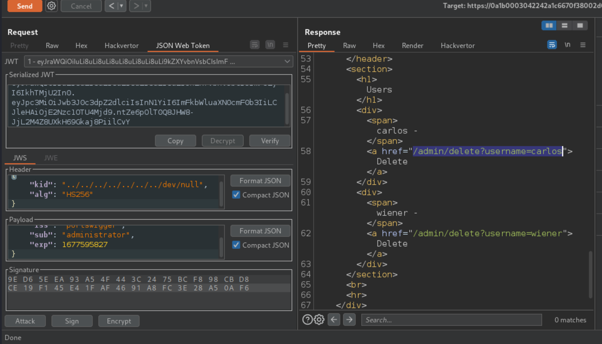

# JWT authentication bypass via kid header path traversal

## Description

[This lab](https://portswigger.net/web-security/jwt/lab-jwt-authentication-bypass-via-kid-header-path-traversal) uses a JWT-based mechanism for handling sessions. In order to verify the signature, the server uses the `kid` parameter in JWT header to fetch the relevant key from its filesystem. 

## Reproduction and proof of concept

Generate a suitable signing key

1. In Burp, [JWT Editor extension](https://portswigger.net/bappstore/26aaa5ded2f74beea19e2ed8345a93dd) from the BApp store.
2. In the lab, log in to your own account and send the post-login `GET /my-account` request to Burp Repeater.
3. In Burp Repeater, change the path to `/admin` and send the request. Observe that the admin panel is only accessible when logged in as the administrator user.
4. Go to the **JWT Editor Keys** tab in Burp's main tab bar.
5. Click **New Symmetric Key**.
6. In the dialog, click Generate to generate a new key in JWK format. Note that you don't need to select a key size as this will automatically be updated later.
7. Replace the generated value for the `k` property with a Base64-encoded null byte (`AA==`).
8. Click **OK** to save the key.

### Modify and sign the JWT

1. Go back to the `GET /admin` request in Burp Repeater and switch to the extension-generated **JSON Web Token message** editor tab.
2. In the header of the JWT, change the value of the `kid` parameter to a path traversal sequence pointing to the `/dev/null` file:

```text
../../../../../../../dev/null
```
    
3. In the JWT payload, change the value of the `sub` claim to `administrator`.
4. At the bottom of the tab, click **Sign**, then select the symmetric key that you generated in the previous section.
5. Make sure that the `Don't modify header` option is selected, then click **OK**. The modified token is now signed using a null byte as the secret key.
6. Send the request and observe that you have successfully accessed the admin panel.
7. In the response, find the URL for deleting Carlos (`/admin/delete?username=carlos`). 



Send the request to this endpoint to solve the lab.

## Exploitability

An attacker will need to log in to `wiener:peter`; forge a JWT that gives access to the admin panel at `/admin`, then delete the user `carlos`. 
