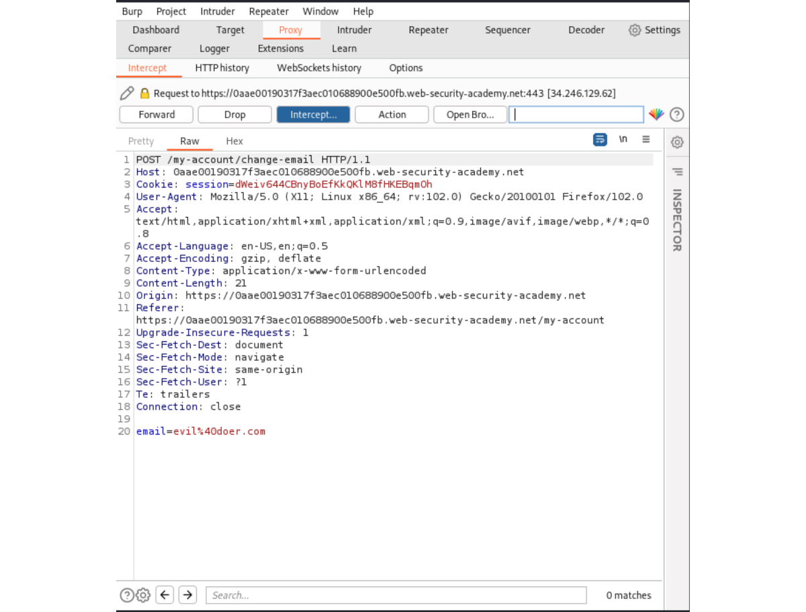
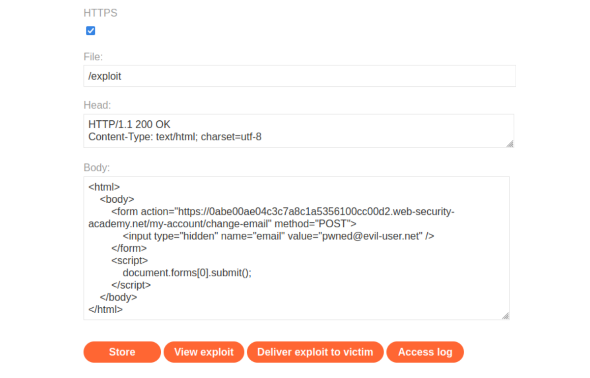

# Cross-site request forgery (CSRF)

## CSRF vulnerability with no defenses

### Description

[This lab](https://portswigger.net/web-security/csrf/lab-no-defenses)'s email change functionality is vulnerable to CSRF.  

### Proof of Concept

1. Log in and intercept updating email (which is vulnerable):



2. To create the exploit, put the correct parameters in the template given in [Cross-site request forgery (CSRF)](https://portswigger.net/web-security/csrf):

```text
<html>
    <body>
        <form action="https://0abe00ae04c3c7a8c1a5356100cc00d2.web-security-academy.net/my-account/change-email" method="POST">
            <input type="hidden" name="email" value="pwned@evil-user.net" />
        </form>
        <script>
            document.forms[0].submit();
        </script>
    </body>
</html>
```

3. Paste the exploit in the `body` field of the exploit server form (link to exploit server is up top):



4. To verify that the exploit works, try it by clicking **View exploit**, turning intercept on again, and checking the resulting HTTP request and response. 
5. Click **Deliver to victim** to solve the lab. 

### Exploitability

An attacker needs to craft some HTML that uses a CSRF attack to change the viewer's email address and upload it to the exploit server. An account with credentials `wiener:peter` is available.

----

## CSRF where token validation depends on request method

### Description

[This lab](https://portswigger.net/web-security/csrf/bypassing-token-validation/lab-token-validation-depends-on-request-method)'s email change functionality is vulnerable to CSRF. It attempts to block CSRF attacks, but only applies defenses to certain types of requests. 

### Proof of Concept

1. Open Burp's browser and log in to your account. Submit the "Update email" form, and find the resulting request in your Proxy history.
2. Send the request to Burp Repeater and observe that if you change the value of the csrf parameter then the request is rejected.
3. Use "Change request method" on the context menu to convert it into a GET request and observe that the CSRF token is no longer verified.
4. If you're using Burp Suite Professional, right-click on the request, and from the context menu select Engagement tools / Generate CSRF PoC. Enable the option to include an auto-submit script and click "Regenerate".

Alternatively, if you're using Burp Suite Community Edition, use the following HTML template. You can get the request URL by right-clicking and selecting "Copy URL".

```text
<form action="https://YOUR-LAB-ID.web-security-academy.net/my-account/change-email">
    <input type="hidden" name="email" value="anything%40web-security-academy.net">
</form>
<script>
        document.forms[0].submit();
</script>
```

5. Go to the exploit server, paste your exploit HTML into the **Body** field, and click **Store**.
6. To verify if the exploit will work, try it out by clicking **View exploit** and checking the resulting HTTP request and response.
7. Click **Deliver to victim**.

### Exploitability

An attacker needs to use the exploit server to host an HTML page that uses a CSRF attack to change the viewer's email address. There is an accounts on the application that can be used to design the attack. The credentials are`wiener:peter`.

----

## CSRF where token validation depends on token being present

### Description

[This lab](https://portswigger.net/web-security/csrf/bypassing-token-validation/lab-token-validation-depends-on-token-being-present)'s email change functionality is vulnerable to CSRF. 

### Proof of Concept

1. Open Burp's browser and log in to your account. Submit the "Update email" form, and find the resulting request in your Proxy history.
2. Send the request to Burp Repeater and observe that if you change the value of the csrf parameter then the request is rejected.
3. Delete the csrf parameter entirely and observe that the request is now accepted.
4. If you're using Burp Suite Professional, right-click on the request, and from the context menu select Engagement tools / Generate CSRF PoC. Enable the option to include an auto-submit script and click "Regenerate".

Alternatively, if you're using Burp Suite Community Edition, use the following HTML template. You can get the request URL by right-clicking and selecting "Copy URL".

```text
<form method="POST" action="https://YOUR-LAB-ID.web-security-academy.net/my-account/change-email">
    <input type="hidden" name="$param1name" value="$param1value">
</form>
<script>
    document.forms[0].submit();
</script>
```

5. Go to the exploit server, paste your exploit HTML into the **Body** field, and click **Store**.
6. To verify if the exploit will work, try it out by clicking **View exploit** and checking the resulting HTTP request and response.
7. Click **Deliver to victim**.

### Exploitability

An attacker needs to use the exploit server to host an HTML page that uses a CSRF attack to change the viewer's email address. There is an accounts on the application that can be used to design the attack. The credentials are`wiener:peter`.

----

## CSRF where token is not tied to user session

### Description

[This lab](https://portswigger.net/web-security/csrf/bypassing-token-validation/lab-token-not-tied-to-user-session)'s email change functionality is vulnerable to CSRF. It uses tokens to try to prevent CSRF attacks, but they aren't integrated into the site's session handling system.  

### Proof of Concept

1. Open Burp's browser and log in to your account. Submit the "Update email" form, and intercept the resulting request.
2. Make a note of the value of the CSRF token, then drop the request.
3. Open a private/incognito browser window, log in to your other account, and send the update email request into Burp Repeater.
4. Observe that if you swap the CSRF token with the value from the other account, then the request is accepted.
5. Create and host a proof of concept exploit as described in the solution to the CSRF vulnerability with no defenses lab (above). Note that the CSRF tokens are single-use, so you'll need to include a fresh one.
6. **Store** the exploit, then click **Deliver to victim**.

### Exploitability

An attacker needs to use the exploit server to host an HTML page that uses a CSRF attack to change the viewer's email address. There are two accounts on the application that can be used to design the attack. The credentials are as follows, `wiener:peter` and `carlos:montoya`.

----

## CSRF where token is tied to non-session cookie

### Description

[This lab](https://portswigger.net/web-security/csrf/bypassing-token-validation/lab-token-tied-to-non-session-cookie)'s email change functionality is vulnerable to CSRF. It uses tokens to try to prevent CSRF attacks, but they aren't fully integrated into the site's session handling system. 

### Proof of Concept

1. Open Burp's browser and log in to your account. Submit the "Update email" form, and find the resulting request in your Proxy history.
2. Send the request to Burp Repeater and observe that changing the session cookie logs you out, but changing the `csrfKey` cookie merely results in the CSRF token being rejected. This suggests that the `csrfKey` cookie may not be strictly tied to the session.
3. Open a private/incognito browser window, log in to your other account, and send a fresh update email request into Burp Repeater.
4. Observe that if you swap the `csrfKey` cookie and csrf parameter from the first account to the second account, the request is accepted.
5. Close the Repeater tab and incognito browser.
6. Back in the original browser, perform a search, send the resulting request to Burp Repeater, and observe that the search term gets reflected in the `Set-Cookie` header. Since the search function has no CSRF protection, you can use this to inject cookies into the victim user's browser.
7. Create a URL that uses this vulnerability to inject your csrfKey cookie into the victim's browser:

```text
/?search=test%0d%0aSet-Cookie:%20csrfKey=YOUR-KEY%3b%20SameSite=None
```
    
8. Create and host a proof of concept exploit as described in the solution to the CSRF vulnerability with no defenses lab (above), ensuring that you include your CSRF token. The exploit should be created from the email change request.
9. Remove the auto-submit `script` block, and instead add the following code to inject the cookie:

```text

```

10. **Store** the exploit, then click **Deliver to victim**.

### Exploitability

An attacker needs to use the exploit server to host an HTML page that uses a CSRF attack to change the viewer's email address. There are two accounts on the application that can be used to design the attack. The credentials are as follows, `wiener:peter` and `carlos:montoya`.

----

## CSRF where token is duplicated in cookie

### Description

[This lab](https://portswigger.net/web-security/csrf/bypassing-token-validation/lab-token-duplicated-in-cookie)'s email change functionality is vulnerable to CSRF. It attempts to use the insecure "double submit" CSRF prevention technique. 

### Proof of Concept

1. Open Burp's browser and log in to your account. Submit the "Update email" form, and find the resulting request in your Proxy history.
2. Send the request to Burp Repeater and observe that the value of the csrf body parameter is simply being validated by comparing it with the csrf cookie.
3. Perform a search, send the resulting request to Burp Repeater, and observe that the search term gets reflected in the Set-Cookie header. Since the search function has no CSRF protection, you can use this to inject cookies into the victim user's browser.
4. Create a URL that uses this vulnerability to inject a fake csrf cookie into the victim's browser:

```text
/?search=test%0d%0aSet-Cookie:%20csrf=fake%3b%20SameSite=None
```
    
5. Create and host a proof of concept exploit as described in the solution to the CSRF vulnerability with no defenses lab (above), ensuring that your CSRF token is set to "fake". The exploit should be created from the email change request.
6. Remove the auto-submit `script` block and instead add the following code to inject the cookie and submit the form:

```text

```

7. **Store** the exploit, then click **Deliver to victim**.

### Exploitability

An attacker needs to use the exploit server to host an HTML page that uses a CSRF attack to change the viewer's email address. 

----

## CSRF where Referer validation depends on header being present

### Description

[This lab](https://portswigger.net/web-security/csrf/bypassing-referer-based-defenses/lab-referer-validation-depends-on-header-being-present)'s email change functionality is vulnerable to CSRF. It attempts to block cross domain requests but has an insecure fallback. 

### Proof of Concept

1. Open Burp's browser and log in to your account. Submit the "Update email" form, and find the resulting request in your Proxy history.
2. Send the request to Burp Repeater and observe that if you change the domain in the Referer HTTP header then the request is rejected.
3. Delete the Referer header entirely and observe that the request is now accepted.
4. Create and host a proof of concept exploit as described in the solution to the CSRF vulnerability with no defenses lab (above). Include the following HTML to suppress the Referer header:

```text
<meta name="referrer" content="no-referrer">
```

5. **Store** the exploit, then click **Deliver to victim**.

### Exploitability

An attacker needs to use the exploit server to host an HTML page that uses a CSRF attack to change the viewer's email address. 

----

## CSRF with broken Referer validation

### Description

[This lab](https://portswigger.net/web-security/csrf/bypassing-referer-based-defenses/lab-referer-validation-broken)'s email change functionality is vulnerable to CSRF. It attempts to detect and block cross domain requests, but the detection mechanism can be bypassed.

### Proof of Concept

1. Open Burp's browser and log in to your account. Submit the "Update email" form, and find the resulting request in your Proxy history.
2. Send the request to Burp Repeater. Observe that if you change the domain in the Referer HTTP header, the request is rejected.
3. Copy the original domain of your lab instance and append it to the Referer header in the form of a query string. The result should look something like this:

```text
Referer: https://arbitrary-incorrect-domain.net?lab-id.web-security-academy.net
```
    
4. Send the request and observe that it is now accepted. The website seems to accept any Referer header as long as it contains the expected domain somewhere in the string.
5. Create a CSRF proof of concept exploit as described in the solution to the CSRF vulnerability with no defenses lab (above) and host it on the exploit server. Edit the JavaScript so that the third argument of the `history.pushState()` function includes a query string with your lab instance URL as follows:

```text
history.pushState("", "", "/?YOUR-LAB-ID.web-security-academy.net")
```

This will cause the Referer header in the generated request to contain the URL of the target site in the query string, just like we tested earlier.

6. If you store the exploit and test it by clicking "View exploit", you may encounter the "invalid Referer header" error again. This is because many browsers now strip the query string from the Referer header by default as a security measure. To override this behaviour and ensure that the full URL is included in the request, go back to the exploit server and add the following header to the "Head" section:

```text
Referrer-Policy: unsafe-url
```
    
Note that unlike the normal Referer header, the word "referrer" must be spelled correctly in this case.
7. **Store** the exploit, then click **Deliver to victim**.

### Exploitability

An attacker needs to use the exploit server to host an HTML page that uses a CSRF attack to change the viewer's email address. 
