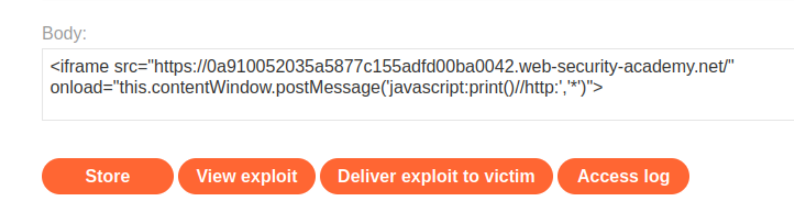

# DOM-based vulnerabilities

## DOM XSS using web messages

[This lab](https://portswigger.net/web-security/dom-based/controlling-the-web-message-source/lab-dom-xss-using-web-messages) demonstrates a simple web message vulnerability. 

### Reproduction and proof of concept

1. The home page contains an `addEventListener()` call that listens for a web message. 

```text
<script>
    window.addEventListener('message', function(e) {
        document.getElementById('ads').innerHTML = e.data;
    })
</script>
```

2. Create payload:

```text
<iframe src="https://LAB-ID.web-security-academy.net/" onload="this.contentWindow.postMessage('','*')">
```

When the iframe loads, the `postMessage()` method sends a web message to the home page. The event listener, which is intended to serve `ads`, takes the content of the web message and inserts it into the `div` with the ID `ads`. However, in this case it inserts our `img` tag, which contains an invalid `src` attribute. This throws an error, which causes the `onerror` event handler to execute the payload. 



3. **Store** the exploit in the exploit server and **Deliver it to the victim**.

### Exploitability

An attacker needs to use the exploit server to post a message to the target site that causes the `print()` function to be called.

----

## DOM XSS using web messages and a JavaScript URL

### Description

[This lab](https://portswigger.net/web-security/dom-based/controlling-the-web-message-source/lab-dom-xss-using-web-messages-and-a-javascript-url) demonstrates a DOM-based redirection vulnerability that is triggered by web messaging.

### Reproduction and proof of concept

1. Note the home page contains an `addEventListener()` call that listens for a web message. The JavaScript contains a flawed `indexOf()` check that looks for the strings `http:` or `https:` anywhere within the web message. It also contains the sink `location.href`.
2. Go to the exploit server and add the following `iframe` to the body, remembering to replace `lab-id`:

```text
<iframe src="https://lab-id.web-security-academy.net/" onload="this.contentWindow.postMessage('javascript:print()//http:','*')">
```
    
3. **Store** the exploit and deliver it to the victim.

This script sends a web message containing an arbitrary JavaScript payload, along with the string `http:`. The second argument specifies that any `targetOrigin` is allowed for the web message.

When the iframe loads, the `postMessage()` method sends the JavaScript payload to the main page. The event listener spots the `http:` string and proceeds to send the payload to the `location.href` sink, where the `print()` function is called.

### Exploitability

To solve this lab, an attacker needs to construct an HTML page on the exploit server that exploits this vulnerability and calls the `print()` function.

----

## DOM XSS using web messages and JSON.parse

### Description

[This lab](https://portswigger.net/web-security/dom-based/controlling-the-web-message-source/lab-dom-xss-using-web-messages-and-json-parse) uses web messaging and parses the message as JSON.  

### Reproduction and proof of concept

1. Note the home page contains an event listener that listens for a web message. This event listener expects a string that is parsed using `JSON.parse()`. In the JavaScript, we can see that the event listener expects a type property and that the `load-channel` case of the `switch` statement changes the `iframe` `src` attribute.
2. Go to the exploit server and add the following `iframe` to the body field, remembering to replace `lab-id`:

```text
<iframe src=https://lab-id.web-security-academy.net/ onload='this.contentWindow.postMessage("{\"type\":\"load-channel\",\"url\":\"javascript:print()\"}","*")'>
```

3. **Store** the exploit and deliver it to the victim.

When the iframe we constructed loads, the `postMessage()` method sends a web message to the home page with the type `load-channel`. The event listener receives the message and parses it using `JSON.parse()` before sending it to the `switch`.

The `switch` triggers the `load-channel` case, which assigns the url property of the message to the `src` attribute of the `ACMEplayer.element` `iframe`. However, in this case, the url property of the message actually contains our JavaScript payload.

As the second argument specifies that any `targetOrigin` is allowed for the web message, and the event handler does not contain any form of origin check, the payload is set as the `src` of the `ACMEplayer.element` `iframe`. The `print()` function is called when the victim loads the page in their browser.

### Exploitability

To solve the lab, an attacker needs to construct an HTML page on the exploit server that exploits this vulnerability and calls the `print()` function.

----

## DOM-based open redirection

### Description

[This lab](https://portswigger.net/web-security/dom-based/open-redirection/lab-dom-open-redirection) contains a DOM-based open-redirection vulnerability. 

### Reproduction and proof of concept

1. Notice the blog post page contains:

```
<a href=’#’ onclick=’returnUrl = /url=(https?:\/\/.+)/.exec(location); if(returnUrl)location.href = returnUrl[1];else location.href = “/”’>Back to Blog</a>
```

The `url` parameter allows changing the `Back to Blog` link.

2. Construct a URL for redirecting the user to the exploit server:

```text
https://lab-id.web-security-academy.net/post?postId=1&url=https://exploit-server-id.web-security-academy.net/
```

3. Paste this url in browser and hit enter.

### Exploitability

To solve this lab, an attacker needs to exploit this vulnerability and redirect the victim to the exploit server. 

----

## DOM-based cookie manipulation

### Description

[This lab](https://portswigger.net/web-security/dom-based/cookie-manipulation/lab-dom-cookie-manipulation) demonstrates DOM-based client-side cookie manipulation. 

### Reproduction and proof of concept

1. Notice that the home page uses a client-side cookie called lastViewedProduct, whose value is the URL of the last product page that the user visited.
2. Go to the exploit server and add the following iframe to the body, remembering to replace YOUR-LAB-ID with your `lab-id`:

```text
<iframe src="https://lab-id.web-security-academy.net/product?productId=1&'><script>print()</script>" onload="if(!window.x)this.src='https://YOUR-LAB-ID.web-security-academy.net';window.x=1;">
```

3. **Store** the exploit and deliver it to the victim.

The original source of the `iframe` matches the URL of one of the product pages, except there is a JavaScript payload added to the end. When the `iframe` loads for the first time, the browser temporarily opens the malicious URL, which is then saved as the value of the `lastViewedProduct` cookie. The `onload` event handler ensures that the victim is then immediately redirected to the home page, unaware that this manipulation ever took place. While the victim's browser has the poisoned cookie saved, loading the home page will cause the payload to execute.

### Exploitability

To solve this lab, an attacker needs to inject a cookie that will cause XSS on a different page and call the `print()` function. The attacker will need to use the exploit server to direct the victim to the correct pages. 

----

## Exploiting DOM clobbering to enable XSS

### Description

[This lab](https://portswigger.net/web-security/dom-based/dom-clobbering/lab-dom-xss-exploiting-dom-clobbering) contains a DOM-clobbering vulnerability. The comment functionality allows "safe" HTML.

### Reproduction and proof of concept

1. Go to one of the blog posts and create a comment containing the following anchors:

```text
<a id=defaultAvatar><a id=defaultAvatar name=avatar href="cid:&quot;onerror=alert(1)//">
```

2. Return to the blog post and create a second comment containing any random text. The next time the page loads, the `alert()` is called.

The page for a specific blog post imports the JavaScript file `loadCommentsWithDomPurify.js`, which contains the following code:

```text
let defaultAvatar = window.defaultAvatar || {avatar: '/resources/images/avatarDefault.svg'}
```

The `defaultAvatar` object is implemented using this dangerous pattern containing the logical OR operator in conjunction with a global variable. This makes it vulnerable to DOM clobbering.

You can clobber this object using anchor tags. Creating two anchors with the same ID causes them to be grouped in a DOM collection. The name attribute in the second anchor contains the value "avatar", which will clobber the avatar property with the contents of the href attribute.

Notice that the site uses the `DOMPurify` filter in an attempt to reduce DOM-based vulnerabilities. However, `DOMPurify` allows for the use of the `cid:` protocol, which does not URL-encode double-quotes. This means an encoded double-quote can be injected that will be decoded at runtime. As a result, the injection described above will cause the `defaultAvatar` variable to be assigned the clobbered property `{avatar: ‘cid:"onerror=alert(1)//’}` the next time the page is loaded.

When you make a second post, the browser uses the newly-clobbered global variable, which smuggles the payload in the `onerror` event handler and triggers the `alert()`.

### Exploitability

To solve this lab, an attacker will need to construct an HTML injection that clobbers a variable and uses XSS to call the `alert()` function. _Note: The intended solution to this lab will only work in Chrome._

----

## Clobbering DOM attributes to bypass HTML filters

### Description

[This lab](https://portswigger.net/web-security/dom-based/dom-clobbering/lab-dom-clobbering-attributes-to-bypass-html-filters) uses the `HTMLJanitor` library, which is vulnerable to DOM clobbering.

### Reproduction and proof of concept

1. Go to one of the blog posts and create a comment containing the following HTML:

```text
<form id=x tabindex=0 onfocus=print()><input id=attributes>
```
    
2. Go to the exploit server and add the following iframe to the body - Change the URL to contain your `lab-id` and make sure that the `postId` parameter matches the `postId` of the blog post into which you injected the HTML in the previous step:

```text
<iframe src=https://lab-id.web-security-academy.net/post?postId=3 onload="setTimeout(()=>this.src=this.src+'#x',500)">
```

3. **Store** the exploit and deliver it to the victim. The next time the page loads, the `print()` function is called.

The library uses the `attributes` property to filter HTML attributes. However, it is still possible to clobber the `attributes` property itself, causing the length to be undefined. This allows us to inject any attributes we want into the `form` element. In this case, we use the `onfocus` attribute to smuggle the `print()` function.

When the `iframe` is loaded, after a 500ms delay, it adds the `#x` fragment to the end of the page URL. The delay is necessary to make sure that the comment containing the injection is loaded before the JavaScript is executed. This causes the browser to focus on the element with the ID `x`, which is the form we created inside the comment. The `onfocus` event handler then calls the `print()` function.

### Exploitability

To solve this lab, an attacker needs to construct a vector that bypasses the filter and uses DOM clobbering to inject a vector that calls the `print()` function. The attacker may need to use the exploit server in order to make your vector auto-execute in the victim's browser. _Note: The intended solution to this lab will not work in Firefox. Use Chrome._
