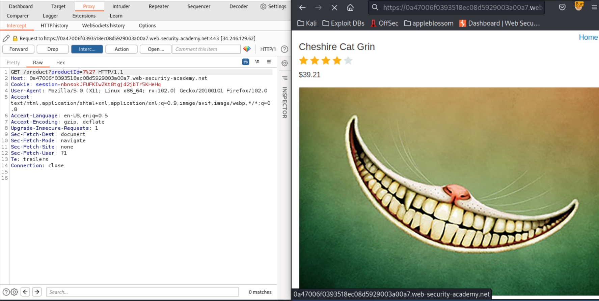
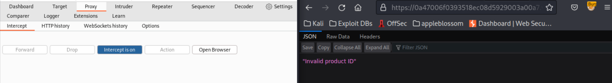
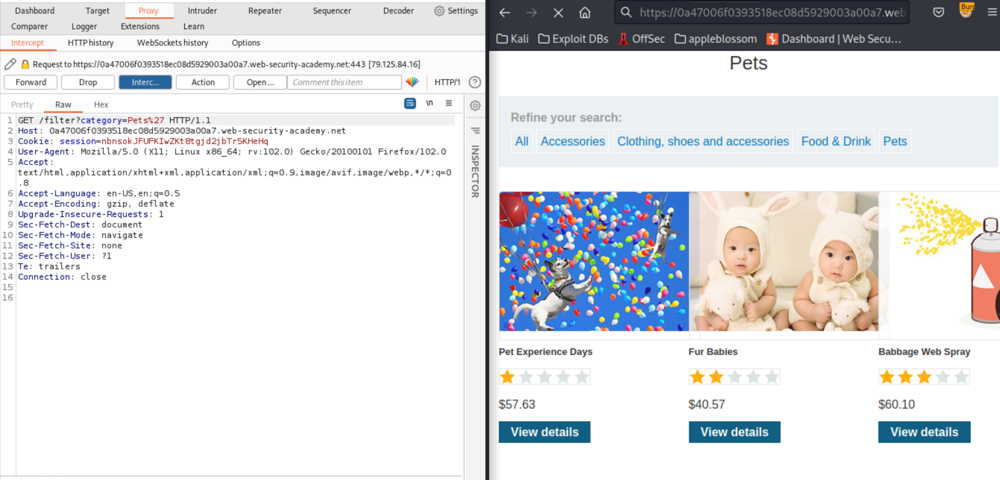
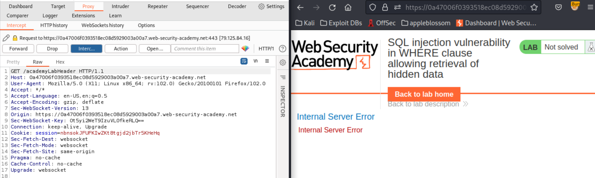
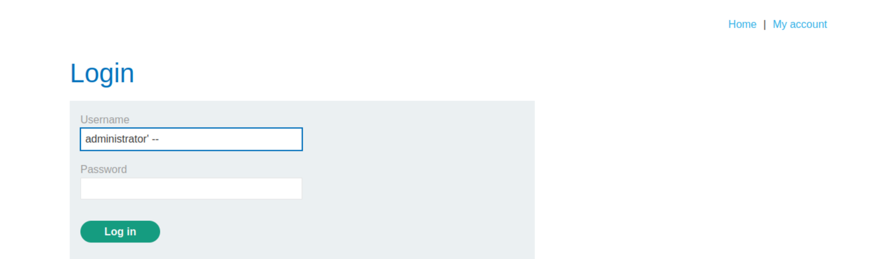
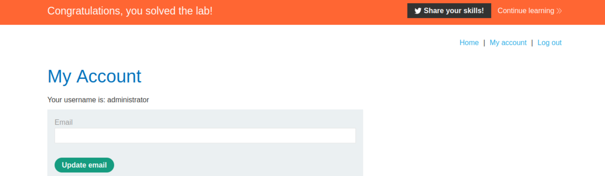

# SQL injection

## Basics

### SQL injection vulnerability in WHERE clause allowing retrieval of hidden data

This lab contains an SQL injection vulnerability in the product category filter. When the user selects a category, the application carries out an SQL query like the following:

    SELECT * FROM products WHERE category = 'Gifts' AND released = 1

To solve the lab, perform an SQL injection attack that causes the application to display details of all products in any category, both released and unreleased. 

Trying `/product?productId=7'`:

|  |
|:--:|
|  |
|  |

Trying `Category=Pets'`:

|  |
|:--:|
|  |
| Bingo! |

Payload:

    https://<random-string>.web-security-academy.net/filter?category=Pets' OR 1=1 -- 

### SQL injection vulnerability allowing login bypass

This lab contains an SQL injection vulnerability in the login function.

To solve the lab, perform an SQL injection attack that logs in to the application as the `administrator` user. 

SQL:

    SELECT * FROM users WHERE username = 'administrator' AND password = '' OR 1=1 --

|  |
|:--:|
|  |

## Practitioner

### SQL injection UNION attack, determining the number of columns returned by the query

### SQL injection UNION attack, finding a column containing text

### SQL injection UNION attack, retrieving data from other tables

### SQL injection UNION attack, retrieving multiple values in a single column

### SQL injection attack, querying the database type and version on Oracle

### SQL injection attack, querying the database type and version on MySQL and Microsoft

### SQL injection attack, listing the database contents on non-Oracle databases

### SQL injection attack, listing the database contents on Oracle

### Blind SQL injection with conditional responses

### Blind SQL injection with conditional errors

### Blind SQL injection with time delays

### Blind SQL injection with time delays and information retrieval

### Blind SQL injection with out-of-band interaction

### Blind SQL injection with out-of-band data exfiltration

### SQL injection with filter bypass via XML encoding
