# Cross-site scripting

## Basics

### Reflected XSS into HTML context with nothing encoded

#### Description

The website in [this lab](https://portswigger.net/web-security/cross-site-scripting/reflected/lab-html-context-nothing-encoded) contains a simple reflected cross-site scripting vulnerability in the search functionality. 

#### Proof of Concept

1. Copy and paste into the search box:

```html
<script>alert(1)</script>
```

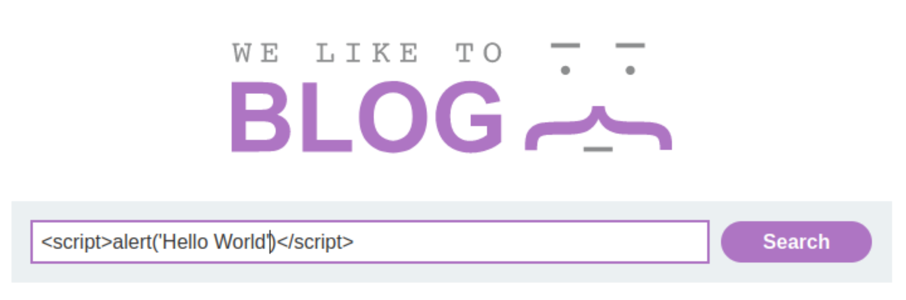
    
2. Click "Search".


----

### Stored XSS into HTML context with nothing encoded

#### Description

The website in [this lab](https://portswigger.net/web-security/cross-site-scripting/stored/lab-html-context-nothing-encoded) contains a stored cross-site scripting vulnerability in the comment functionality.  

#### Proof of Concept

1. Enter the following into the comment box:

```html
<script>alert('Hello World')</script>
```

2. Enter a name, email and website.

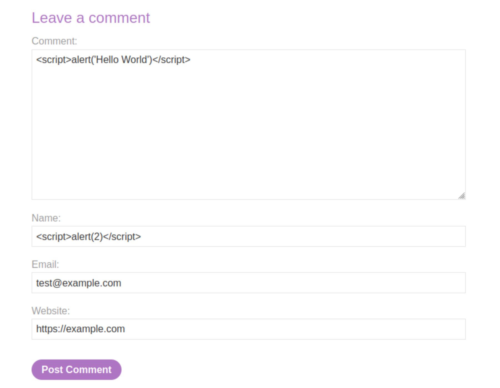

3. Click **Post comment**.
4. Go back to the blog.

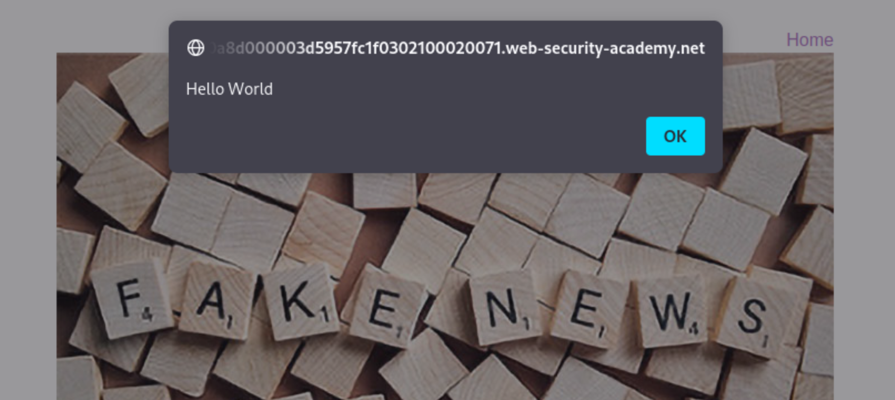

----

### DOM XSS in document.write sink using source location.search

#### Description

The website in [this lab](https://portswigger.net/web-security/cross-site-scripting/dom-based/lab-document-write-sink) contains a DOM-based cross-site scripting vulnerability in the search query tracking functionality. It uses the JavaScript `document.write` function, which writes data out to the page. The `document.write` function is called with data from `location.search`, which can be controlled using the website URL.

#### Proof of Concept

1. Enter a random alphanumeric string into the search box.
2. Right-click and inspect the element, and observe that your random string has been placed inside an `img src` attribute.

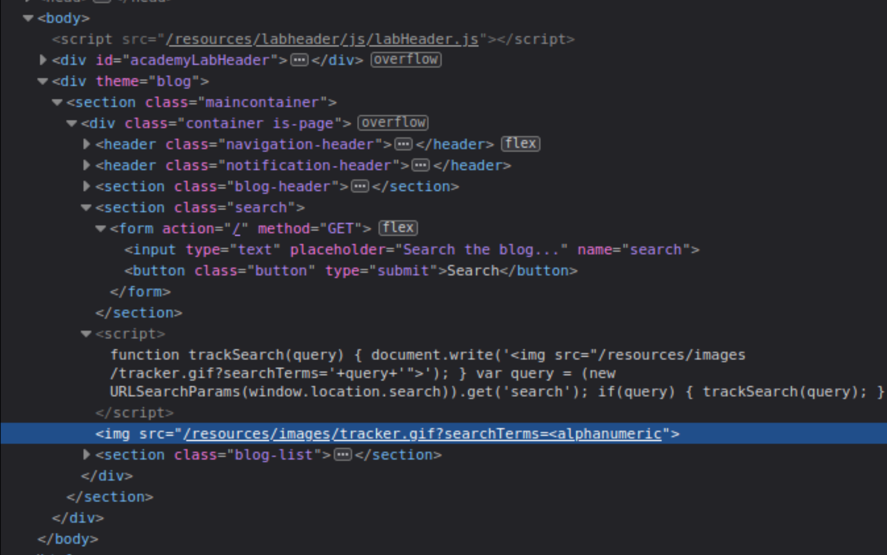

3. Break out of the `img` attribute:

```html
"><script>alert('Hello World')</script>
```

[DOM XSS](../../_static/images/dom5.png)

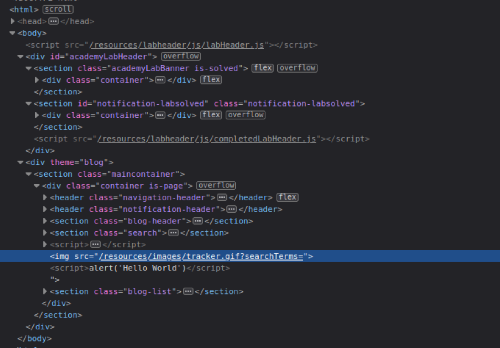

----

### DOM XSS in innerHTML sink using source location.search

#### Description

The website in [this lab](https://portswigger.net/web-security/cross-site-scripting/dom-based/lab-innerhtml-sink) contains a DOM-based cross-site scripting vulnerability in the search blog functionality. It uses an innerHTML assignment, which changes the HTML contents of a div element, using data from `location.search`.

#### Proof of Concept

1. If there is a query in the `location.search` variable (the URL input), `document.getElementById` gets the element with ID `searchMessage`. Then it will set its `innerHTML` to the query. Enter into the search box: 

```html

```

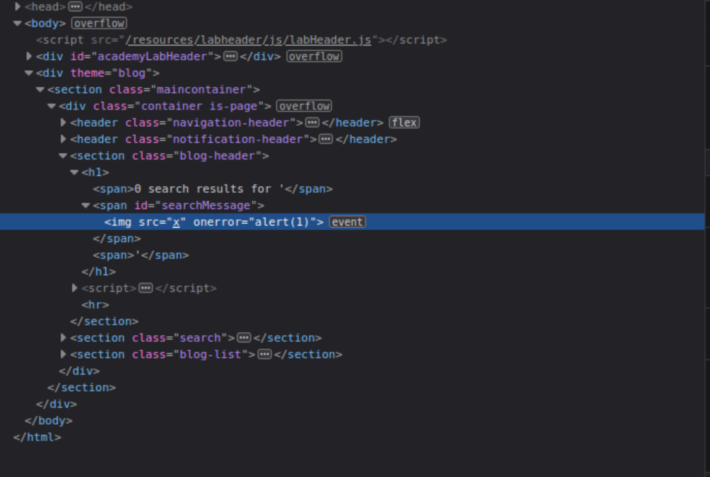

During the rendering of the page, the image fails to load. This will raise the JavaScript `alert`  box, confirming the XSS vulnerability.

----

### DOM XSS in jQuery anchor href attribute sink using location.search source

#### Description

The website in [this lab](https://portswigger.net/web-security/cross-site-scripting/dom-based/lab-jquery-href-attribute-sink) contains a DOM-based cross-site scripting vulnerability in the submit feedback page. It uses the jQuery library's `$` selector function to find an anchor element, and changes its `href` attribute using data from `location.search`.

#### Proof of Concept

1. On the Submit feedback page, change the query parameter returnPath to `/` followed by a random alphanumeric string.
2. Right-click and inspect the element, and observe that your random string has been placed inside an `a href` attribute.
3. Change returnPath to:

```html
javascript:alert(document.cookie)
```

For example:

    https://0a1800ac03209537c12be0bd005f00f0.web-security-academy.net/feedback?returnPath=javascript:alert(document.cookie)
    
4. Hit enter and click the `Back` button on the site to trigger the attack.

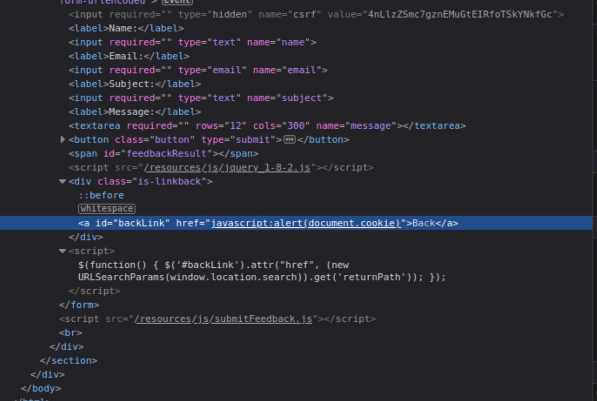

----

### DOM XSS in jQuery selector sink using a hashchange event

#### Description

The website in [this lab](https://portswigger.net/web-security/cross-site-scripting/dom-based/lab-jquery-selector-hash-change-event) contains a DOM-based cross-site scripting vulnerability on the home page. It uses jQuery's `$()` selector function to auto-scroll to a given post, whose title is passed via the `location.hash` property.

#### Proof of Concept

1. Notice the vulnerable code on the home page using Burp or the browser's DevTools. 

```html
<script>
    $(window).on('hashchange', function(){
        var post = $('section.blog-list h2:contains(' + decodeURIComponent(window.location.hash.slice(1)) + ')');
        if (post) post.get(0).scrollIntoView();
    });
</script>
```

A [Jquery hashchange](https://github.com/apopelo/jquery-hashchange) event tracks URL history changes. When a change happens, `decodeURIComponent` is called on the `window.location.hash`. If that part of the page exists, the browser scrolls to it.

2. Create exploit:

```html
<iframe src="https://lab-id.web-security-academy.net/#" onload="this.src+=''">
```

3. From the lab banner, open the exploit server.
4. For delivery, up top click on Go To Exploit Server, enter the exploit in the body field and **Store** the changes.

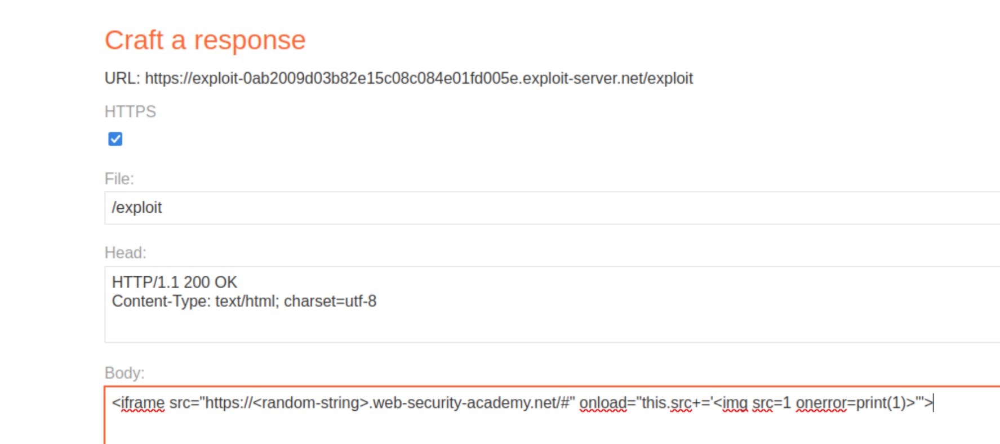

5. Then click **View Exploit** to try it out on yourself. If that worked, click **Deliver Exploit to Victim**.

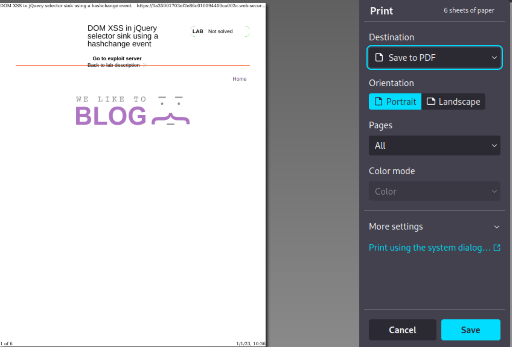

----

### Reflected XSS into attribute with angle brackets HTML-encoded

#### Description

The website in [this lab](https://portswigger.net/web-security/cross-site-scripting/contexts/lab-attribute-angle-brackets-html-encoded) contains a reflected cross-site scripting vulnerability in the search blog functionality where angle brackets are HTML-encoded.

Also see the leads from HackTricks concerning [XSS methodology](https://book.hacktricks.xyz/pentesting-web/xss-cross-site-scripting#methodology) and [XSS Inside HTML tags attribute](https://book.hacktricks.xyz/pentesting-web/xss-cross-site-scripting#inside-html-tags-attribute): _2. If you can escape from the attribute but not from the tag (-> is encoded or deleted), depending on the tag you could create an event that executes JS code:_

#### Proof of Concept

1. Put a random alphanumeric string in the search box, then use Burp Suite to intercept the search request and send it to Burp Repeater.
2. The random string has been reflected inside a quoted attribute.
3. Replace the input with a payload to escape the quoted attribute and inject an event handler:

```html
" autofocus onfocus=alert(1) x="
```

4. Verify the technique worked by right-clicking, selecting "Copy URL", and pasting the URL in the browser. When you move the mouse over the injected element it should trigger an alert.

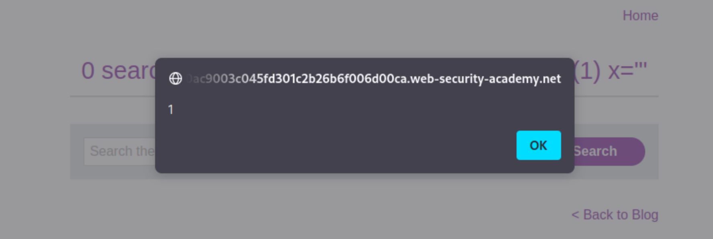

The resulting HTML:

```html
<section class=blog-header>
    <h1>0 search results for '&quot; autofocus onfocus=alert(1) x=&quot;'</h1>
    <hr>
</section>
```

----

### Stored XSS into anchor href attribute with double quotes HTML-encoded

#### Description

The website in [this lab](https://portswigger.net/web-security/cross-site-scripting/contexts/lab-href-attribute-double-quotes-html-encoded) contains a stored cross-site scripting vulnerability in the comment functionality.

#### Proof of Concept

#### Proof of Concept

1. Post a comment with a random alphanumeric string in the "Website" input, then use Burp Suite to intercept the request and send it to Burp Repeater.
2. Make a second request in the browser to view the post and use Burp Suite to intercept the request and send it to Burp Repeater.
3. The random string in the second Repeater tab has been reflected inside an anchor `href` attribute.
4. Repeat the process again, replacing the input with a payload to inject a JavaScript URL that calls alert:

```html
javascript:alert(1)
```

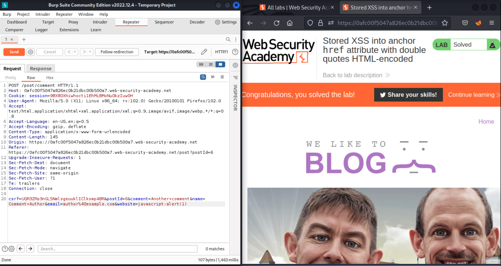
    
5. Verify the technique worked by right-clicking, selecting **Copy URL**, and pasting the URL in the browser. Clicking the name above the comment should now trigger an alert.

----

### Reflected XSS into a JavaScript string with angle brackets HTML encoded

#### Description

The website in [this lab](https://portswigger.net/web-security/cross-site-scripting/contexts/lab-javascript-string-angle-brackets-html-encoded) contains a reflected cross-site scripting vulnerability in the search query tracking functionality where angle brackets are encoded. The reflection occurs inside a JavaScript string. Also see the HackTricks XSS page, in the section on [Inside JavaScript code](https://book.hacktricks.xyz/pentesting-web/xss-cross-site-scripting#inside-javascript-code).

#### Proof of Concept

1. Put a random alphanumeric string in the search box, then use Burp Suite to intercept the search request and send it to Burp Repeater.

```html
<script>
    var searchTerms = '&lt;alphanumeric';
    document.write('');
</script>
```

2. The random string has been reflected inside a JavaScript string: The script accepts input, assigns it to the variable `searchTerms`, and does a `document.write` with the encoded URL using `encodeURIComponent`.
3. Replace the input with this payload to break out of the JavaScript string and inject an alert:
 
```html
'-alert('XSS')-'
```

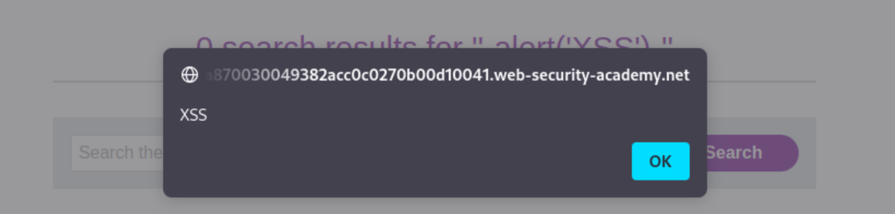

----

## Practitioner

### DOM XSS in document.write sink using source location.search inside a select element

### DOM XSS in AngularJS expression with angle brackets and double quotes HTML-encoded

### Reflected DOM XSS

### Stored DOM XSS

### Exploiting cross-site scripting to steal cookies

### Exploiting cross-site scripting to capture passwords

### Exploiting XSS to perform CSRF

### Reflected XSS into HTML context with most tags and attributes blocked

### Reflected XSS into HTML context with all tags blocked except custom ones

### Reflected XSS with some SVG markup allowed

### Reflected XSS in canonical link tag

### Reflected XSS into a JavaScript string with single quote and backslash escaped

### Reflected XSS into a JavaScript string with angle brackets and double quotes HTML-encoded and single quotes escaped

### Stored XSS into onclick event with angle brackets and double quotes HTML-encoded and single quotes and backslash escaped

### Reflected XSS into a template literal with angle brackets, single, double quotes, backslash and backticks Unicode-escaped

## Expert

### Reflected XSS with event handlers and href attributes blocked

### Reflected XSS in a JavaScript URL with some characters blocked

### Reflected XSS with AngularJS sandbox escape without strings

### Reflected XSS with AngularJS sandbox escape and CSP

### Reflected XSS protected by very strict CSP, with dangling markup attack

### Reflected XSS protected by CSP, with CSP bypass