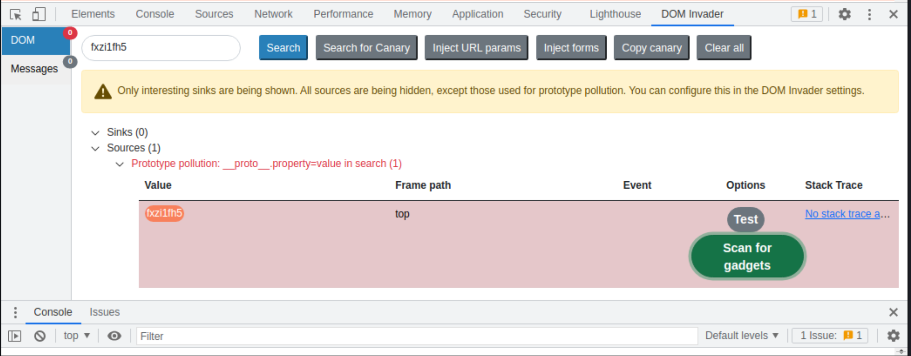
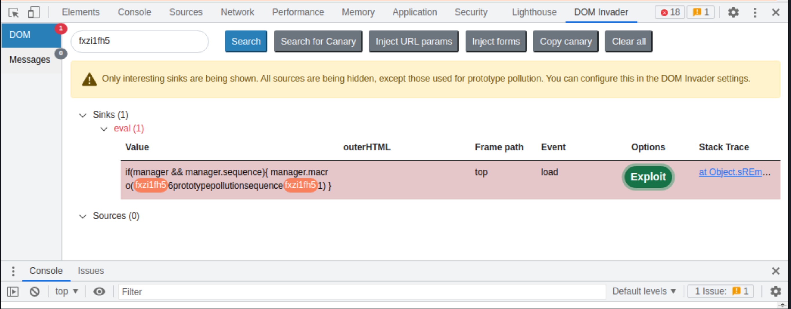

# DOM XSS via an alternative prototype pollution vector

## Description

[This lab](https://portswigger.net/web-security/prototype-pollution/finding/lab-prototype-pollution-dom-xss-via-an-alternative-prototype-pollution-vector) is vulnerable to DOM XSS via client-side prototype pollution.

## Reproduction and proof of concept

1. Load the lab in Burp's built-in browser.
2. Enable [DOM Invader](https://portswigger.net/burp/documentation/desktop/tools/dom-invader) and enable the prototype pollution option.
3. Open the browser DevTools panel and go to the **DOM Invader** tab and reload the page.
4. Observe that DOM Invader has identified a prototype pollution vector in the search property i.e. the query string.

5. Click **Scan for gadgets**. A new tab opens in which DOM Invader begins scanning for gadgets using the selected source.
6. When the scan is complete, open the DevTools panel in the same tab as the scan, then go to the **DOM Invader** tab.
7. Observe that DOM Invader has successfully accessed the `eval()` sink via the sequence gadget.

8. Click Exploit. Observe that DOM Invader's auto-generated proof-of-concept doesn't trigger an `alert()`.
9. Go back to the previous browser tab and look at the `eval()` sink again in **DOM Invader**. Notice that following the closing canary string, a numeric 1 character has been appended to the payload.
10. Click Exploit again. In the new tab that loads, append a minus character (`-`) to the URL and reload the page.
11. Observe that the `alert(1)` is called and the lab is solved.

## Exploitability

An attacker will need to find a source that can be used to add arbitrary properties to the global `Object.prototype`; identify a gadget property that allows for executing arbitrary JavaScript; combine these to call `alert()`.

This lab can be solved manually in a browser, or by using [DOM Invader](https://portswigger.net/burp/documentation/desktop/tools/dom-invader). 
