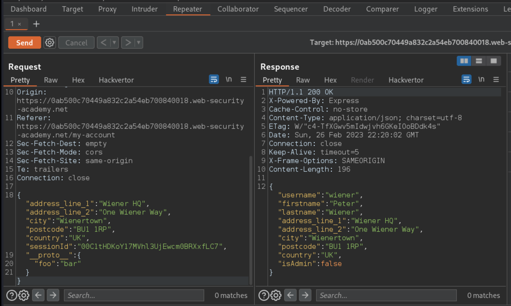
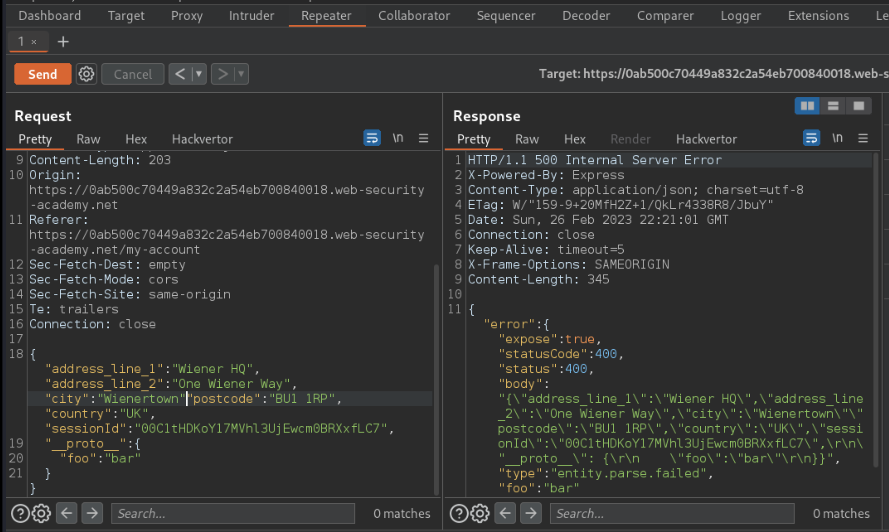
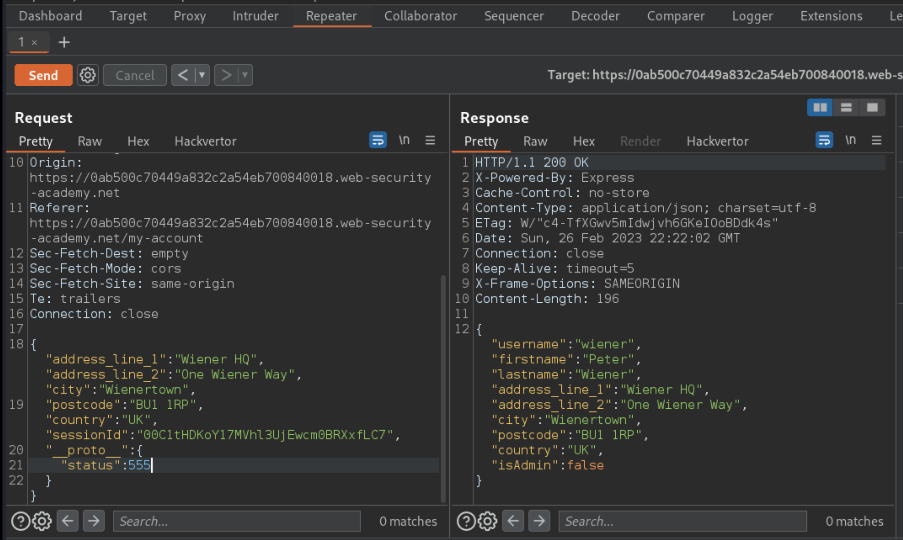
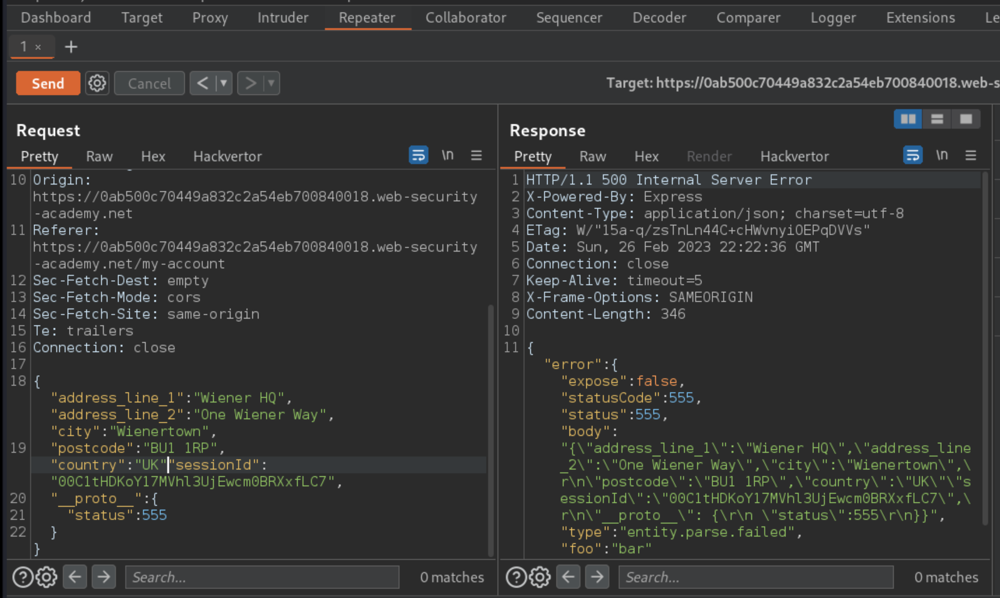
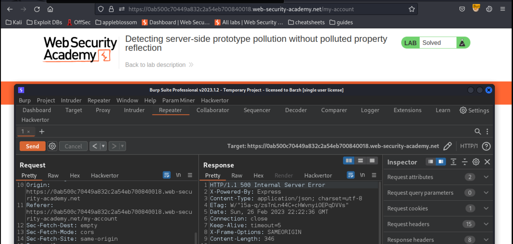

# Detecting server-side prototype pollution without polluted property reflection

[This lab](https://portswigger.net/web-security/prototype-pollution/server-side/lab-detecting-server-side-prototype-pollution-without-polluted-property-reflection) is built on `Node.js` and the `Express` framework. It is vulnerable to server-side prototype pollution because it unsafely merges user-controllable input into a server-side JavaScript object. 

## Reproduction and PoCs

### Study the address change feature

1. Log in and visit your account page. Submit the form for updating your billing and delivery address.
2. In Burp, go to the **Proxy -> HTTP history** tab and find the `POST /my-account/change-address` request.
3. When submitting the form, the data from the fields is sent to the server as JSON. The server responds with a JSON object that appears to represent your user. This has been updated to reflect the new address information.
4. Send the request to Burp Repeater.
5. In Repeater, add a new property to the JSON with the name `__proto__`, containing an object with an arbitrary property:

```text
"__proto__": {
    "foo":"bar"
}
```



6. Send the request. The object in the response does not reflect the injected property. However, this doesn't necessarily mean that the application isn't vulnerable to prototype pollution.

### Identify a prototype pollution source

1. In the request, modify the JSON in a way that intentionally breaks the syntax. For example, delete a comma from the end of one of the lines.
2. Send the request. Observe that you receive an error response in which the body contains a JSON error object.



3. Although a `500` error response is received, the error object contains a status property with the value `400`.
4. In the request, make the following changes:

* Fix the JSON syntax by reversing the changes that triggered the error.
* Modify the injected property to try polluting the prototype with your own distinct status property. Remember that this must be between `400` and `599`.

```text
"__proto__": {
    "status":555
}
```

5. Send the request. 



The normal response containing the user object is received.

6. Intentionally break the JSON syntax again and reissue the request.



7. The same error is triggered, but the `status` and `statusCode` properties in the JSON response match the arbitrary error code that was injected into `Object.prototype`. This strongly suggests that the prototype is polluted and the lab is solved.



## Exploitability

An attacker will need to identify and confirm the vulnerability by polluting `Object.prototype` in a way that triggers a noticeable but non-destructive change in the server's behaviour. As this lab is designed to practice non-destructive detection techniques, do not progress to exploitation.

**When testing for server-side prototype pollution, it's possible to break application functionality or even bring down the server completely. If this happens to the lab, restart the server manually using the button provided in the lab banner. You are unlikely to have this option when testing real websites, so always use caution.**
