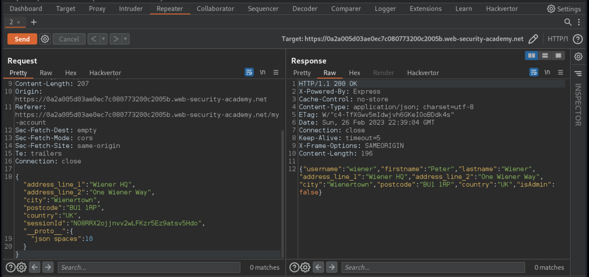
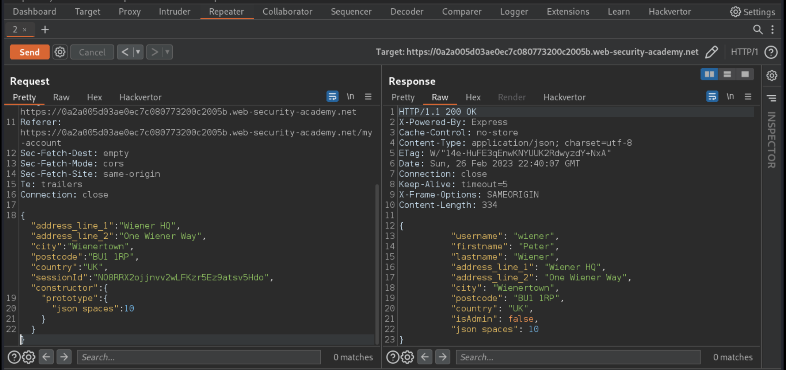
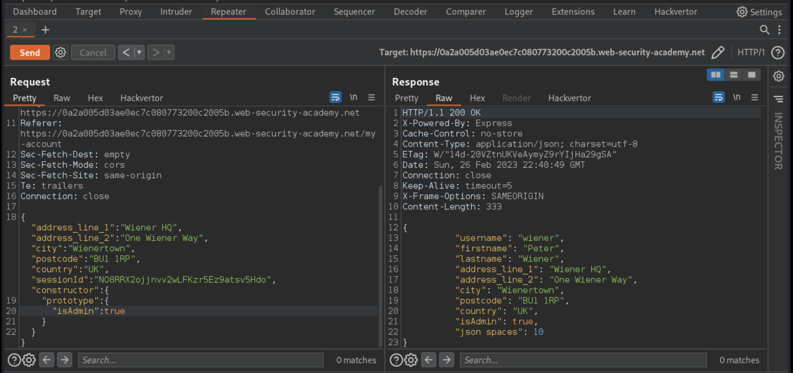
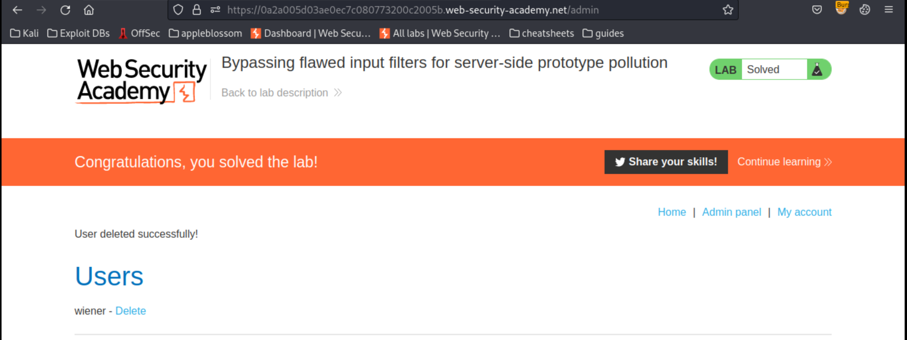

# Bypassing flawed input filters for server-side prototype pollution

This lab is built on `Node.js` and the `Express` framework. It is vulnerable to server-side prototype pollution because it unsafely merges user-controllable input into a server-side JavaScript object.

## Reproduction and PoCs

### Study the address change feature

1. Log in with `wiener:peter` and visit the account page. Submit the form for updating your billing and delivery address.
2. In Burp, go to the **Proxy -> HTTP** history tab and find the `POST /my-account/change-address` request.
3. When submitting the form, the data from the fields is sent to the server as JSON. The server responds with a JSON object that appears to represent your user. This has been updated to reflect your new address information.
4. Send the request to Burp Repeater.

### Identify a prototype pollution source

1. In Repeater, add a new property to the JSON with the name `__proto__`, containing an object with a json spaces property.

```text
"__proto__": {
    "json spaces":10
}
```

2. Send the request.
3. In the Response panel, switch to the **Raw** tab. 



The JSON indentation appears to be unaffected.

4. Modify the request to try polluting the prototype via the constructor property instead:

```text
"constructor": {
    "prototype": {
        "json spaces":10
    }
}
```

5. Resend the request.
6. In the Response panel, go to the **Raw** tab. 



The JSON indentation has increased based on the value of your injected property. This strongly suggests that you have successfully polluted the prototype.

### Identify a gadget

1. Look at the additional properties in the response body.
2. Notice the `isAdmin` property, which is currently set to false.

### Craft an exploit

1. Modify the request to try polluting the prototype with your own `isAdmin` property:

```text
"constructor": {
    "prototype": {
        "isAdmin":true
    }
}
```

2. Send the request. 



The `isAdmin` value in the response has been updated. This suggests that the object doesn't have its own `isAdmin` property, but has instead inherited it from the polluted prototype.

3. In the browser, refresh the page and confirm that you now have a link to access the admin panel.
4. Go to the admin panel and delete the user carlos to solve the lab.



## Exploitability

An attacker will need to find a prototype pollution source that can be used to add arbitrary properties to the global `Object.prototype`; identify a gadget property that can be used to escalate  privileges; and access the admin panel and delete the user carlos. 