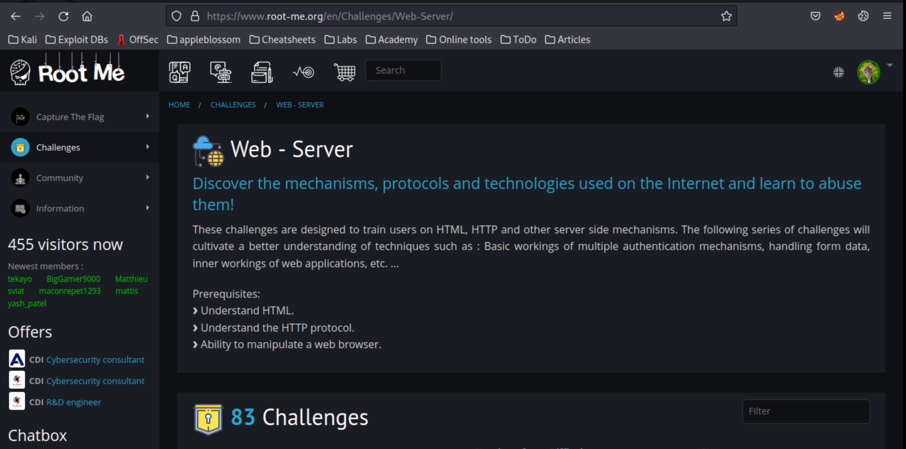

# Introduction

## What?

## Why?

The fast, easy, and **very** affordable way to test hacking skills.

## How?

* [Insecure Code Management](git.md)
* [Directory traversal](traversal.md)
* [File upload: null byte](upload-null.md)
* [PHP assert()](php1.md)
* [PHP Filters](php2.md)
* [PHP Register globals](php3.md)
* [JWT Introduction](jwt1.md)
* [JWT (not) revoked token](jwt2.md)
* [JWT weak secret](jwt3.md)
