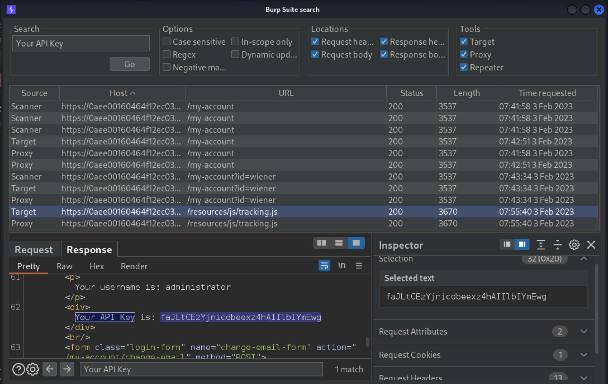

# Exploiting HTTP request smuggling to perform web cache deception

## Description

[This lab](https://portswigger.net/web-security/request-smuggling/exploiting/lab-perform-web-cache-deception) involves a front-end and back-end server, and the front-end server doesn't support chunked encoding. The front-end server is caching static resources. 

## Reproduction and proof of concept

1. Log in to the `wiener:peter` account and access the account page.
2. Observe that the response doesn't have any anti-caching headers.
3. Smuggle a request to fetch the API key:

4. Repeat this request a few times, then load the home page in an incognito browser window.
5. Use the Search function on the Burp menu to see if the phrase "Your API Key" has appeared in any static resources. If it hasn't, repeat the POST requests, force-reload the browser window, and re-run the search.

6. Enter the victim's API key as the lab solution.

## Exploitability

An attacker will need to log in as `wiener:peter`, to perform a request smuggling attack such that the next user's request causes their API key to be saved in the cache. Then retrieve the victim user's API key from the cache and submit it as the lab solution. The attacker will need to wait for 30 seconds from accessing the lab before attempting to trick the victim into caching their API key.

The lab simulates the activity of a victim user. Every few POST requests an attacker makes to the lab, the victim user will make their own request. Attacks might need to be repeated a few times to ensure that the victim user's request occurs as required. 

Manually fixing length fields in request smuggling attacks can be tricky. The [HTTP Request Smuggler Burp extension](https://portswigger.net/blog/http-desync-attacks-request-smuggling-reborn#demo) was designed to help. It can be installed via the BApp Store.
