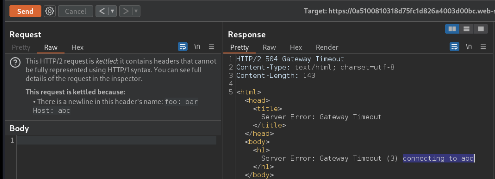
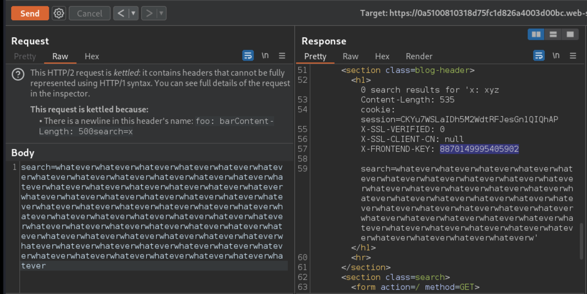
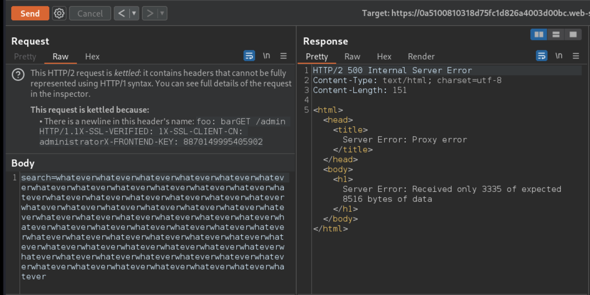
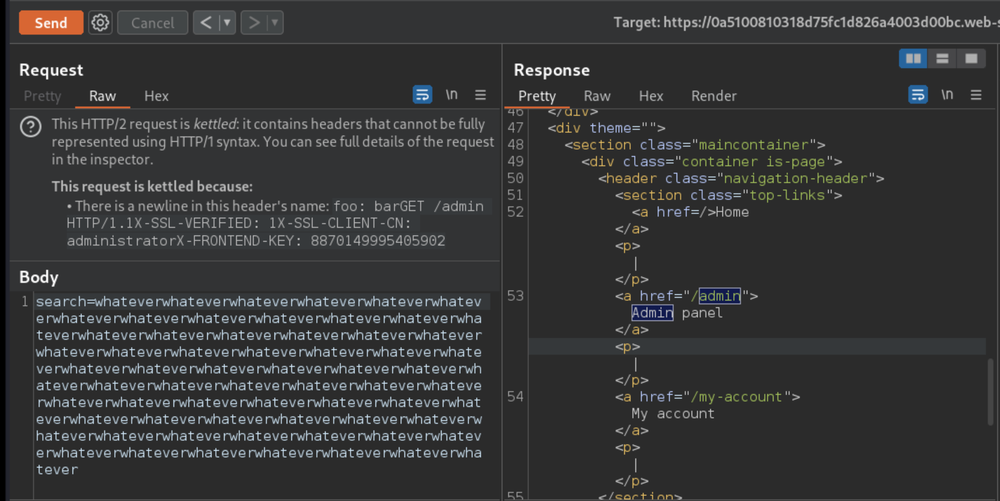
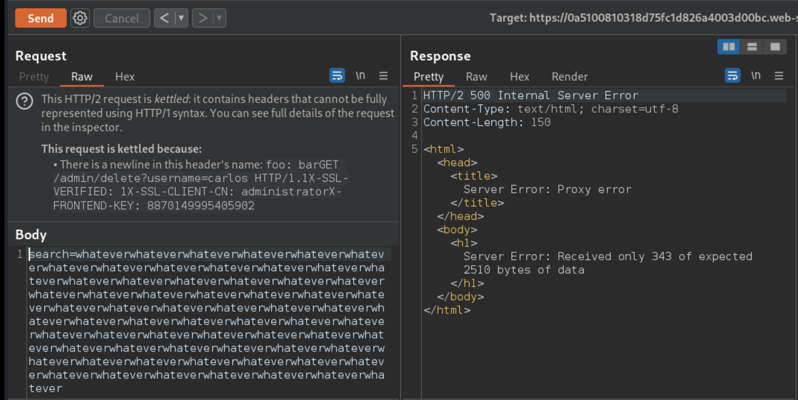

# Bypassing access controls via HTTP/2 request tunnelling

## Description

[This lab](https://portswigger.net/web-security/request-smuggling/advanced/request-tunnelling/lab-request-smuggling-h2-bypass-access-controls-via-request-tunnelling) is vulnerable to request smuggling because the front-end server downgrades HTTP/2 requests and fails to adequately sanitize incoming header names.

The front-end server doesn't reuse the connection to the back-end, so isn't vulnerable to classic request smuggling attacks. However, it is still vulnerable to request tunnelling. 

## Reproduction and proof of concept

1. Send the `GET /` request to Burp Repeater. Expand the Inspector's Request Attributes section and change the protocol to HTTP/2.
2. Using the Inspector, append an arbitrary header to the end of the request and try smuggling a Host header in its name as follows:

Name
```text
foo: bar\r\n
Host: abc
```

Value
```text
xyz
```


    
Observe that the error response indicates that the server processes your injected host, confirming that the lab is vulnerable to CRLF injection via header names.

3. In the browser, notice that the lab's search function reflects your search query in the response. Send the most recent `GET /?search=whatever` request to Burp Repeater and upgrade it to an HTTP/2 request.
4. In Burp Repeater, right-click on the request and select Change request method. Send the request and notice that the search function still works when you send the search parameter in the body of a POST request.
5. Add an arbitrary header and use its name field to inject a large Content-Length header and an additional search parameter as follows:

Name
```text
foo: bar\r\n
Content-Length: 500\r\n
\r\n
search=x
```

Value
```text
xyz
```

6. In the main body of the request (in the message editor panel) append arbitrary characters to the original search parameter until the request is longer than the smuggled `Content-Length` header.
7. Send the request and observe that the response now reflects the headers that were appended to your request by the front-end server:



Notice that these appear to be headers used for client authentication.

8. Change the request method to HEAD and edit your malicious header so that it smuggles a request for the admin panel. Include the three client authentication headers, making sure to update their values as follows:

Name
```text
foo: bar\r\n
\r\n
GET /admin HTTP/1.1\r\n
X-SSL-VERIFIED: 1\r\n
X-SSL-CLIENT-CN: administrator\r\n
X-FRONTEND-KEY: 8870149995405902\r\n
\r\n
```

Value
```text
xyz
```

9. Send the request and observe that you receive an error response saying that not enough bytes were received. This is because the `Content-Length` of the requested resource is longer than the tunnelled response you're trying to read.



10. Change the :path pseudo-header so that it points to an endpoint that returns a shorter resource. In this case, you can use `/login`.
11. Send the request again. You should see the start of the tunnelled HTTP/1.1 response nested in the body of your main response.
12. In the response, find the URL for deleting Carlos (`/admin/delete?username=carlos`), then update the path in your tunnelled request accordingly and resend it. Although you will likely encounter an error response, Carlos is deleted and the lab is solved.



Name
```text
foo: bar\r\n
\r\n
GET /admin/delete?username=carlos HTTP/1.1\r\n
X-SSL-VERIFIED: 1\r\n
X-SSL-CLIENT-CN: administrator\r\n
X-FRONTEND-KEY: 8870149995405902\r\n
\r\n
```

Value
```text
xyz
```



## Exploitability

An attacker will need to access the admin panel at `/admin` as the administrator user and delete carlos. 

_Note: This lab supports HTTP/2 but doesn't advertise this via ALPN. To send HTTP/2 requests using Burp Repeater, you need to enable the Allow HTTP/2 ALPN override option and manually change the protocol to HTTP/2 using the Inspector. Please note that this feature is only available from Burp Suite Professional / Community 2021.9.1._
