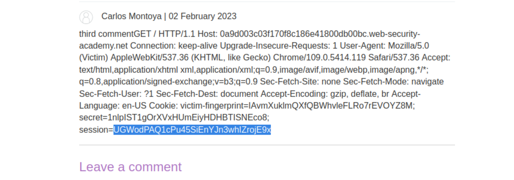
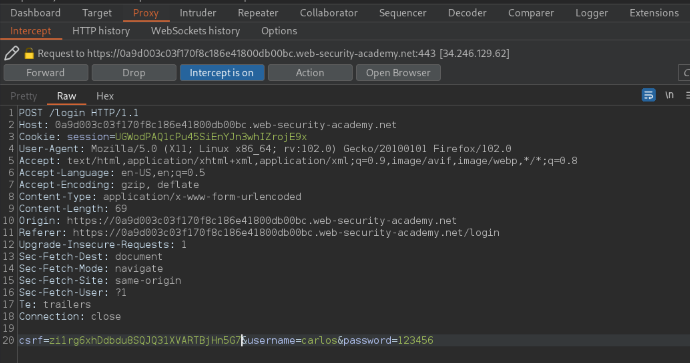

# Exploiting HTTP request smuggling to capture other users' requests

## Description

[This lab](https://portswigger.net/web-security/request-smuggling/exploiting/lab-capture-other-users-requests) involves a front-end and back-end server, and the front-end server doesn't support chunked encoding.

## Reproduction and proof of concept

1. Visit a blog post and post a comment.
2. Send the ``comment-post`` request to Burp Repeater, shuffle the body parameters so the ``comment`` parameter occurs last, and make sure it still works.
3. Increase the ``comment-post`` request's ``Content-Length`` to 400, then smuggle it to the back-end server:

```text
POST / HTTP/1.1
Host: lab-id.web-security-academy.net
Content-Type: application/x-www-form-urlencoded
Content-Length: 256
Transfer-Encoding: chunked

0

POST /post/comment HTTP/1.1
Content-Type: application/x-www-form-urlencoded
Content-Length: 400
Cookie: session=your-session-token

csrf=your-csrf-token&postId=5&name=Carlos+Montoya&email=carlos%40normal-user.net&website=&comment=test
```

4. View the blog post to see if there's a comment containing a user's request. Note that the target user only browses the website intermittently so you may need to repeat this attack a few times before it's successful.

A few times, like around 5:


Then headers as a comment, but not enough yet. So, repeating with `700`, then `800` (nearly there), and finally, with a content-length of `810`:



5. Intercept, `carlos`'s login, change the user's `Cookie` header from the comment, and the csrf token from the one used in the comments requests, and use it to access his account.



## Exploitability

An attacker will need to smuggle a request to the back-end server that causes the next user's request to be stored in the application. Then retrieve the next user's request and use the victim user's cookies to access their account.
