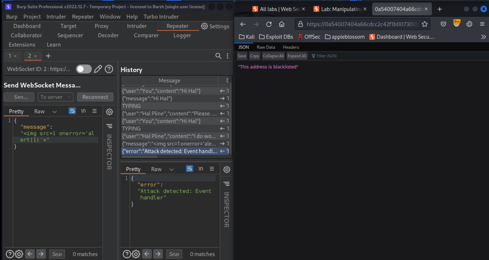
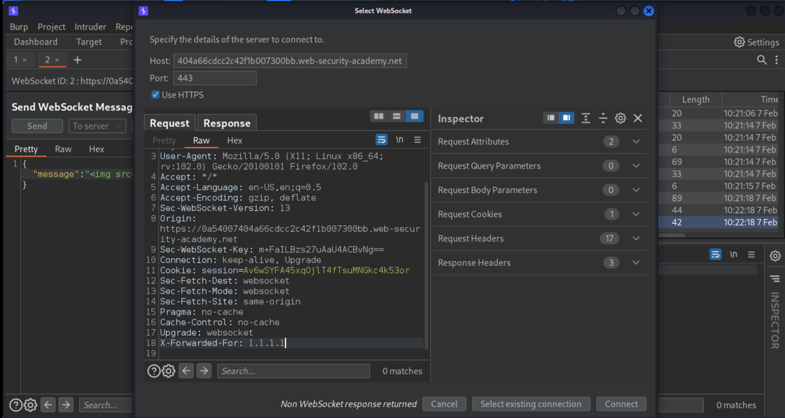

# Manipulating the WebSocket handshake to exploit vulnerabilities

## Description

[This online shop](https://portswigger.net/web-security/websockets/lab-manipulating-handshake-to-exploit-vulnerabilities) has a live chat feature implemented using WebSockets. It has an aggressive but flawed XSS filter. 

## Reproduction and proof of concept

1. Click **Live chat** and send a chat message.
2. In Burp Proxy, go to the WebSockets history tab, and observe that the chat message has been sent via a WebSocket message.
3. Right-click on the message and select "Send to Repeater".
4. Edit and resend the message containing a basic XSS payload, such as:

```text

```

5. Observe that the attack has been blocked, and that your WebSocket connection has been terminated.



6. Click **Reconnect**, and observe that the connection attempt fails because your IP address has been banned.
7. Add the `X-Forwarded-For` header to the handshake request to spoof the IP address:

```text
X-Forwarded-For: 1.1.1.1
```



8. Click "Connect" to successfully reconnect the WebSocket. 
9. Send a WebSocket message containing an obfuscated XSS payload, such as:

```text
 
```


## Exploitability

An attacker will need to use a WebSocket message to trigger an `alert()` popup in the support agent's browser. 
