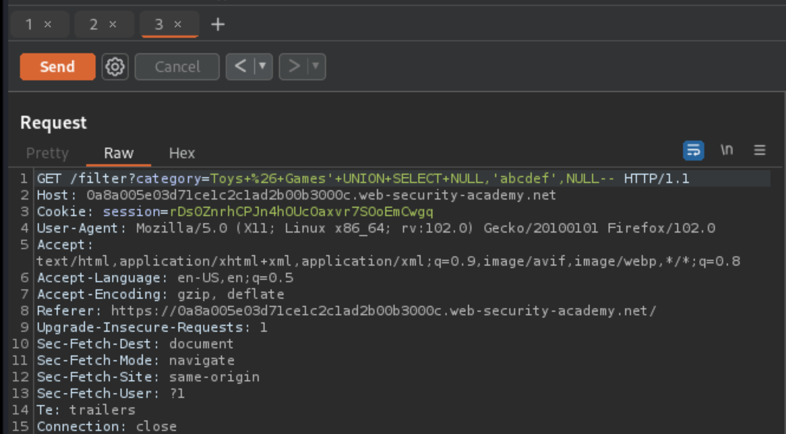
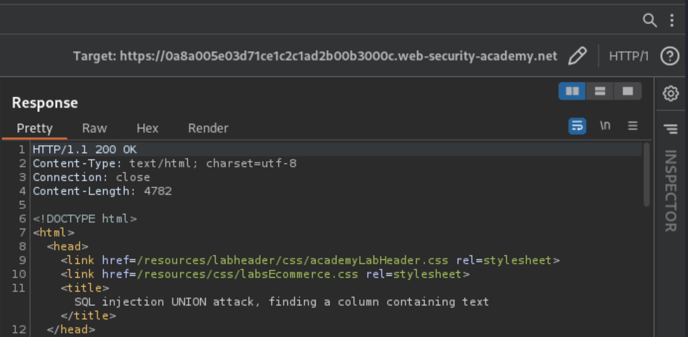

# SQL injection UNION attack, finding a column containing text

## Description

[This lab](https://portswigger.net/web-security/sql-injection/union-attacks/lab-find-column-containing-text) contains an SQL injection vulnerability in the product category filter. The results from the query are returned in the application's response, so you can use a UNION attack to retrieve data from other tables. To construct such an attack, you first need to determine the number of columns returned by the query. You can do this using a technique you learned in a previous lab. The next step is to identify a column that is compatible with string data.

The lab will provide a random value that you need to make appear within the query results. 

## Reproduction and proof of concept

1. Use Burp Suite to intercept and modify the request that sets the product category filter.
2. Determine the number of columns that are being returned by the query. Verify that the query is returning three columns, using the following payload in the category parameter: `'+UNION+SELECT+NULL,NULL,NULL--`
3. Try replacing each null with the random value provided by the lab, for example: `'+UNION+SELECT+'abcdef',NULL,NULL--`
4. If an error occurs, move on to the next null and try that instead.

## Exploitability

An attacker needs to perform an SQL injection UNION attack that returns an additional row containing the value provided. This technique helps determine which columns are compatible with string data. 
