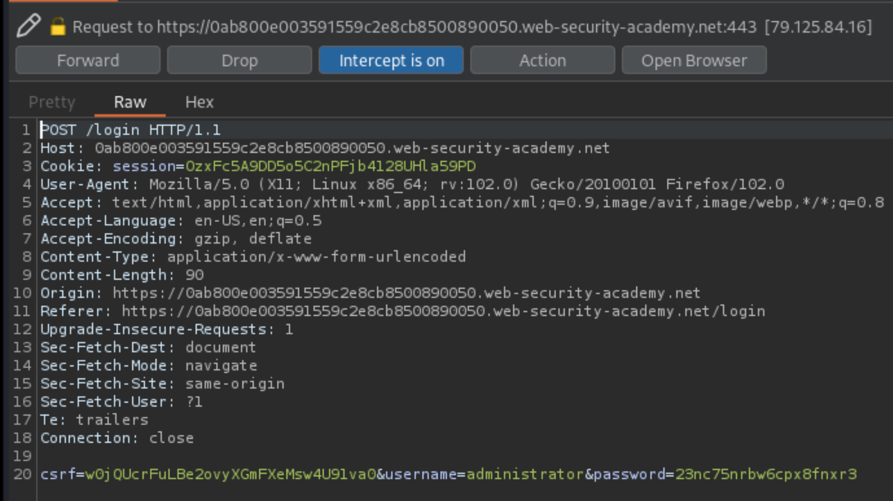

# SQL injection UNION attack, retrieving data from other tables

## Description

[This lab](https://portswigger.net/web-security/sql-injection/union-attacks/lab-retrieve-data-from-other-tables) contains an SQL injection vulnerability in the product category filter. The results from the query are returned in the application's response, it is possible to use a UNION attack to retrieve data from other tables. 

The database contains a different table called users, with columns called username and password.

## Reproduction and proof of concept

1. Use Burp Suite to intercept and modify the request that sets the product category filter.
2. Determine the number of columns that are being returned by the query and which columns contain text data. Verify that the query is returning two columns, both of which contain text, using a payload like the following in the category parameter: `'+UNION+SELECT+'abc','def'--`
3. Use the following payload to retrieve the contents of the users table: `'+UNION+SELECT+username,+password+FROM+users--`
4. Verify that the application's response contains usernames and passwords.
5. Log in as administrator.

## Exploitability

An attacker needs to perform an SQL injection UNION attack that retrieves all usernames and passwords, and use the information to log in as the administrator user. 
