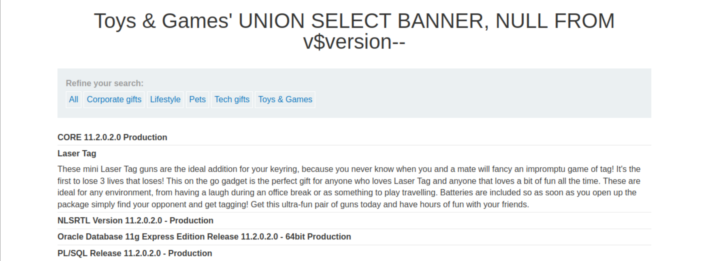

# SQL injection attack, querying the database type and version on Oracle

## Description

[This lab](https://portswigger.net/web-security/sql-injection/examining-the-database/lab-querying-database-version-oracle) contains an SQL injection vulnerability in the product category filter. It is possible to use a UNION attack to retrieve the results from an injected query.

## Reproduction and proof of concept

1. Use Burp Suite to intercept and modify the request that sets the product category filter.
2. Determine the number of columns that are being returned by the query and which columns contain text data. Verify that the query is returning two columns, both of which contain text, using a payload like the following in the category parameter: `'+UNION+SELECT+'abc','def'+FROM+dual--`
3. Use the following payload to display the database version: `'+UNION+SELECT+BANNER,+NULL+FROM+v$version--`

## Exploitability

An attacker will need to display the database version string.
