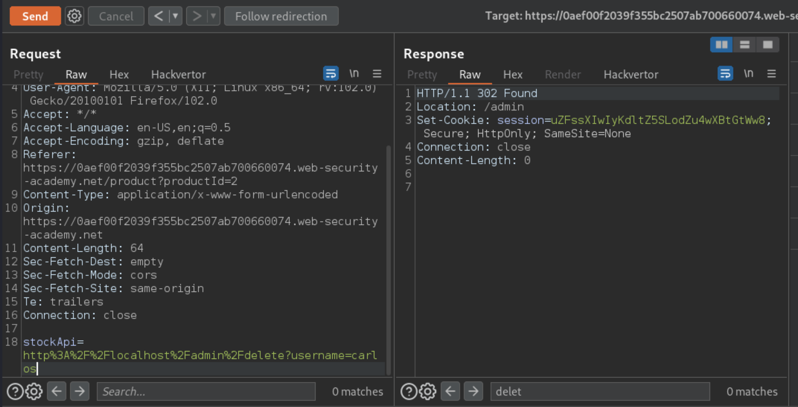

# Basic SSRF against the local server

## Description

[This lab](https://portswigger.net/web-security/ssrf/lab-basic-ssrf-against-localhost) has a stock check feature which fetches data from an internal system.

## Reproduction and proof of concept

1. Browse to ``/admin`` and observe that you can't directly access the admin page.
2. Visit a product, click "Check stock", intercept the request in Burp Suite, and send it to Burp Repeater.
3. Change the URL in the ``stockApi`` parameter to ``http://localhost/admin``. This should display the administration interface.
4. Read the HTML to identify the URL to delete the target user, which is:

```
http://localhost/admin/delete?username=carlos
```

5. Submit this URL in the ``stockApi`` parameter, to deliver the SSRF attack.




## Exploitability

An attacker will need to change the stock check URL to access the admin interface at `http://localhost/admin` and delete the user `carlos`.
